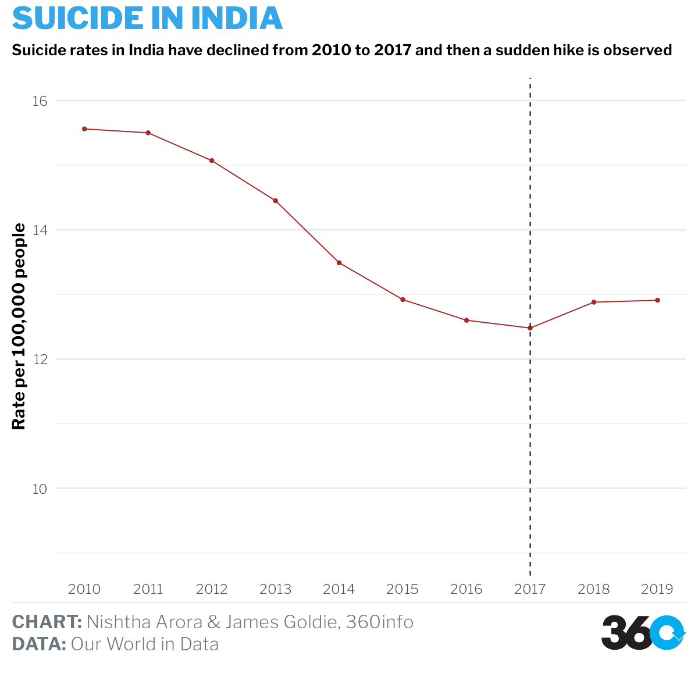

```{r setup, include=FALSE}
knitr::opts_chunk$set(
  echo = TRUE,
  message = FALSE,
  warning = FALSE,
  fig.width = 12,
  fig.height = 8
)
```

```{r libraries}
library(readr)
library(themes360info)
library(readxl)
library(tidyverse)
library(hrbrthemes)
library(ggthemes)
library(lubridate)
library(sf)
library(rgeos)
library(pdftools)
```

# Visualization 1

## WORLD SUICIDE RATE'S COMPARISON WITH DEVELOPMENT STATUS.

### Data sources 

- Worldwide suicide rates OWID (filtering from 2000-2019, i.e. 10 years)
https://ourworldindata.org/suicide

- HDI Data-UNDP-  Values recorded in 2021, rank (2020).
http://hdr.undp.org/en/composite/HDI

```{r HDI_data}
read_data <- function(range, development_status) {
  read_excel("data/InitialA1/HDIstatus.xlsx",
             range = range,
             col_names = FALSE) |> 
    rename(
      HDI_rank_2021 = ...1,
      Country = ...2,
      HDI_Value = ...3,
      Life_expectancy = ...5,
      Expected_years_of_schooling = ...7,
      Mean_years_of_schooling = ...9,
      GNI_per_capita = ...11,
      GNI_rank_minus_HDI_rank = ...13,
      HDI_rank_2020 = ...15
    ) |> 
    select(
      HDI_rank_2021,
      Country,
      HDI_Value,
      Life_expectancy,
      Expected_years_of_schooling,
      Mean_years_of_schooling,
      GNI_per_capita,
      GNI_rank_minus_HDI_rank,
      HDI_rank_2020
    ) |>  
    mutate(Degree_of_Human_Development = development_status)
}

very_high_hdi <-
  read_data("A9:O74", "VERY HIGH HUMAN DEVELOPMENT")

high_hdi <-
  read_data("A76:O128", "HIGH HUMAN DEVELOPMENT")

medium_hdi <-
  read_data("A130:O166", "MEDIUM HUMAN DEVELOPMENT")

low_hdi <-
  read_data("A168:O200", "LOW HUMAN DEVELOPMENT")

hdi <- bind_rows(very_high_hdi, high_hdi, medium_hdi, low_hdi)

write_csv(hdi, "data/InitialA1/HDIStatus2.csv")

tidied_hdi_data <- read_csv("data/InitialA1/HDIStatus2.csv") |>
  rename("Entity" = Country)
```


```{r suicide_data}
suicide_rates <- read_csv("data/InitialA1/suicide-death-rates.csv")
# setdiff(data2$Entity, data3$Entity)
# rename countries to align with other dataset
change <- suicide_rates |>
  mutate(
    Entity = recode(
      Entity,
      "American Samoa" = "Samoa",
      "Bolivia" = "Bolivia (Plurinational State of)",
      "Brunei" = "Brunei Darussalam",
      "Cape Verde" = "Cabo Verde",
      "Cote d'Ivoire" = "Côte d'Ivoire",
      "Democratic Republic of Congo" = "Congo (Democratic Republic of the)",
      "Eswatini" = "Eswatini (Kingdom of)",
      "Iran" = "Iran (Islamic Republic of)",
      "Laos" = "Lao People's Democratic Republic",
      "Micronesia (country)" = "Micronesia (Federated States of)",
      "North Korea" = "Korea (Republic of)",
      "Northern Ireland" = "Ireland",
      "Palestine" = "Palestine, State of",
      "Russia" = "Russian Federation",
      "South Sudan" = "Sudan",
      "Syria" = "Syrian Arab Republic",
      "Timor" = "Timor-Leste",
      "Venezuela" = "Venezuela (Bolivarian Republic of)",
      "Vietnam" = "Viet Nam"
    )
  )

# calculate the average death rate over 2008 to latest
selected_suicide_rates <- change |>
  filter(Year > 2007) |>
  group_by(Entity) |>
  summarise(avg_rate = mean(`Deaths - Self-harm - Sex: Both - Age: Age-standardized (Rate)`))

join <- full_join(selected_suicide_rates, tidied_hdi_data) |>
  arrange(desc(avg_rate)) |>
  na.omit() |>
  rename(`Development status` = Degree_of_Human_Development) |>
  mutate(avg_rate = round(avg_rate, digits = 2))

plot1 <- join |> head(30)
```

```{r plot1}
write_csv(plot1, "data/presentation/visualization1.csv")

ggplot(plot1,
       aes(
         x = reorder(Entity,-avg_rate),
         y = avg_rate,
         fill = `Development status`
       )) +
  geom_col() +
  geom_text(
    aes(label = avg_rate),
    vjust = 2,
    colour = "white",
    size = 3
  ) +
  theme(
    legend.position = "bottom",
    axis.text.x = element_text(
      angle = 45,
      vjust = 0.5,
      hjust = 1
    ),
    plot.title = element_text(face = "bold")
  ) +
  labs(title = "Top 30 countries by average suicide rate (2008-2019)",
       x = substitute(paste(bold("Country"))),
       y = substitute(paste(bold(
         "Suicide rate per 100,000 people"
       )))) +
  scale_fill_manual(values = c("#A0331C", "#1C56A0", "#4B902F", "#635A61"))
```

# Visualization 2

## SUICIDE RATE BEFORE AND AFTER 2017 (INDIA'S MENTAL HEALTH ACT 2017).

### Data source:

- WHO- https://www.who.int/data/gho/data/themes/mental-health/suicide-rates

```{r who_data}
who_data <- read_csv("data/InitialA1/data-2.csv") |>
  filter(Dim1 == "Both sexes") |>
  select(SpatialDimValueCode, Location, Period, Dim1, FactValueNumeric)

india_who_data <- who_data |> filter(Location == "India") 
```

```{r plot2}

write_csv(india_who_data, "data/presentation/visualization2.csv")

india_who_data |>
  ggplot(aes(x = Period, y = FactValueNumeric)) +
  geom_line() +
  geom_point(color = "brown", size = 1.5) +
  geom_vline(xintercept = 2017, linetype = "dashed") +
  scale_x_continuous(breaks = seq(from = 2000, to = 2019, by = 1)) +
  theme(
    legend.position = "none",
    axis.title = element_text(face = "bold"),
    plot.title = element_text(size = 14, lineheight = .8)
  ) +
  xlab(NULL) +
  ylab(substitute(paste(bold(
    "Rate per 100,000 people"
  )))) +
  ggtitle("Time-series for India, 2000-2019") +
  theme(plot.title = element_text(size = 14, lineheight = .8)) +
  geom_vline(xintercept = 2017, linetype = "dashed") +
  scale_color_manual(values = c('Brown', 'Purple', 'Black')) +
  theme(legend.position = "none")
```

# Visualization 3

## 2019 STATE/UT INDIA'S SUICIDE RATES

### Data sources:

- Data.gov- https://data.gov.in/catalog/stateut-wise-distribution-suicides-causes

- http://www.diva-gis.org/datadown

```{r reading_region_wise_data_mapfiles}
options(scipen = 999)

region_cases_2019 <-
  read_csv("data/InitialA1/RS_Session_253_A_211.1.csv") |>
  filter(str_detect(`State/UT`, "Total ", negate = TRUE)) |>
  rename(wrong_total = Total) |>
  rowwise() |>  # total cases, wrong data
  mutate(Total = sum(Male, Female, Transgender)) |>
  select(`State/UT`, Total)

states_shape_sf <- read_sf("data/InitialA1/IND_adm/IND_adm1.shp")

#Correcting the data by manually looking at Id's as geometry was matching with wrong id's.

df_newid = data.frame(
  id = c(
    2,
    3,
    4,
    5,
    7,
    11,
    12,
    13,
    14,
    15,
    16,
    17,
    18,
    20,
    21,
    22,
    23,
    24,
    25,
    26,
    28,
    29,
    30,
    31,
    32,
    33,
    34,
    35,
    36,
    1,
    6,
    8,
    9,
    10,
    19,
    27
  )
)

join_newid <- cbind(region_cases_2019, df_newid) |>
  mutate(id = as.numeric(id))

states_merged <- inner_join(states_shape_sf, join_newid,
                            by = c("ID_1" = "id"))

```

```{r plot3}
write_csv(states_merged, "data/presentation/visualization3.csv")

colors <- c('#C6B7F7', "#744BF7", "#6B96EC", "#103E99")
b <- c(0, 1000, 10000, 18000)
ggplot() +
  geom_sf(
    aes(fill = Total),
    data = states_merged,
    color = "black",
    linewidth = 0.25
  ) +
  geom_sf_text(
    data = states_merged,
    aes(label = NAME_1),
    size = 3,
    color = "black",
    fontface = "bold"
  ) +
  coord_sf() +
  scale_fill_fermenter(
    palette = "YlGnBu",
    direction = -1,
    # trans = "log10",
    labels = scales::label_number_si()
  ) +
  theme(
    axis.title = element_text(face = "bold"),
    panel.grid.major.x = element_blank(),
    panel.grid.minor.x = element_blank()
  ) +
  labs(title = "Region-wise 2019 data:India")
```


# Visulaization 4

## OUTLIERS(DATA GAP) IN SUICIDE RATES GLOBALLY

### Data source: 

- WHO- https://www.who.int/data/gho/data/themes/mental-health/suicide-rates

```{r outliers_indatacollection_plot4}
viz4_who_data <- who_data |> filter(
  Location %in% c(
    "Kiribati",
    "Central African Republic",
    "Latvia",
    "Republic of Korea",
    "Fiji",
    "Rwanda",
    "Poland",
    "Comoros",
    "Uzbekistan",
    "Bosnia and Herzegovina",
    "Grenada",
    "Niger",
    "Cuba",
    "Equatorial Guinea",
    "Burkina Faso",
    "Samoa",
    "Latvia",
    "Sao Tome and Principe",
    "Honduras",
    "Lebanon",
    "Maldives",
    "Bahamas",
    "Timor-Leste",
    "Iraq",
    "Dominican Republic",
    "Iran (Islamic Republic of)",
    "Brazil",
    "Bolivia (Plurinational State of)",
    "The former Yugoslav Republic of Macedonia",
    "Portugal",
    "Belize",
    "Serbia",
    "Mali",
    "Argentina",
    "United Republic of Tanzania",
    "Democratic People's Republic of Korea"
  )
) 

write_csv(viz4_who_data, "data/presentation/visualization4.csv")

viz4_who_data |>
  ggplot(aes(x = Location, y = FactValueNumeric, fill = Location)) +
  geom_boxplot() +
  theme(legend.position = "none") +
  scale_fill_viridis_d(alpha = 0.6) +
  theme(
    text = element_text(size = 8),
    axis.text.x = element_text(angle = 45, hjust = 1),
    axis.title = element_text(face = "bold"),
    plot.title = element_text(
      size = 14,
      lineheight = 8,
      face = "bold"
    )
  ) +
  labs(x = "Country",
       y = "Suicide rate",
       title = "Irregularity in Data Collection")

```

# Visulaization 5

## SOUTH ASIAN COUNTRIES:SUICIDE RATES

### Data source

- WHO- https://www.who.int/data/gho/data/themes/mental-health/suicide-rates


```{r data_plot5}
filtered <- who_data |>
  filter(
    Location %in% c(
      "India",
      "Maldives",
      "Afghanistan",
      "Nepal",
      "Bangladesh",
      "Bhutan",
      "Sri Lanka",
      "Pakistan"
    )
  )


write_csv(filtered, "data/presentation/visualization5.csv")

ggplot(filtered, aes(colour = Location, y = FactValueNumeric, x = Period)) +
  geom_line() +
  geom_point() +
  ylab("Suicide rate") +
  ggtitle("South Asian Countries") +
  scale_colour_brewer(type = "seq", palette = "Dark2") +
  theme_classic()
```


# SHORT-LISTED VISHUALIZATIONS: ADDING 360 THEME

## TIME SERIES 

```{r final_article_plot6}
india_suicide_rates <- who_data |> filter(Location == "India") |>
  filter(Period > 2009) |>
  mutate(year = as.Date(as.character(Period), format = "%Y"),
         year = year(year))

write_csv(india_suicide_rates, "data/presentation/visualization6.csv")

plot_india <-
  ggplot(india_suicide_rates, aes(x = year, y = FactValueNumeric)) +
  geom_line(color = "brown") +
  geom_point(color = "brown", size = 1.5) +
  geom_vline(xintercept = 2017, linetype = "dashed") +
  labs(
    x = NULL,
    y = "Rate per 100,000 people",
    title = "SUICIDE IN INDIA",
    subtitle = "Suicide rates in India have declined from 2010 to 2017 and then a sudden hike is observed",
    caption = paste(
      "**CHART:** Nishtha Arora & James Goldie, 360info",
      "**DATA:** Our World in Data",
      sep = "<br>"
    )
  ) +
  scale_x_continuous(breaks = 2010:2021) +
  ylim(9, 16) +
  theme_360() +
  theme(
    legend.position = "none",
    axis.title = element_text(face = "bold"),
    panel.grid.major.x = element_blank(),
    panel.grid.minor.x = element_blank()
  ) +
  annotate_360_light(
    x = 2016.9,
    y = 19,
    label = paste(
      "Suicide rates slightly increased",
      "after the introduction of the ",
      "Mental Healthcare Act in 2017.",
      sep = "<br>"
    ) ,
    hjust = 1,
    size = 5
  )

save_360plot(plot_india, "graphs/indiatimeseries.png")

```

## Map

```{r plot7}
india_map <- ggplot() +
  geom_sf(
    aes(fill = Total),
    data = states_merged,
    color = "black",
    linewidth = 0.25
  ) +
  geom_sf_text(
    data = states_merged,
    aes(label = NAME_1),
    size = 3,
    color = "black",
    fontface = "bold"
  ) +
  coord_sf() +
  scale_fill_fermenter(
    palette = "YlGnBu",
    direction = -1,
    # trans = "log10",
    labels = scales::label_number_si()
  ) +
  labs(
    title = "REGION-WISE: SUICIDE IN INDIA 2019",
    subtitle = "No. of suicides were maximum in Andhra Pradesh and Arunachal Pradesh",
    caption = paste(
      "**CHART:** Nishtha Arora & James Goldie, 360info",
      "**DATA:** Our World in Data",
      sep = "<br>"
    )
  ) +
  theme_360() +
  theme(
    axis.title = element_text(face = "bold"),
    panel.grid.major.x = element_blank(),
    panel.grid.minor.x = element_blank()
  ) +
  xlab(NULL) +
  ylab(NULL)

save_360plot(india_map, "graphs/indiamap.png")
knitr::include_graphics("graphs/indiamap.png")
```

# FINAL VISUALIZATION OF NEED

## TIME SERIES WITH NCRB DATA

### Data source:

- National Crime Records Bureau: https://ncrb.gov.in/sites/default/files/adsi_reports_previous_year/Table%202.1.pdf

```{r ncrb_data_pdf_extract}
ncrb_pdf <-
  pdftools::pdf_text(pdf = "https://ncrb.gov.in/sites/default/files/adsi_reports_previous_year/Table%202.1.pdf") |>
  str_split("\n")

for (i in 1) {
  #sets the iteration to go through all 17 pages
  ncrb_pdf[[i]] <- ncrb_pdf[[i]][11:41]
} |>
  str_squish()


numbers_ex = list()
k = 1
for (i in 1) {
  numbers <- ncrb_pdf[[i]]
  numbers_df <- data.frame(numbers)
  while (k <= 1000) {
    numbers_ex[[k]] <- numbers_df
    k <- k + 1
    break
  }
  
  NH_numbers <- dplyr::bind_rows(numbers_ex)
}

new <- NH_numbers |>
  separate(
    numbers,
    into = c("extra", "id", "year", "count", "population", "rate"),
    sep = "\\s+"
  ) |>
  na.omit() |>
  select(year, rate, count) |>
  mutate(
    year = str_remove(year, "[#@$]"),
    # year = as.Date(paste0(year, "-07-01")),
    count = as.numeric(count),
    rate = as.numeric(rate),
    year = as.numeric(year)
  )
```

```{r plot8}

write_csv(new, "data/presentation/visualization8.csv")

plot_ncrb <- ggplot(new,
                    aes(x = year, y = rate)) +
  geom_line(color = "brown") +
  geom_point(color = "brown", size = 1.5) +
  geom_vline(xintercept = 2017, linetype = "dashed") +
  labs(
    x = NULL,
    y = "Rate per 100,000 people",
    title = "SUICIDE IN INDIA (data.gov)",
    subtitle = "Suicide rates in India have rapidly fallen till 2016.",
    caption = paste(
      "**CHART:** Nishtha Arora & James Goldie, 360info",
      "**DATA:** NCRB",
      sep = "<br>"
    )
  ) +
  scale_x_continuous(breaks = 2010:2021) +
  ylim(9, 16) +
  
  theme_360() +
  theme(
    legend.position = "none",
    axis.title = element_text(face = "bold"),
    panel.grid.major.x = element_blank(),
    panel.grid.minor.x = element_blank()
  )
annotate_360_light(
  x = 2015,
  y = 10.2,
  label = paste("Suicide rates have rapidly increased after 2017.",
                sep = "<br>") ,
  hjust = 1,
  size = 5
)

save_360plot(plot_ncrb, "graphs/indiatimeseries2.png")
knitr::include_graphics("graphs/indiatimeseries2.png")
```


