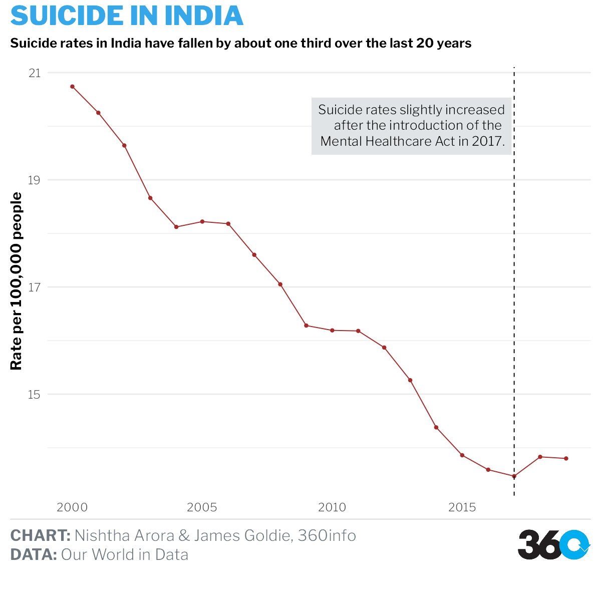
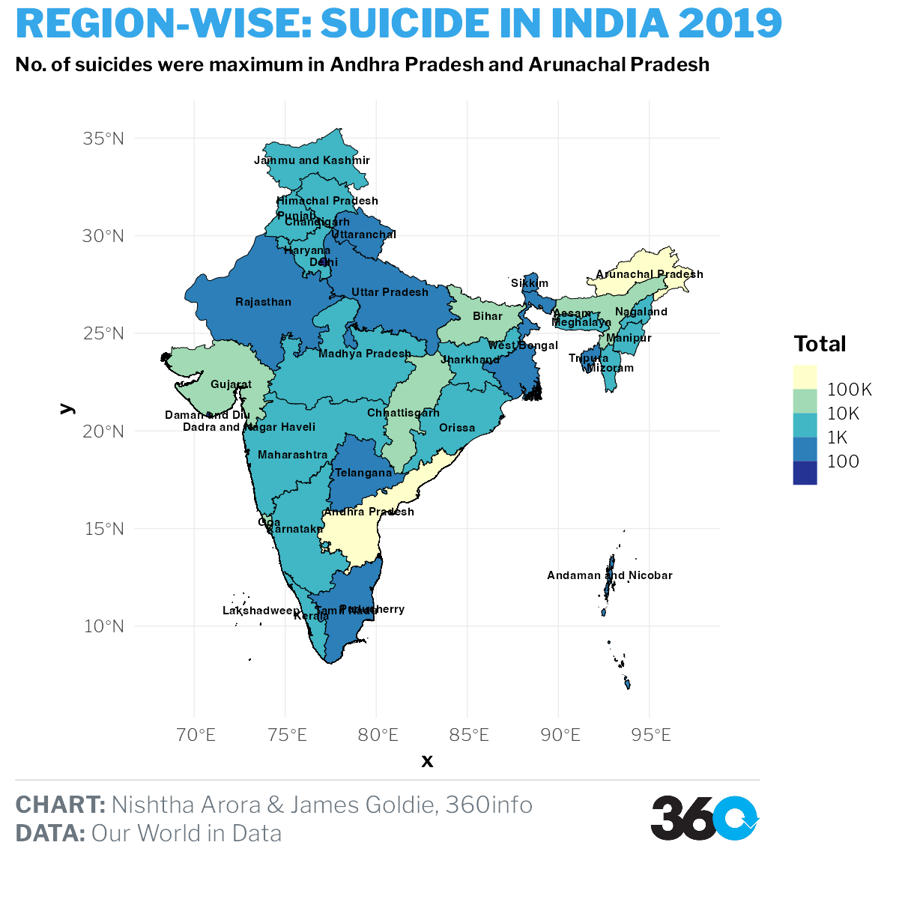

```{r setup, include=FALSE}
knitr::opts_chunk$set(echo = TRUE, message = FALSE, warning = FALSE, fig.width=12, fig.height=8)
```

```{r libraries}
library(readr)
library(readxl)
library(tidyverse)
library(hrbrthemes)
library(viridis)
library(ggthemes)
library(reshape2)
library(lubridate)
library(ggplot2)
library(RColorBrewer)
library(ggmap)
library(maps)
library(mapproj)
library(maptools)
library(rgeos)
library(themes360info)
library(sf)
```

# Time-Series

```{r final_article_plot}
who_data <-read_csv("data/InitialA1/data-2.csv") %>% 
  filter(Dim1=="Both sexes") %>% 
  select(Location, Period, FactValueNumeric)
india_suicide_rates <- who_data %>% filter(Location=="India")

plot_india <- ggplot(india_suicide_rates, aes(x=Period, y=FactValueNumeric)) +
  geom_line(color="brown") +
  geom_point(color = "brown", size = 1.5) +
  geom_vline(xintercept = 2017, linetype = "dashed") +
  labs(
    x = NULL,
    y = "Rate per 100,000 people",
    title = "SUICIDE IN INDIA",
    subtitle="Suicide rates in India have fallen by about one third over the last 20 years",
    caption = paste(
      "**CHART:** Nishtha Arora & James Goldie, 360info",
      "**DATA:** Our World in Data",
      sep = "<br>")) +
  theme_360()+
  theme(
    legend.position = "none",
    axis.title = element_text(face = "bold"),
     panel.grid.major.x = element_blank(),
        panel.grid.minor.x = element_blank())+
    annotate_360_light(x = 2016.9, y = 19, label = paste( "Suicide rates slightly increased", "after the introduction of the ", "Mental Healthcare Act in 2017.",
                  sep="<br>") ,hjust=1, size=5)

save_360plot(plot_india, "indiatimeseries.png")

```

# Map of Indian States and UT's.

```{r data_correction}
options(scipen=999)

region_cases_2019 <- read_csv("data/InitialA1/RS_Session_253_A_211.1.csv") %>% 
  filter(str_detect(`State/UT`, "Total ", negate = TRUE)) %>% 
  select(`State/UT`, Total ) 

    
states_shape_sf <- read_sf("data/InitialA1/IND_adm/IND_adm1.shp") 

#Correcting the data by manually looking at Id's as geometry was matching with wrong id's.

df_newid=data.frame(id=c(2,3,4, 5,7,11,12,13,14,15,16,17,18,20, 21,22,23,24,25,26, 28,29,30, 31,32,33,34, 35,36, 1, 6, 8,9,10,19, 27))

join_newid <- cbind(region_cases_2019, df_newid) %>% 
    mutate(id=as.numeric(id))

states_merged <- inner_join(states_shape_sf, join_newid,
  by = c("ID_1" = "id"))
              
```

```{r map_plot_article2}
ggplot() +
  geom_sf(
    aes(fill = Total),
    data = states_merged,
    color = "black",
    linewidth = 0.25
  )+
  coord_sf() +
  scale_fill_gradient(name = "Suicide Rate", low = "lightblue", high = "#B99AFC") 

#   labs(
#     title = "Region-wise: SUICIDE IN INDIA 2019",
#     subtitle="No. of suicides were maximum in Andhra Pradesh and Arunachal Pradesh",
#     caption = paste(
#       "**CHART:** Nishtha Arora & James Goldie, 360info",
#       "**DATA:** Our World in Data",
#       sep = "<br>")) +
#   theme_360()+
# theme(
#   axis.title = element_text(face = "bold"),
#    panel.grid.major.x = element_blank(),
#       panel.grid.minor.x = element_blank())
# 
# save_360plot(plot_india, "indiamap.png")
# 

```


