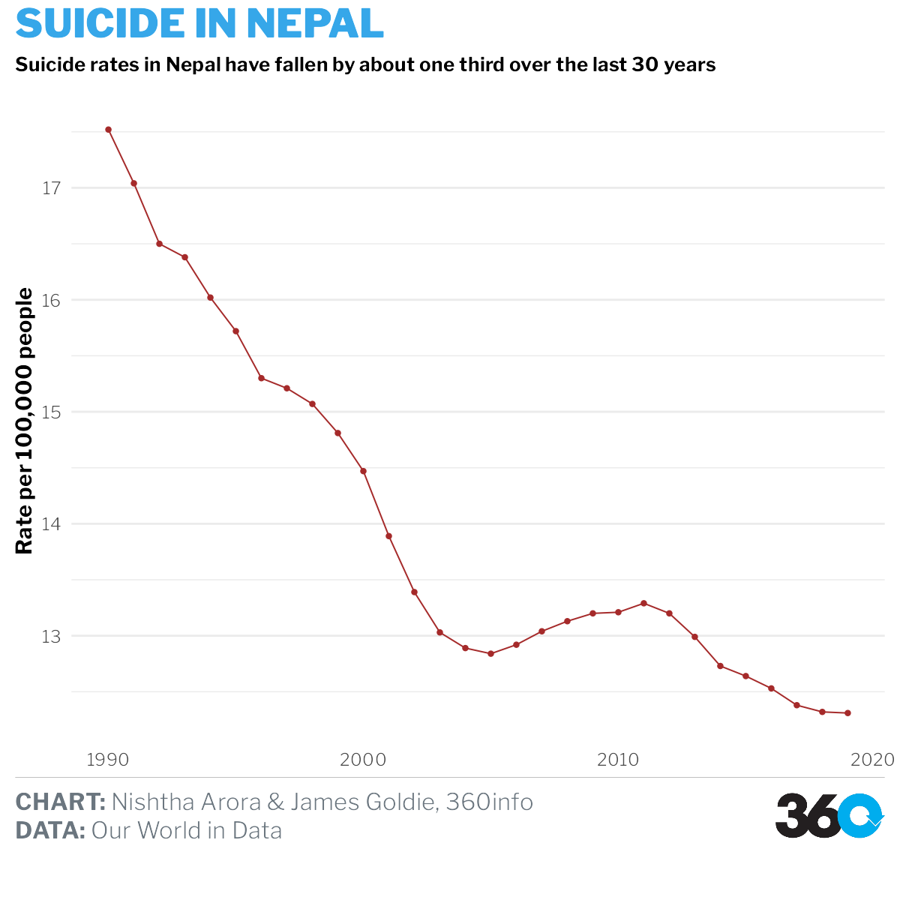

```{r setup, include=FALSE}
knitr::opts_chunk$set(echo = TRUE, message = FALSE, warning = FALSE, fig.width=12, fig.height=8)
```

# Data sources 
https://ourworldindata.org/suicide

https://data.worldbank.org/indicator/SH.STA.SUIC.P5?locations=IN


```{r libraries}
library(readxl)
library(tidyverse)
library(hrbrthemes)
library(ggthemes)
library(lubridate)
library(sf)
# library(gridExtra)
library(rgeos)
library(themes360info)
```

```{r}
suicide_rates <- read_csv("data/InitialA1/suicide-death-rates.csv")

india_suicide_rates <- suicide_rates %>%
  filter(Entity == "India") %>%
  filter(Year > 1999)

plot_india <- ggplot(india_suicide_rates, aes(x = Year, y = `Deaths - Self-harm - Sex: Both - Age: Age-standardized (Rate)`)) +
  geom_line(color="brown") +
  geom_point(color = "brown", size = 1.5) +
  geom_vline(xintercept = 2017, linetype = "dashed") +
  # geom(aes(x = 2005, y = 18.5, label = "Suicide Rate", colour = "Black")) +
  # scale_x_continuous(breaks = seq(from = 2000, to = 2019, by = 1)) +
  # scale_color_manual(values = c("brown", "purple", "black")) +
  labs(
    x = NULL,
    y = "Rate per 100,000 people",
    title = "SUICIDE IN INDIA",
    subtitle="Suicide rates in India have fallen by about one third over the last 20 years",
    caption = paste(
      "**CHART:** Nishtha Arora & James Goldie, 360info",
      "**DATA:** Our World in Data",
      sep = "<br>"
      )
  ) +
  theme_360()+
  theme(
    legend.position = "none",
    axis.title = element_text(face = "bold"),
     panel.grid.major.x = element_blank(),
        panel.grid.minor.x = element_blank(),
    
    )+
  theme( panel.grid.major.x = element_blank(),
        panel.grid.minor.x = element_blank() )+
    annotate_360_light(x = 2016.9, y = 20, label = paste( "Suicide rates slightly increased",
    "after the introduction of the ",
                                                          "Mental Healthcare Act
                                                          in 2017.",
                  sep="<br>")
               ,hjust=1, size=5)

save_360plot(plot_india, "indiatimeseries.pdf")
knitr::include_graphics("indiatimeseries.png")
```

#Plot 2
https://data.gov.in/catalog/stateut-wise-distribution-suicides-causes
http://www.diva-gis.org/datadown

```{r}
india_regional_2014 <-
  read_excel("data/map/datafile.xls") %>%
  select(`States/UTs`, `Grand Total`) %>%
  group_by(`States/UTs`) %>%
  summarise(Average_suicide_rate = mean(`Grand Total`)) %>%
  filter(str_detect(`States/UTs`, "Total ", negate = TRUE)) %>%
  mutate(id = seq.int(nrow(.)))
```

```{r}
states_shape_sf <- read_sf("data/map/IND_adm/IND_adm1.shp")
states_merged <- inner_join(states_shape_sf, india_regional_2014,
  by = c("ID_1" = "id"))
```

```{r}
# map_india <- ggplot() +
#   geom_sf(
#     aes(fill = Average_suicide_rate),
#     data = states_merged,
#     color = "black",
#     linewidth = 0.25
#   ) +
#   theme_360()+
#   labs(
#     title = "Region Map: India",
#     caption = paste(
#       "**CHART:** Nishtha Arora & James Goldie, 360info",
#       "**DATA:** [some data source here]",
#       sep = "</br>"))
#   coord_sf() +
#   scale_fill_gradient(name = "Suicide Rate", low = "white", high = "red") +
#   labs(title = "Region-wise 2014 data:India")
# geom_text(data=cnames, aes(long, lat, label = id), size=3, fontface="bold")
# 
# save_360plot(map_india, "indiamap.png")
# knitr::include_graphics("indiamap.png")
```

## Nepal

```{r}
nepal <- suicide_rates %>% filter(Entity == "Nepal") 

# ggplot(nepal, aes(x=Year, y=`Deaths - Self-harm - Sex: Both - Age: Age-standardized (Rate)`))+
#   geom_line()+
#   ylab(substitute(paste(bold("Rate per 100,000 people"))))+
#   xlab(NULL)+
#   geom_point(color="brown", size=1.5)+
#   ggtitle("Time-series for Nepal, 1990-2019")+
#  theme_economist()+
#    theme(plot.title = element_text(size=14, lineheight=.8))+
# 
#   geom_vline(xintercept = 2005, linetype = "dashed")+
#   scale_x_continuous(breaks = seq(from= 1990,to=2019, by =1 ))+
# scale_color_manual(values=c('Brown','Purple', 'Black'))+
#   theme(legend.position = "none")+
#   theme(text = element_text(size=8),
#         axis.text.x = element_text(angle=45, hjust=1),
#       plot.title = element_text(size=14, lineheight=8))
```

```{r}
plot_nepal <- ggplot(nepal, aes(x = Year, y = `Deaths - Self-harm - Sex: Both - Age: Age-standardized (Rate)`)) +
  geom_line(color="brown") +
  geom_point(color = "brown", size = 1.5) +
  # geom_vline(xintercept = 2007, linetype = "dashed") +
  # geom(aes(x = 2005, y = 18.5, label = "Suicide Rate", colour = "Black")) +
  # scale_x_continuous(breaks = seq(from = 2000, to = 2019, by = 1)) +
  # scale_color_manual(values = c("brown", "purple", "black")) +
  labs(
    x = NULL,
    y = "Rate per 100,000 people",
    title = "SUICIDE IN NEPAL",
    subtitle="Suicide rates in Nepal have fallen by about one third over the last 30 years",
    caption = paste(
      "**CHART:** Nishtha Arora & James Goldie, 360info",
      "**DATA:** Our World in Data",
      sep = "<br>"
      )
  ) +
  theme_360()+
  theme(
    legend.position = "none",
    axis.title = element_text(face = "bold"),
     panel.grid.major.x = element_blank(),
        panel.grid.minor.x = element_blank(),
    
    )+
  theme( panel.grid.major.x = element_blank(),
        panel.grid.minor.x = element_blank() )
    # annotate_360_light(x = 2015, y = 20, label = "something",hjust=1, size=7)

save_360plot(plot_nepal, "nepaltimeseries.pdf")

```

