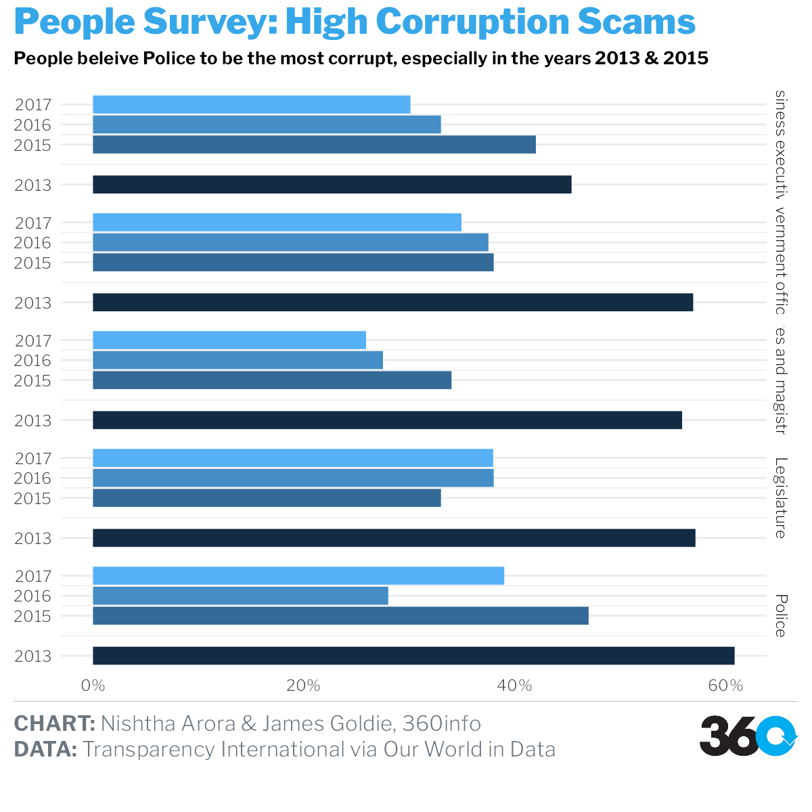
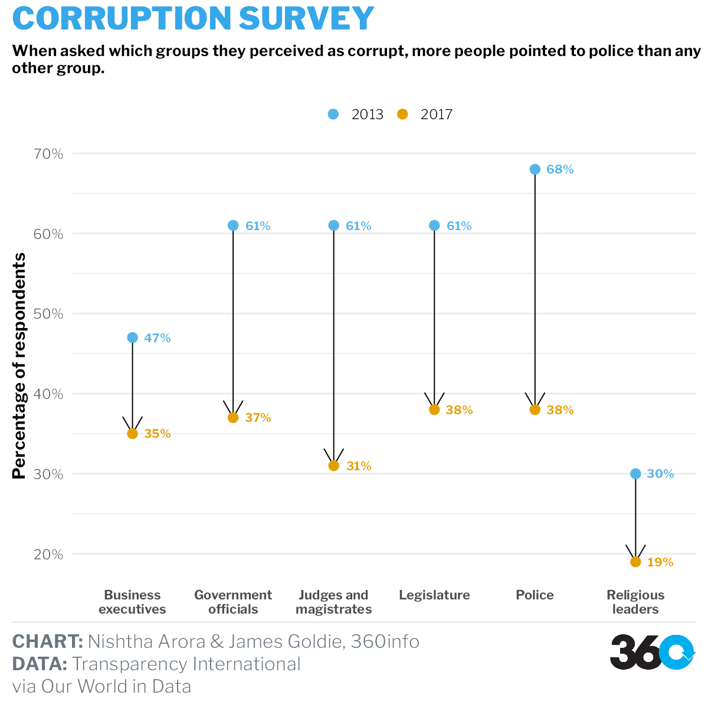

```{r setup, include=FALSE}
knitr::opts_chunk$set(echo = TRUE, message=FALSE, warning=FALSE)
```

```{r loading_libraries}
library(readxl)
library(themes360info)
library(readr)
library(readxl)
library(tidyverse)
library(lubridate)
library(ggthemes)
library(scales)
```

# Visualization 1 & 2

## HIGH CORRUPTION COUNTS GLOBALLY

### Data source:

- UNODC: https://dataunodc.un.org/dp-crime-corruption-offences

```{r daya_unodc_plot1,2}
corruption_UNODC <-
  read_excel("data/policingthepolice/data_cts_corruption_and_economic_crime.xlsx") |> slice(-c(1, 2))
colnames(corruption_UNODC) <-
  c(
    'Iso3_code',
    'Country',
    'Region',
    'Subregion',
    'Indicator',
    'Dimension',
    'Category',
    'Sex',
    'Age',
    'Year',
    'Unit of measurement',
    'VALUE',
    'Source'
  )

data_clean <- corruption_UNODC |>
  filter(`Unit of measurement` == "Counts") |>
  select(Iso3_code, Country, Category, VALUE, Year) |>
  filter(Category %in% c("Corruption")) |>
  mutate(VALUE = as.numeric(VALUE))

plot_global <- data_clean |>
  group_by(Country) |>
  summarise(VALUE = mean(VALUE)) |>
  arrange(desc(VALUE)) |>
  head(10) |>
  mutate(ToHighlight = ifelse(VALUE > 30000, "yes", "no")) |>
  ggplot(aes(reorder(x = Country,-VALUE), y = VALUE, fill = ToHighlight)) +
  geom_col() +
  theme(legend.position = "none") +
  theme_dark() +
  ggtitle("Average corruption count, 2013-2021") +
  xlab("Country") +
  ylab("Corruption Count") +
  theme(
    plot.title = element_text(face = "bold", size = 18),
    axis.title.x = element_text(face = "bold"),
    axis.title.y = element_text(face = "bold"),
    legend.position = "none"
  ) +
  scale_fill_manual(values = c("yes" = "#57AFD5", "no" = "lightblue"))
plot_global

plot_usa <- data_clean |>
  filter(Country == "United States of America") |>
  mutate(Year = as.Date(as.character(Year), format = "%Y"),
         Year = year(Year)) |>
  ggplot(aes(x = Year, y = VALUE)) +
  geom_col(fill = "lightblue", width = 0.4) +
  geom_line(size = 1, colour = "#811B0F") +
  ggtitle("Corruption Count: USA") +
  ylab("Corruption Count") +
  theme_dark() +
  theme(
    plot.title = element_text(face = "bold", size = 15),
    axis.title.x = element_text(face = "bold"),
    axis.title.y = element_text(face = "bold")
  )
plot_usa
```

# Visualization 3 & 11

## PERCEPTION OF CORRUPTION SURVEY, 2013-2017

### Data source:

- OWID (Our World in Data): https://ourworldindata.org/corruption

```{r}
OWID_police_perc <-
  read_csv("data/policingthepolice/perception-of-corruption-by-institution.csv") 

owid_facet <- OWID_police_perc |>
  mutate_if(is.numeric, ~replace(., is.na(.), 0)) |>
  group_by(Year) |>
  summarise_if(is.numeric, mean)  |>
  pivot_longer(cols = -Year, names_to = "Institution", values_to = "Count") |>
  mutate(Count= Count/100) |>
filter(Institution %in% c("Police", "Legislature", "Judges and magistrates", "Government officials", "Business executives"))

# world <- OWID_police_perc |>
#   slice(130,131)

world <- OWID_police_perc |> 
  filter(Entity == "World") |> 
  group_by(Year) |> 
  summarise_if(is.numeric, mean) |> 
  pivot_longer(cols = -Year, names_to = "Institution", values_to = "Count") |> 
  na.omit()
```


```{r data_owid_plot3}

OWID_police <- OWID_police_perc |> 
  summarise_if(is.numeric, mean, na.rm = TRUE) |> select(-c(Year))


#transpose of the data
t_data_OWID <- data.frame(t(OWID_police)) |>
  rename(Count = t.OWID_police.)


ggplot(t_data_OWID, aes(
  x = reorder(rownames(t_data_OWID),-Count),
  y = Count,
  fill = rownames(t_data_OWID)
)) +
  geom_col() +
  theme(legend.position = "none") +
  theme(axis.text.x = element_text(
    color = "#993333",
    angle = 20,
    size = 10
  )) +
  ggtitle("Global Perception of corruption by institution, 2013-2017") +
  xlab("Institution") +
  scale_fill_manual(
    values = c(
      "#C9BE4E",
      "#478934",
      "#5CD2FF",
      "#5C7077",
      "#C898DC",
      "#B23F1D",
      "#C25B7E",
      "#AE95CA",
      "#7C213D",
      "#09A2E5"
    )
  )
```

```{r plot11}
ggplot(owid_facet, aes( x = Count, y = Institution, fill=Institution))+
  geom_col()+
  facet_wrap( ~ Year, ncol = 2)+
  theme(legend.position = "none")+
  scale_x_continuous(labels = scales::percent)+
  scale_fill_manual(
    values = c(
      "#C9BE4E",
      "#478934",
      "#5CD2FF",
      "#5C7077",
      "#C898DC",
      "#B23F1D",
      "#C25B7E",
      "#AE95CA",
      "#7C213D",
      "#09A2E5"
    ))
```

```{r plot12}
plot_police <- ggplot(owid_facet, aes( y = Count, x = Year, fill=Year))+
  geom_col()+

  facet_grid(rows = vars(Institution),
             labeller = label_wrap_gen(multi_line = TRUE))+
  theme(legend.position = "none")+
  coord_flip()+
  scale_x_continuous(breaks = c(2013,2015, 2016, 2017))+
   scale_y_continuous(labels = scales::percent)+
  labs(
    y = NULL,
    x = NULL,
    title = "People Survey: High Corruption Scams",
    subtitle = "People beleive Police to be the most corrupt, especially in the years 2013 & 2015",
    caption = paste(
      "**CHART:** Nishtha Arora & James Goldie, 360info",
      "**DATA:** Transparency International via Our World in Data",
      sep = "<br>"
    )
  )+
  theme_360() +
  theme(
    legend.position = "none",
    axis.title = element_text(face = "bold"),
    panel.grid.major.x = element_blank(),
    panel.grid.minor.x = element_blank()
  )

save_360plot(plot_police, "police.png")

```

```{r plot13}
b_2013<-world %>% filter(Year == "2013")
c_2017<-world %>% filter(Year == "2017") |>
  filter(Institution %in% c("Police", "Government officials", "Legislature", "Business executives", "Judges and magistrates", "Religious leaders"))

b_2013$Institution<-as.factor(b_2013$Institution)
c_2017$Institution<-as.factor(c_2017$Institution)

d_1317<-merge(b_2013,c_2017, by.x=c("Institution"), by.y = c("Institution"))

e<-d_1317 %>%
  mutate("diff"=pmin(Count.x-Count.y)) %>%
  arrange(diff)
d_1317$Institution<-factor(d_1317$Institution,  e$Institution)

chapters <-  c("a","a","a","b","b","b")
d_1317 <- cbind(e, chapters)


library(dumbbell)
dumbbell(xdf=d_1317,id = "Institution",key="chapters",column1 = "Count.x",column2 = "Count.y",
         lab1 = "2013",lab2 = "2017", delt=1, expandx = 0.1, col_lab1 = "blue", col_lab2 = "red", pt_val = 1,
         arrow = 1, arrow_size = 0.2, segsize = 0.7,
    pointsize = 1.5, col_seg1 = "#A9A9A9", col_seg2 = "#A9A9A9") +
  coord_flip()
```

```{r plot14}
plot3 <- world |> 
  mutate(Count=Count/100) |> 
  filter(Institution %in% c("Police", "Government officials", "Legislature", "Business executives", "Judges and magistrates", "Religious leaders")) |> 
  ggplot() +
  aes(x = Institution) +
  geom_line(
    aes(y = Count, group = Institution),
    arrow = grid::arrow()
  ) +
  geom_point(aes(y = Count, colour = as.factor(Year)), size = 3) +
  labs(
    y = "Survey Respondents",
    x = NULL,
    title = "People Survey: High Corruption Scams",
    subtitle = "People believe Police to be the most corrupt, especially in 2013, i.e. about 68%.",
    caption = paste(
      "**CHART:** Nishtha Arora & James Goldie, 360info",
      "**DATA:** Transparency International", 
      "     via Our World in Data",
      sep = "<br>"
    )
  )+
  theme_360() +
  theme(
    axis.title = element_text(face = "bold"),
    panel.grid.major.x = element_blank(),
    panel.grid.minor.x = element_blank(),
    axis.text.x = element_text(
      color = "#993333",
      angle = 45,
      size = 10,
      face="bold"
    )
  )+
  labs(colour="Year")+
  scale_y_continuous(labels = scales::percent)


save_360plot(plot3, "police_2.png")

  
```

# Visualization 4 & 5

## FATAL ENCOUNTER IN USA, 2015-2022

### Data Sources:

- https://www.washingtonpost.com/graphics/investigations/police-shootings-database/

-https://github.com/washingtonpost/data-police-shootings/tree/master/v1

- https://www2.census.gov/programs-surveys/popest/datasets/2010-2020/counties/totals/

- https://www2.census.gov/programs-surveys/popest/datasets/2020-2022/counties/totals/

-https://github.com/jasonong/List-of-US-States/blob/master/states.csv

```{r data_wrangling}

options(scipen = 999)

co_est2020 <- read_csv("data/policingthepolice/co-est2020.csv") |> 
  select(-c(SUMLEV, REGION, DIVISION, STATE, COUNTY, CTYNAME, CENSUS2010POP, ESTIMATESBASE2010, POPESTIMATE042020, POPESTIMATE2011, POPESTIMATE2012,POPESTIMATE2013, POPESTIMATE2014, POPESTIMATE2010)) |> 
  group_by(STNAME) |> 
   # summarise(summarise_if(is.numeric, mean))
  summarise(`2015`=mean(POPESTIMATE2015),
            `2016`=mean(POPESTIMATE2016),
            `2017`=mean(POPESTIMATE2017),
            `2018`=mean(POPESTIMATE2018),
            `2019`=mean(POPESTIMATE2019),
            `2020`=mean(POPESTIMATE2020)
            ) 

co_est2022_alldata <- read_csv("data/policingthepolice/co-est2022-alldata.csv") |> 
    select(STNAME, POPESTIMATE2021, POPESTIMATE2022) |> 
  group_by(STNAME) |> 
  summarise(`2021`=mean(POPESTIMATE2021),
            `2022`=mean(POPESTIMATE2022)
            ) |> 
   select(-c(STNAME))

bind_pop <- cbind(co_est2020, co_est2022_alldata) |> 
  pivot_longer(cols = 2:9, names_to = 'year', values_to = 'population') |> 
  rename(state_name=STNAME) |> 
  mutate(year=as.numeric(year))

states <- read_csv("data/policingthepolice/states.csv") |> 
  rename(state_name=State,
         state=Abbreviation)

fatal_police_shootings_data <-
  read_csv("data/policingthepolice/fatal-police-shootings-data.csv") |>
  mutate(year = year(date)) |>
  select(gender, race, city, state, year)

state_shooting <- left_join(fatal_police_shootings_data, states, by= "state") |> 
select(-c(state,city)) |> 
   group_by(year, state_name) |>
  summarise(count = n())

join_pop_killings <- full_join(bind_pop, state_shooting, by=c("state_name", "year")) |> 
  mutate(rate=(count/population)*100000) |> 
  select(-c(population, count)) |> 
  group_by(state_name) |> 
  summarise(rate=mean(rate)) |> 
  arrange(desc(rate)) |> 
  head(10)
  
#rate per 100,000 population |

```


```{r data_us_plot4,5}
  ggplot( join_pop_killings, aes(x = state_name, y = rate)) +
  geom_segment(aes(
    x = reorder(state_name,-rate),
    xend = state_name,
    y = 0,
    yend = rate
  )) +
  geom_point(
    size = 6,
    color = "#6F0269",
    fill = alpha("#074B1D", 0.3),
    alpha = 0.7,
    shape = 21,
    stroke = 2
  ) +
  theme_wsj() +
  ggtitle("USA States with Highest Police Shootings, 2015-2022")

```

# Visualization 6 & 7

## REGESTERED CASES AGAINST POLICE VS ARRESTED, 2017-2020

### NCRB 

- https://ncrb.gov.in/en/crime-in-india-table-addtional-table-and-chapter-contents?page=21

```{r data_india_bind}
Table_16A_5_0 <-
  read_excel("data/policingthepolice/castagainstpolicep/Table 16A.5_0.xlsx") |>
  slice(-c(1, 2, 3, 4, 5, 35, 36, 44, 45, 46, 47)) |>
  add_column(Year = "2018")
colnames(Table_16A_5_0) <-
  c(
    'S. No.',
    'State/UT',
    'Registered Cases',
    'Quashed/ Stayed by Court',
    'Charge-sheeted cases',
    'Final Report Submitted',
    'Arrested',
    ' Charge-sheeted police',
    'Cases With-drawn/ Disposed Off',
    'Trials were Completed',
    ' Convicted',
    'Acquitted or Discharged',
    'Year'
  )

Table_16A_5_1 <-
  read_excel("data/policingthepolice/castagainstpolicep/Table 16A.5_1.xlsx") |>
  slice(-c(1, 2, 3, 4, 5, 35, 36, 44, 45, 46, 47)) |>
  add_column(Year = "2017")
colnames(Table_16A_5_1) <-
  c(
    'S. No.',
    'State/UT',
    'Registered Cases',
    'Quashed/ Stayed by Court',
    'Charge-sheeted cases',
    'Final Report Submitted',
    'Arrested',
    ' Charge-sheeted police',
    'Cases With-drawn/ Disposed Off',
    'Trials were Completed',
    ' Convicted',
    'Acquitted or Discharged',
    'Year'
  )

Table_16A_5_2 <-
  read_excel("data/policingthepolice/castagainstpolicep/Table 16A.5-2.xlsx") |>
  slice(-c(1, 2, 3, 4, 5, 34, 35, 44, 45, 46, 47)) |>
  add_column(Year = "2020")
colnames(Table_16A_5_2) <-
  c(
    'S. No.',
    'State/UT',
    'Registered Cases',
    'Quashed/ Stayed by Court',
    'Charge-sheeted cases',
    'Final Report Submitted',
    'Arrested',
    ' Charge-sheeted police',
    'Cases With-drawn/ Disposed Off',
    'Trials were Completed',
    ' Convicted',
    'Acquitted or Discharged',
    'Year'
  )

Table_16A_5 <-
  read_excel("data/policingthepolice/castagainstpolicep/Table 16A.5.xlsx") |>
  slice(-c(1, 2, 3, 4, 5, 35, 36, 44, 45, 46, 47)) |>
  add_column(Year = "2019")
colnames(Table_16A_5) <-
  c(
    'S. No.',
    'State/UT',
    'Registered Cases',
    'Quashed/ Stayed by Court',
    'Charge-sheeted cases',
    'Final Report Submitted',
    'Arrested',
    ' Charge-sheeted police',
    'Cases With-drawn/ Disposed Off',
    'Trials were Completed',
    ' Convicted',
    'Acquitted or Discharged',
    'Year'
  )

options(digits = 2)

data_policecases <-
  rbind(Table_16A_5_0, Table_16A_5_1, Table_16A_5_2, Table_16A_5) |>
  mutate(Arrested = as.numeric(Arrested),
         `Registered Cases` = as.numeric(`Registered Cases`)) |>
  select(`State/UT`, `Registered Cases`, Arrested, Year) |>
  mutate(
    sum = rowSums(across(where(is.numeric))),
    percentage_arrested = (Arrested / sum) * 100,
    `State/UT` = trimws(`State/UT`),
    `State/UT` = recode(`State/UT`,
                        "Delhi UT" = "Delhi")
  ) |>
  select(-c(sum)) 
```
  
```{r plot6}
plot6_percentage <- data_policecases |>
  filter(Year == "2020") |>
  arrange(desc(`Registered Cases`)) |>
  head(15) |>
  mutate(`State/UT` = factor(`State/UT`, `State/UT`)) |>
  ggplot(
    aes(
      x = `Registered Cases`,
      y = percentage_arrested,
      size = `Registered Cases`,
      fill = `State/UT`
    )
  ) +
  geom_point(alpha = 0.5,
             shape = 21,
             color = "black") +
  scale_size(range = c(.1, 24), name = "No. of police Personnel Arrested") +
  ggtitle("Top 15 States with Highest Registeres Cases, 2020") +
  ylab("Percentage of Police arrested out of Registered Cases") +
  theme_classic()
plot6_percentage
```

```{r karnataka_plot7}
plot7_kar <- data_policecases |>
  filter(`State/UT` == "Karnataka") |>
  ggplot() +
  geom_col(aes(x = reorder(Year,-`Registered Cases`), y = `Registered Cases`), fill = "#86BCD9") +
  geom_col(aes(x = Year, y = Arrested), fill = "#E95E5E") +
  ggtitle("Registered Cases vs Police Arrested: Karnataka") +
  ylab("Regestered Cases & Arrested (Red") +
  xlab("Year") +
  theme_minimal() +
  annotate("text",
           x = 1,
           y = 10,
           label = "12% Arrested") +
  annotate("text",
           x = 3,
           y = 8,
           label = "34% Arrested")

plot7_kar 
```

# Visualization 8

## EUROPE TRUST IN POLICE (RATING), 2013

### Data and Viz Source:

-OWID: https://ourworldindata.org/grapher/trust-in-others-vs-trust-in-police

```{r plot8}
options(scipen = 999)
europe_trust_in_police <-
  read_csv("data/policingthepolice/trust-in-others-vs-trust-in-police.csv") |>
  na.omit()

ggplot(
  europe_trust_in_police,
  aes(y = `GDP per capita, PPP (constant 2017 international $)`, x = `Trust in police (Eurostat (2015))`)
) +
  geom_point() +
  geom_smooth(method = lm, se = FALSE) +
  annotate("text",
           x = 6,
           y = 110000,
           label = "Luxembourg") +
  annotate("text",
           x = 7.4,
           y = 69877,
           label = "Switzerland") +
  annotate("text",
           x = 6.4,
           y = 45000,
           label = "UK") +
  theme_bw()
```


# Visualization 9- ASK

## FINACIAL RESERVE UK 2018

### Data source:

- https://data.police.uk/data/open-data/

```{r plot9}
Police_reserves_data_2018 <-
  read_csv("data/policingthepolice/financial_reserves_data/Police reserves data 2018.csv") |>
  slice(-c(1, 2, 3, 4, 47, 48, 49, 50, 51, 52, 53, 54)) 
```


# Visualization 10

## PHILLIPPINES DRUG WAR CASUALITIES

### Data source:

-  https://data.world/stabile-center/ph-drug-war#

```{r plot10}
PH_data <- read_excel("data/policingthepolice/PH data.xlsx") |>
  filter(`Type of killing` == "Police killing") |>
  mutate(Date = as.Date(Date, format = "%Y")) |>
  select(City, `Type of killing`, Date) |>
  group_by(City, Date) |>
  summarise(count = n())

ggplot(PH_data, aes(x = Date, y = count, fill = City)) +
  geom_bar(stat = "identity",
           position = position_dodge(),
           alpha = 0.75) +
  ggtitle("Phillippines Drug War Police Killings") +
  ylab("People Killed") +
  theme_economist() +
  scale_fill_economist() +
  theme(axis.title.x = element_text(face = "bold"),
        axis.title.y = element_text(face = "bold")) +
  scale_x_date(breaks = date_breaks("years"),
               labels = date_format("20%y"))
```


# Reference

Basic question for plotting x axis using row.names. (n.d.). Google Groups. https://groups.google.com/g/ggplot2/c/UkmDYDcRNWc?pli=1

Chang, W. (2023, May 28). 7.1 Adding Text Annotations | R Graphics Cookbook, 2nd edition. https://r-graphics.org/recipe-annotate-text

Combine two data frames with the same column names. (n.d.). Stack Overflow. https://stackoverflow.com/questions/20081256/combine-two-data-frames-with-the-same-column-names

Crime in India Table Contents |  National Crime Records Bureau. (n.d.). https://ncrb.gov.in/en/crime-in-india-table-addtional-table-and-chapter-contents?field_date_value%5Bvalue%5D%5Byear%5D=&field_select_table_title_of_crim_value=18&items_per_page=All

Formatting Decimal places in R. (n.d.). Stack Overflow. https://stackoverflow.com/questions/3443687/formatting-decimal-places-in-r

GeeksforGeeks. (2021). Change column name of a given DataFrame in R. GeeksforGeeks. https://www.geeksforgeeks.org/change-column-name-of-a-given-dataframe-in-r/

ggplot2 axis scales and transformations - Easy Guides - Wiki - STHDA. (n.d.). http://www.sthda.com/english/wiki/ggplot2-axis-scales-and-transformations

ggplot2 scatter plots : Quick start guide - R software and data visualization - Easy Guides - Wiki - STHDA. (n.d.). http://www.sthda.com/english/wiki/ggplot2-scatter-plots-quick-start-guide-r-software-and-data-visualization

Highlight a single “bar” in ggplot. (n.d.). Stack Overflow. https://stackoverflow.com/questions/45820250/highlight-a-single-bar-in-ggplot

how to add lines over a column bar graph where the lines pass by the middle-top of the bars considering bars with position=’dodge’? (n.d.). Stack Overflow. https://stackoverflow.com/questions/72116660/how-to-add-lines-over-a-column-bar-graph-where-the-lines-pass-by-the-middle-top

Plot data in descending order as appears in data frame. (n.d.). Stack Overflow. https://stackoverflow.com/questions/16961921/plot-data-in-descending-order-as-appears-in-data-frame

Side By Side Bar Graphs In R & ggplot2. (n.d.). https://dk81.github.io/dkmathstats_site/rvisual-sidebyside-bar.html

Sum across multiple columns with dplyr. (n.d.). Stack Overflow. https://stackoverflow.com/questions/28873057/sum-across-multiple-columns-with-dplyr