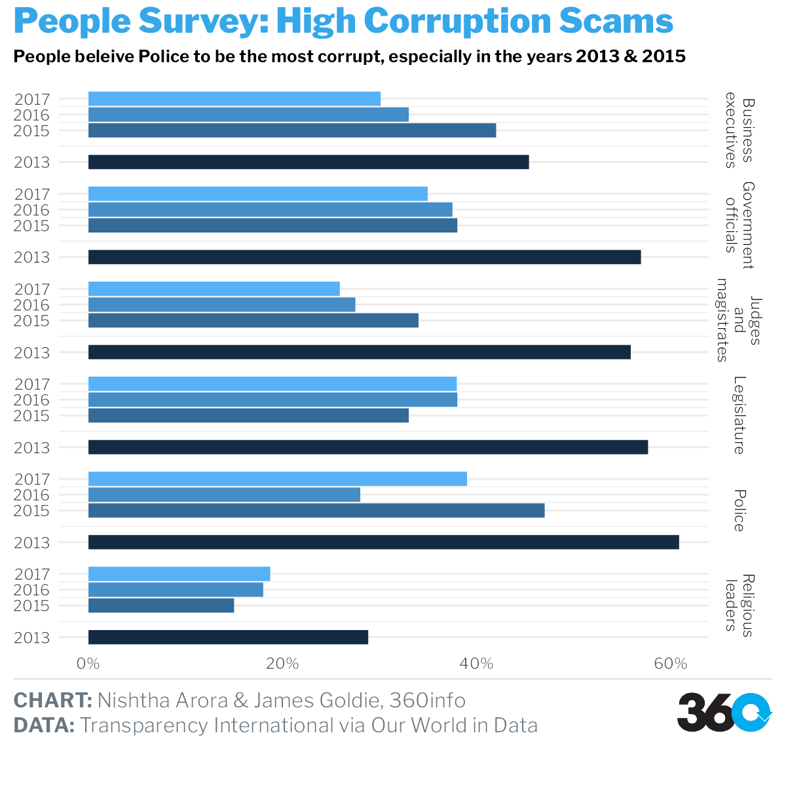
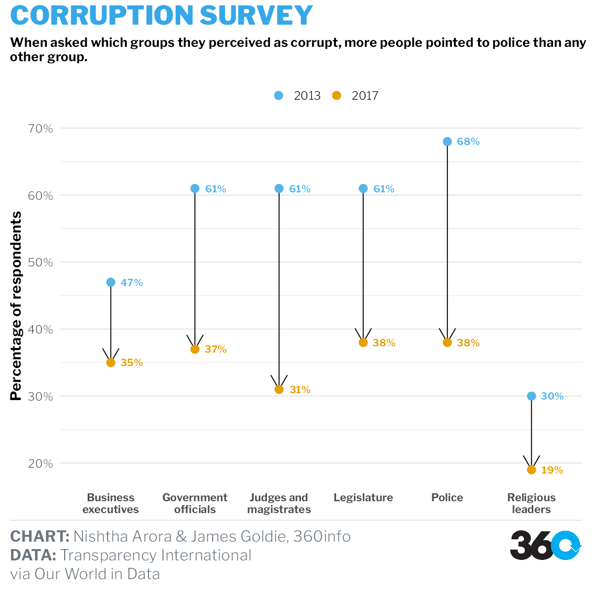

```{r setup, include=FALSE}
knitr::opts_chunk$set(echo = TRUE, message=FALSE, warning=FALSE)
```

```{r loading_libraries}
library(readxl)
library(themes360info)
library(readr)
library(readxl)
library(tidyverse)
library(lubridate)
library(ggthemes)
library(scales)
library(dumbbell)
library(RColorBrewer)
```

# Visualization 1 & 2

## HIGH CORRUPTION COUNTS GLOBALLY

### Data source:

- UNODC: https://dataunodc.un.org/dp-crime-corruption-offences

```{r data_unodc}
corruption_UNODC <-
  read_excel("data/policingthepolice/data_cts_corruption_and_economic_crime.xlsx") |>
  slice(-c(1, 2)) |>
  set_names(c( #colnames changed to setnames
    "Iso3_code",
    "Country",
    "Region",
    "Subregion",
    "Indicator",
    "Dimension",
    "Category",
    "Sex",
    "Age",
    "Year",
    "Unit of measurement",
    "VALUE",
    "Source"
  ))

corruption_UNODC_clean <- corruption_UNODC |>#use better dataset names
  filter(`Unit of measurement` == "Counts") |>
  select(Iso3_code, Country, Category, VALUE, Year) |>
  filter(Category %in% c("Corruption")) |>
  mutate(VALUE = as.numeric(VALUE))

plot_global <- corruption_UNODC_clean |>
  group_by(Country) |>
  summarise(VALUE = mean(VALUE)) |>
  arrange(desc(VALUE)) |>
  head(10) |>
  mutate(ToHighlight = ifelse(VALUE > 30000, "yes", "no"))
```

```{r plot1}

write_csv(plot_global, "data/presentation/visualization9.csv")

plot_global  |>
  ggplot(aes(reorder(x = Country,-VALUE), y = VALUE, fill = ToHighlight)) +
  geom_col() +
  theme(legend.position = "none") +
  theme_dark() +
  ggtitle("Average corruption count, 2013-2021") +
  xlab("Country") +
  ylab("Corruption Count") +
  theme(
    plot.title = element_text(face = "bold", size = 18),
    axis.title.x = element_text(face = "bold"),
    axis.title.y = element_text(face = "bold"),
      axis.text.x = element_text(angle = 35, face = "bold"),
    legend.position = "none"
  ) +
  scale_fill_manual(values = c("yes" = "#57AFD5", "no" = "lightblue"))

```

```{r data_clean_2}

plot_usa <- corruption_UNODC_clean |>
  filter(Country == "United States of America") |>
  mutate(
    Year = as.Date(as.character(Year), format = "%Y"),
         Year = year(Year)
    ) 

```

```{r plot2}
write_csv(plot_usa, "data/presentation/visualization10.csv")

plot_usa |>
  ggplot(aes(x = Year, y = VALUE)) +
  geom_col(fill = "lightblue", width = 0.4) +
  geom_line(size = 1, colour = "#811B0F") +
  ggtitle("Corruption Count: USA") +
  ylab("Corruption Count") +
  theme_dark() +
  theme(
    plot.title = element_text(face = "bold", size = 15),
    axis.title.x = element_text(face = "bold"),
    axis.title.y = element_text(face = "bold")
  )
```

# Visualization 3 

## PERCEPTION OF CORRUPTION SURVEY, 2013-2017

### Data source:

- OWID (Our World in Data): https://ourworldindata.org/corruption

```{r data_owid}
 
OWID_police <-
  read_csv("data/policingthepolice/perception-of-corruption-by-institution.csv") |>
  group_by(Year) |>
  summarise_if(is.numeric, mean, na.rm = TRUE) |>
  pivot_longer(cols = -Year, names_to = "Institution", values_to = "Count") |>
  ungroup() #added

# sum counts across all years
OWID_police_allyears <-
  OWID_police |>
  group_by(Institution) |>
  summarise(Count = sum(Count, na.rm = TRUE)) |> #sum instea dof mean
  mutate(Institution = fct_reorder(Institution, Count, .desc = TRUE))

```

```{r plot3}

write_csv(OWID_police_allyears, "data/presentation/visualization11.csv")

ggplot(OWID_police_allyears, aes(
  x = Institution,
  y = Count,
  fill = Institution
)) +
  geom_col() +
  theme(axis.text.x = element_text(
    color = "#993333",
    size = 5
  )) +
  ggtitle("Global Perception of corruption by institution, 2013-2017") +
  xlab("Institution") +
  theme_minimal()+
    theme(legend.position = "none") +
  scale_fill_manual(
    values = c(
      "#C9BE4E",
      "#478934",
      "#5CD2FF",
      "#5C7077",
      "#C898DC",
      "#B23F1D",
      "#C25B7E",
      "#AE95CA",
      "#7C213D",
      "#09A2E5"
    )
  ) +
  scale_x_discrete(labels = label_wrap(12)) #instead of giving axis text an angle
```


# Visualization 4 & 5

## FATAL ENCOUNTER IN USA, 2015-2022

### Data Sources:

- https://www.washingtonpost.com/graphics/investigations/police-shootings-database/

-https://github.com/washingtonpost/data-police-shootings/tree/master/v1

- https://www2.census.gov/programs-surveys/popest/datasets/2010-2020/counties/totals/

- https://www2.census.gov/programs-surveys/popest/datasets/2020-2022/counties/totals/

-https://github.com/jasonong/List-of-US-States/blob/master/states.csv

```{r data_wrangling, message=FALSE, warning=FALSE}

options(scipen = 999)

co_est2020 <- read_csv("data/policingthepolice/co-est2020.csv") |>
  select(
    -c(
      SUMLEV,
      REGION,
      DIVISION,
      STATE,
      COUNTY,
      CTYNAME,
      CENSUS2010POP,
      ESTIMATESBASE2010,
      POPESTIMATE042020,
      POPESTIMATE2011,
      POPESTIMATE2012,
      POPESTIMATE2013,
      POPESTIMATE2014,
      POPESTIMATE2010
    )
  ) |>
  group_by(STNAME) |>
  # summarise(summarise_if(is.numeric, mean))
  summarise(
    `2015` = mean(POPESTIMATE2015),
    `2016` = mean(POPESTIMATE2016),
    `2017` = mean(POPESTIMATE2017),
    `2018` = mean(POPESTIMATE2018),
    `2019` = mean(POPESTIMATE2019),
    `2020` = mean(POPESTIMATE2020)
  )

co_est2022_alldata <-
  read_csv("data/policingthepolice/co-est2022-alldata.csv") |>
  select(STNAME, POPESTIMATE2021, POPESTIMATE2022) |>
  group_by(STNAME) |>
  summarise(`2021` = mean(POPESTIMATE2021),
            `2022` = mean(POPESTIMATE2022)) |>
  select(-c(STNAME))

bind_pop <- cbind(co_est2020, co_est2022_alldata) |>
  pivot_longer(cols = 2:9,
               names_to = 'year',
               values_to = 'population') |>
  rename(state_name = STNAME) |>
  mutate(year = as.numeric(year))

states <- read_csv("data/policingthepolice/states.csv") |>
  rename(state_name = State,
         state = Abbreviation)

fatal_police_shootings_data <-
  read_csv("data/policingthepolice/fatal-police-shootings-data.csv") |>
  mutate(year = year(date)) |>
  select(gender, race, city, state, year)

state_shooting <-
  left_join(fatal_police_shootings_data, states, by = "state") |>
  select(-c(state, city)) |>
  group_by(year, state_name) |>
  summarise(count = n())

join_pop_killings <-
  full_join(bind_pop, state_shooting, by = c("state_name", "year")) |>
  mutate(rate = (count / population) * 100000) |>
  select(-c(population, count)) |>
  group_by(state_name) |>
  summarise(rate = mean(rate)) |>
  arrange(desc(rate)) |>
  head(10)

#rate per 100,000 population |

join_pop_killings <-
  full_join(bind_pop, state_shooting, by = c("state_name", "year")) |>
  mutate(rate = (count / population) * 100000) |>
  select(-c(population, count)) 

shots_usa_plot4 <- join_pop_killings |>
  group_by(year) |>
  na.omit() |>
  summarise(avg_rate = mean(rate))

shots_usa_plot5 <-  join_pop_killings |>
  group_by(state_name) |>
  summarise(rate = mean(rate)) |>
  arrange(desc(rate)) |>
  head(10) 

```


```{r data_us_plot4}

write_csv(shots_usa_plot4, "data/presentation/visualization12.csv")

shots_usa_plot4  |>
  ggplot(aes(x = year, y = avg_rate)) +
  geom_line(color = "#6F0269") +
  geom_point() +
  geom_vline(xintercept = 2021, linetype = "dashed")+
  theme_wsj() +
  ggtitle("USA Killings: 2015-2022")


```

```{r plot5}
write_csv(shots_usa_plot5, "data/presentation/visualization13.csv")

shots_usa_plot5 |>
  ggplot(aes(x = state_name, y = rate)) +
  geom_segment(aes(
    x = reorder(state_name, -rate),
    xend = state_name,
    y = 0,
    yend = rate
  )) +
  geom_point(
    size = 6,
    color = "#6F0269",
    fill = alpha("#074B1D", 0.3),
    alpha = 0.7,
    shape = 21,
    stroke = 2
  ) +
  theme_wsj() +
  theme(axis.text.x = element_text(size=8, angle = 35))+
  labs(title = "Highest Killing States",
       subtitle = "USA: 2015-2022")


```

# Visualization 6 & 7

## REGESTERED CASES AGAINST POLICE VS ARRESTED, 2017-2020

### NCRB 

- https://ncrb.gov.in/en/crime-in-india-table-addtional-table-and-chapter-contents?page=21

```{r data_india_bind}
ncrb_col_names <- c(
  #adding column names at once
  "S. No.",
  "State/UT",
  "Registered Cases",
  "Quashed/ Stayed by Court",
  "Charge-sheeted cases",
  "Final Report Submitted",
  "Arrested",
  " Charge-sheeted police",
  "Cases With-drawn/ Disposed Off",
  "Trials were Completed",
  " Convicted",
  "Acquitted or Discharged",
  "Year"
)

Table_16A_5_0 <-
  read_excel("data/policingthepolice/castagainstpolicep/Table 16A.5_0.xlsx") |>
  slice(-c(1, 2, 3, 4, 5, 35, 36, 44, 45, 46, 47)) |>
  mutate(Year = "2018") |>  #mutate instead of add_column
  set_names(ncrb_col_names) #set_name instead of colnames

Table_16A_5_1 <-
  read_excel("data/policingthepolice/castagainstpolicep/Table 16A.5_1.xlsx") |>
  slice(-c(1, 2, 3, 4, 5, 35, 36, 44, 45, 46, 47)) |>
  add_column(Year = "2017") |>
  set_names(ncrb_col_names)

Table_16A_5_2 <-
  read_excel("data/policingthepolice/castagainstpolicep/Table 16A.5-2.xlsx") |>
  slice(-c(1, 2, 3, 4, 5, 34, 35, 44, 45, 46, 47)) |>
  add_column(Year = "2020") |>
  set_names(ncrb_col_names)

Table_16A_5 <-
  read_excel("data/policingthepolice/castagainstpolicep/Table 16A.5.xlsx") |>
  slice(-c(1, 2, 3, 4, 5, 35, 36, 44, 45, 46, 47)) |>
  add_column(Year = "2019") |>
  set_names(ncrb_col_names)


options(digits = 2)

data_policecases <-
  bind_rows(Table_16A_5_0, Table_16A_5_1, Table_16A_5_2, Table_16A_5) |> #bind rows instead of rbind
  mutate(`Registered Cases` = as.numeric(`Registered Cases`),
         `Arrested` = as.numeric(`Arrested`)) |> #not comparing with anything as not sure of what variables are
  select(`State/UT`, `Registered Cases`, Year, Arrested) |> 
  mutate(`State/UT` = recode(`State/UT`, "Delhi UT" = "Delhi"))
  
plot6_india <- data_policecases |> 
  arrange(desc(`Registered Cases`)) |> 
    head(36)

plot7_kar <- data_policecases |>
  filter(`State/UT` == "Karnataka") 

```
  
```{r plot6}
write_csv(plot6_india , "data/presentation/visualization14.csv")

colourCount = length(unique(data_policecases$`State/UT`))
 plot6_india |> 
ggplot(aes( y = `Registered Cases`, x = Year, fill=`State/UT`))+
  geom_col()+
  scale_fill_manual(values = colorRampPalette(brewer.pal(15, "Set1"))(colourCount)) +
theme_calc()+
  theme(legend.position="bottom") +
  guides(fill=guide_legend(nrow=3))+
  ylab("Regestered Cases against Police")+
  ggtitle("India: States with higehst regestered cases", subtitle = " States with 100 or more cases in any/each year")

```

```{r karnataka_plot7}

write_csv(plot7_kar , "data/presentation/visualization15.csv")

plot7_kar |>
  ggplot() +
  geom_col(
    aes(
      x = reorder(Year, -`Registered Cases`),
      y = `Registered Cases`),
      fill = "#86BCD9") +
  geom_col(aes(x = Year, y = Arrested), fill = "#E95E5E") +
  ggtitle("Registered Cases vs Police Arrested: Karnataka") +
  ylab("Regestered Cases & Arrested (Red") +
  xlab("Year") +
  theme_minimal() +
  annotate("text",
    x = 1,
    y = 10,
    label = "12% Arrested"
  ) +
  annotate("text",
    x = 3,
    y = 8,
    label = "34% Arrested"
  )

```

# Visualization 8

## EUROPE TRUST IN POLICE (RATING), 2013

### Data and Viz Source:

-OWID: https://ourworldindata.org/grapher/trust-in-others-vs-trust-in-police

```{r plot8_data}
options(scipen = 999)
europe_trust_in_police <-
  read_csv("data/policingthepolice/trust-in-others-vs-trust-in-police.csv") |>
  na.omit()
```

```{r plot8}

write_csv(europe_trust_in_police , "data/presentation/visualization16.csv")

ggplot(
  europe_trust_in_police,
  aes(y = `GDP per capita, PPP (constant 2017 international $)`, x = `Trust in police (Eurostat (2015))`)
) +
  geom_point() +
  geom_smooth(method = lm, se = FALSE) +
  geom_text(
    aes(label = Entity),
    data = europe_trust_in_police |> filter(
      Entity %in% c("Luxembourg", "Switzerland", "United Kingdom")),
      nudge_y = -0.25E4) +
  theme_bw()
```


# Visualization 9

## PHILLIPPINES DRUG WAR CASUALITIES

### Data source:

-  https://data.world/stabile-center/ph-drug-war#

```{r plot9_data}
PH_data <- read_excel("data/policingthepolice/PH data.xlsx") |>
  filter(`Type of killing` == "Police killing") |>
  mutate(Date = as.Date(Date, format = "%Y")) |>
  select(City, `Type of killing`, Date) |>
  group_by(City, Date) |>
  summarise(count = n())
```

```{r plot9}
write_csv(PH_data , "data/presentation/visualization17.csv")

ggplot(PH_data, aes(x = Date, y = count, fill = City)) +
  geom_bar(
    stat = "identity",
    position = position_dodge(),
    alpha = 0.75
  ) +
  ggtitle("Phillippines Drug War Police Killings") +
  ylab("People Killed") +
  theme_economist() +
  scale_fill_economist() +
  theme(
    axis.title.x = element_text(face = "bold"),
    axis.title.y = element_text(face = "bold")
  ) +
  scale_x_date(
    breaks = date_breaks("years"),
    labels = date_format("20%y")
  )
```

# SHORT-LISTED VISHUALIZATIONS: ADDING 360 THEME

## Facet Bar graph

```{r plot10_data}

facet_plot_owid <- OWID_police |> 
   filter(Institution %in% c("Police", "Government officials", "Legislature", "Business executives", "Judges and magistrates", "Religious leaders"))
```

```{r plot10}
write_csv(facet_plot_owid , "data/presentation/visualization18.csv")

plot_police <- 
  ggplot( facet_plot_owid, aes( y = Count/100, x = Year, fill=Year))+
  geom_col()+
  facet_grid(rows = vars(Institution),
             labeller = label_wrap_gen(width = 2, multi_line = TRUE))+
  theme(legend.position = "none")+
  coord_flip()+
  scale_x_continuous(breaks = c(2013,2015, 2016, 2017))+
   scale_y_continuous(labels = scales::percent)+
  labs(
    y = NULL,
    x = NULL,
    title = "People Survey: High Corruption Scams",
    subtitle = "People beleive Police to be the most corrupt, especially in the years 2013 & 2015",
    caption = paste(
      "**CHART:** Nishtha Arora & James Goldie, 360info",
      "**DATA:** Transparency International via Our World in Data",
      sep = "<br>"
    )
  )+
  theme_360() +
  theme(
    legend.position = "none",
    axis.title = element_text(face = "bold"),
    panel.grid.major.x = element_blank(),
    panel.grid.minor.x = element_blank()
  )


save_360plot(plot_police, "graphs/police.png")

```

## Dumbbell plot

```{r plot11_data}
world_owid_police <- 
  read_csv("data/policingthepolice/perception-of-corruption-by-institution.csv") |>
filter(Entity == "World") |> 
  select(-c(Entity, Code)) |> 
  pivot_longer(cols = -Year, names_to = "Institution", values_to = "Count") |>
  ungroup() |> 
  filter(Institution %in% c("Police", "Government officials", "Legislature", "Business executives", "Judges and magistrates", "Religious leaders"))

b_2013<-world_owid_police |> 
  filter(Year == "2013")

c_2017<-world_owid_police |> 
  filter(Year == "2017") 

b_2013$Institution<-as.factor(b_2013$Institution)
c_2017$Institution<-as.factor(c_2017$Institution)

d_1317<-merge(b_2013,c_2017, by.x=c("Institution"), 
              by.y = c("Institution"))

e<-d_1317 |> 
  mutate("diff"=pmin(Count.x-Count.y)) |> 
  arrange(diff)

d_1317$Institution<-factor(d_1317$Institution,  e$Institution)

chapters <-  c("a","a","a","b","b","b")
d_1317 <- cbind(e, chapters)
```

```{r plot11}
write_csv(d_1317 , "data/presentation/visualization19.csv")

dumbbell(xdf=d_1317,id = "Institution",
         key="chapters",
         column1 = "Count.x",
         column2 = "Count.y",
         lab1 = "2013",lab2 = "2017", 
         # delt=1, 
         expandy = 0.05, 
         col_lab1 = "blue", 
         col_lab2 = "red", 
         pt_val = 1,
         arrow = 1, 
         arrow_size = 0.2, 
         segsize = 1,
    pointsize = 1.5, 
    col_seg1 = "#A9A9A9", 
    col_seg2 = "#A9A9A9") +
  coord_flip()+
   scale_y_discrete(labels = scales::label_wrap(14))

```

# FINAL VISUALIZATION OF NEED

## Dumbbell Plot using ggplot

```{r plot12_data}
plot12 <- world_owid_police |> 
  mutate(Count=Count/100) 
```

```{r plot12}
write_csv(plot12 , "data/presentation/visualization20.csv")

plot12_viz <- plot12 |> 
  ggplot(aes(label=factor(Count))) +
  aes(x = Institution, y = Count) +
  geom_line(
    aes(group = Institution),
    arrow = grid::arrow()
  ) +
  geom_point(aes(colour = as.factor(Year)), size=4) +
  geom_text(aes(label = scales::percent(Count), colour = as.factor(Year)), nudge_x = 0.25, family = "Body 360info", fontface = "bold") +
  labs(
    y = "Percentage of respondents",
    x = NULL,
    title = "CORRUPTION SURVEY",
    subtitle = str_wrap("When asked which groups they perceived as corrupt, more people pointed to police than any other group.", 90),
    caption = paste(
      "**CHART:** Nishtha Arora & James Goldie, 360info",
      "**DATA:** Transparency International", 
      "     via Our World in Data",
      sep = "<br>"
    )
  )+
  theme_360() +
  theme(
    axis.title = element_text(face = "bold"),
    panel.grid.major.x = element_blank(),
    panel.grid.minor.x = element_blank(),
    axis.text.x = element_text(
      size = 12,
      face="bold"
    ),
    legend.position = "top"
  )+
  labs(colour=NULL)+
  scale_y_continuous(labels = scales::percent)+
  scale_color_manual(values=c("#56B4E9", "#E69F00"))+
  scale_x_discrete(labels = scales::label_wrap(14))


save_360plot(plot12_viz, "graphs/police_2.png")

  
  
```

# Reference

Basic question for plotting x axis using row.names. (n.d.). Google Groups. https://groups.google.com/g/ggplot2/c/UkmDYDcRNWc?pli=1

Chang, W. (2023, May 28). 7.1 Adding Text Annotations | R Graphics Cookbook, 2nd edition. https://r-graphics.org/recipe-annotate-text

Combine two data frames with the same column names. (n.d.). Stack Overflow. https://stackoverflow.com/questions/20081256/combine-two-data-frames-with-the-same-column-names

Crime in India Table Contents |  National Crime Records Bureau. (n.d.). https://ncrb.gov.in/en/crime-in-india-table-addtional-table-and-chapter-contents?field_date_value%5Bvalue%5D%5Byear%5D=&field_select_table_title_of_crim_value=18&items_per_page=All

Formatting Decimal places in R. (n.d.). Stack Overflow. https://stackoverflow.com/questions/3443687/formatting-decimal-places-in-r

GeeksforGeeks. (2021). Change column name of a given DataFrame in R. GeeksforGeeks. https://www.geeksforgeeks.org/change-column-name-of-a-given-dataframe-in-r/

ggplot2 axis scales and transformations - Easy Guides - Wiki - STHDA. (n.d.). http://www.sthda.com/english/wiki/ggplot2-axis-scales-and-transformations

ggplot2 scatter plots : Quick start guide - R software and data visualization - Easy Guides - Wiki - STHDA. (n.d.). http://www.sthda.com/english/wiki/ggplot2-scatter-plots-quick-start-guide-r-software-and-data-visualization

Highlight a single “bar” in ggplot. (n.d.). Stack Overflow. https://stackoverflow.com/questions/45820250/highlight-a-single-bar-in-ggplot

how to add lines over a column bar graph where the lines pass by the middle-top of the bars considering bars with position=’dodge’? (n.d.). Stack Overflow. https://stackoverflow.com/questions/72116660/how-to-add-lines-over-a-column-bar-graph-where-the-lines-pass-by-the-middle-top

how to wrap text in ggplot for facet_grid labels. (n.d.). Stack Overflow. https://stackoverflow.com/questions/43796409/how-to-wrap-text-in-ggplot-for-facet-grid-labels

Kanevsky, G. (2013). How to expand color palette with ggplot and RColorBrewer | R-bloggers. R-bloggers. https://www.r-bloggers.com/2013/09/how-to-expand-color-palette-with-ggplot-and-rcolorbrewer/

Plot data in descending order as appears in data frame. (n.d.). Stack Overflow. https://stackoverflow.com/questions/16961921/plot-data-in-descending-order-as-appears-in-data-frame

Side By Side Bar Graphs In R & ggplot2. (n.d.). https://dk81.github.io/dkmathstats_site/rvisual-sidebyside-bar.html

Sum across multiple columns with dplyr. (n.d.). Stack Overflow. https://stackoverflow.com/questions/28873057/sum-across-multiple-columns-with-dplyr