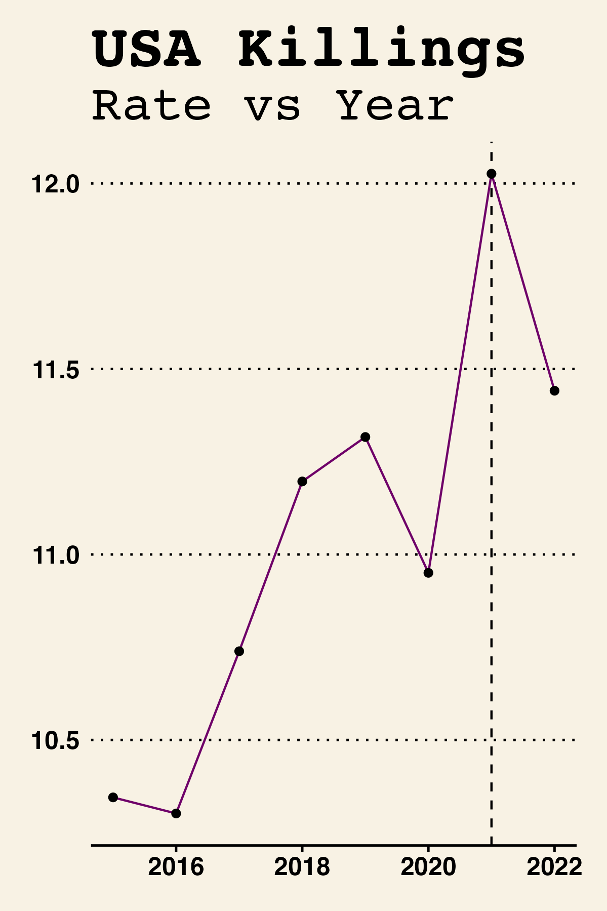
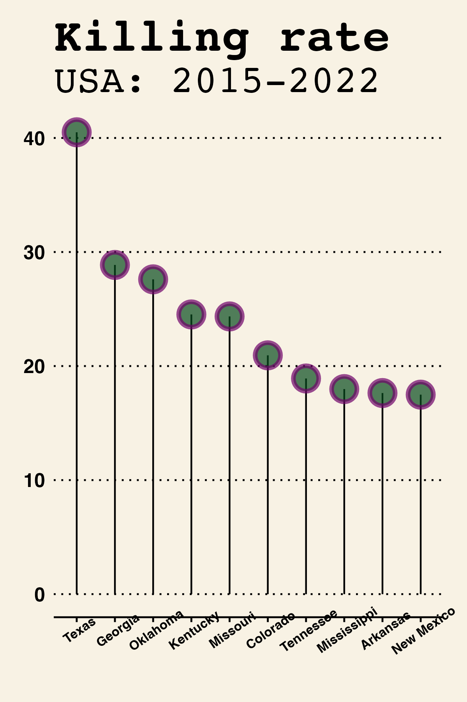

```{=openxml}
<w:p><w:r><w:br w:type="page"/></w:r></w:p>
```
\newpage

```{r setup, include=FALSE}
knitr::opts_chunk$set(cache = FALSE, warning = FALSE, message = FALSE, fig.height = 6, fig.width = 4)
```

```{r libraries, include=FALSE}
library(readr)
library(themes360info)
library(readxl)
library(tidyverse)
library(hrbrthemes)
library(ggthemes)
library(lubridate)
library(sf)
library(rgeos)
library(pdftools)
library(ggthemes)
library(scales)
library(dumbbell)
library(RColorBrewer)
library(DiagrammeR)
library(kableExtra)
```

\newpage

# About {.unnumbered}

[*360info*](https://360info.org) is a not-for-profit open access agency that provides global information regarding world's issues and provides solutions for the same. This content is forwarded to re-publishers without charge, under Creative Commons.

The content published is based on research, and each week a special report is published, focusing on a global problem, which consists of 5-10 articles covering different aspects in the problem. These articles are contributions from academics across various fields of study, depending on the article.

Each report is supported by visuals, can be images, graphics or interactives. Any story telling can be made better with a data-driven analysis along with it and hence, this internship has given me a chance to work in the data and digital story telling team, produce data visualizations, collaborating with the authors and editors.

All the published work is reproducible for media partners and is published under Creative Commons licences, which is good for art, educational and entertainment works. 360info uses Creative Commons attribution 4.0 because it allows the user's rights under the licence to be reinstated, if the user comes in compliance within 30 days of discovering that they were in violation of the rights.

Special thanks for the guidance, to the mentors for the project,  Mr. Damjan Vukcevic, Associate Professor, Monash University, Australia and Mr. James Goldie, Data and Digital Story-Telling Lead, 360info.org, Monash Univeristy, Caulfield, Australia.

```{r image1, fig.align='right', out.width="20%", echo=FALSE, fig.pos="bottom"}

```

\newpage

# Background and motivation

**Suicide** is a worldwide public health problem. There have been over 700,000 deaths from suicide worldwide in 2019. Overtime, there have been a no. of theories if decriminalizing suicide is a boon or a bane? Will it increase the suicide rate or decrease it? It may decrease the overall rates because then people will start talking about it openly, which will improve mental health and therefore, less suicides, or it may increase the attempt to suicide rate. According to WHO, there are still 20 countries that have criminalized suicide (World Health Organization: WHO, 2021).

```{r image2, fig.align='centre', out.width="100%", echo=FALSE}

```

The British common law stated that one has no right to take his/her life as it belong to the state and this affected many former British colonies like Kenya, who still criminalize suicide, even after the colonization ended. The Christian Commandment of 'Thou shall not kill' signifies that one should not kill himself/herself as will. And Suicide is a sin under the Sharia Law, under the Islamic Tradition (Ochuku et al., 2022).

With the advancement of science in the 19th and 20th century, it was discovered that suicidal tendencies are caused by biological factors as well and hence, continents like Europe and North America revoked the laws regarding criminalize suicide. Further, as the years went by, and awareness increased, lot of policies came into action, like Convention on the Rights of Persons with Disabilities and World Health Organization Mental Health Action Plan 2020--2030 prompted various countries to decriminalize suicide

Suicides are are result of no. of causes, ranging from abuse victims, loss, loneliness, use of intoxicants to financial issues. All these issues result in mental breakdown and it is safe to say that all potential suicide victims go through a mental health issue, it might not be true vice versa. These mental health issues come with stress, anxiety or depression and often times are linked to suicidal feelings or behaviour and might not be the only cause of suicide. The relationship between mental health and suicides is complex.

Theories like 'criminalizing suicide prevents people from reaching out for help which results in an increase in suicide rate' or 'criminalizing suicide would decrease the attempts made to suicide and hence, lower the suicide rate', are up for debates.

\newpage

The concept of **Policing the Police** has been emerging recently because of historic law enforcement officers not caring about and allowing misconduct by the police, due to less resources and external power. There was no check kept on the Police, which lead to a no. of reforms and protests by the police. An example of this is the death of George Floyd, an African-American man murdered by a police officer in Minneapolis, Minnesota, over Floyd being a suspect for using a counterfeit twenty-dollar bill.

```{r, image2_b, fig.align='centre', out.width="50%", echo=FALSE}

```

Police is responsible for our safety and we rely on them for protection. But it is not everytime, that thye can be trusted nowadays. 'Police accountability' is up for debates around the world. With about 1440 cases recorded against police within England and Wales during 2019-2020, 3.4% complains against law enforecemnt officers involving racism and discrimination  in Australia and mass shooting in the US, concern regarding police integrity check and punishments are being discussed around the world.

There are certain plans and implementations that are being enforced for the process like independent investigations per officer, body cameras that provide proof of the misconduct, public surveys and strickter punishments. It is being stated that those who are supposed to protect us, must also be overseed by a body to keep actions of law in check.

There are debates about increasing reinforcements on the police, to improve trust and accountability which some may argue that increasing oversight on the police, may bring down the police morale and may affect police efficiency.

Here, is is very important to discover, what all are the instances where the police is involved and needs to be checked. Also, it is important to discover the factors that might lead to police misbehaving, whether it is in the corruption department, killings, etc.
\newpage

# Objectives and Significance

```{r image3, echo = FALSE, fig.show = "hold", out.width = "50%", fig.align = "default"}
knitr::include_graphics(
  c(
    "images/whatsapp-image-2019-01-29-at-13-46-16.jpeg",
    "images/CAIR-Who-is-policing-the-police-sign-1.jpg"
    
  )
)
```

For every one completed suicide, 20 more attempts are made. Identification of potential suicide victims via these attempts can result in help-seeking and prevention of suicide but criminalizing it hinders the help-seeking and also results in inaccurate tracking of suicides. 

For the instances and issues addressed above regarding police misconduct, the significant of this issue is vital for the growth and well being of the world. It is important to find out the relation between countries status and police mishapps, i.e. how the financial or political history may or may-not affect the occurrences in that area. Are there any patters seen over the years for a particular area in the world? Can religion be a factor in this? There are so many questions that can be answered with help of data, for a better result.

These results are important to be tackled with. On the basis of this there can be better reforms, bills and laws passed that could assure transparency, police-in-check laws. Areas of improvement can be targetted and the use of force can be monitored around the world accordingly.

Hence, the objective of this project are:

- To perform need analysis for the package 'Decriminalizing Suicide', i.e., work with the authors to make their articles stronger with statistical proof. 

- To identify factors affecting and aspects related to 'Policing the Police' and work on a generic visualization, giving an idea about how things have changed overtime.

- To discover differences amongst different data sources and research to select the aligning/trusted source.

- Also, to tackle the data gaps and anomalies.

There are data gaps in data round the world for a particular year, years or season which could be a result of no. of factors like, a change in the government, a sudden technology advancement, a low economy country, major events, etc.

\newpage

# Methodology

Each package, i.e. 'Decriminalizing Suicide' and  'Policing the Police' would have a special report, which would contain about 8-9 articles covering different topic aligning to the package.

This project allowed us to stick to 'Static Plots' and not interactions, as for interactives to be published, plotly isn't the best tool, and javascript is preferred, which we would have had to get comfortable with, but due to time constraints and prioritizing the aim of the project, 'Static' worked for the best.

- **Step 1:** Creating initial visualizations, aligning with specific draft articles.

- **Step 2:** More relevant plots were made and shortlisted where 360themes was added.

- **Step 3:** Plot with corrected flaws was made for one of the short-listed plots. Save this plot in .png.

- **Step 4:** Create a renv.lock file using capsule package and save it to Github, for example:

```{r capsule, fig.align='left', out.width="90%", echo=FALSE}
knitr::include_graphics("images/1.png")
```


**Process carried out by Data and Story-Telling Lead, after finalizing the visualization**

- **Step 5:** To transfer the image to the code of the publication directly, .png file (saved) would be considered.

- **Step 6:** To reproduce the code, the renv.lock file (created above) is used by using the following code (installing renv package and renv::restore to install the same R packages used by interns in their project)

```{r renv, fig.align='left', out.width="90%", echo=FALSE}

```

- **Step 7:** knit the project as usual.

**Note: Every text in the report, that's italic,  is a hyperlink**

\newpage

# Data, Results and Discussion

## Decrimanalizing Suicide

### Initial Visualizations

#### Visualization 1: A generic visualization for the package [*Decimanlizing suicide- Crimanlizing suicide only makes it worse*](https://360info.org/criminalising-suicide-only-makes-it-worse/).

Data source:

-   [*World wide suicide rates: Our World in Data*](https://ourworldindata.org/suicide)

-   [*Human Development Index: UNDP*](http://hdr.undp.org/en/composite/HDI)

HDI (Human Development Index) is a statistic composite of life expectancy, mean years of schooling, expected years of schooling and per capita income. These indicators are used to classify countries into four tiers of human development.

```{r class, echo=FALSE}
classification_hdi <- data.frame(
  HDI_Value_2019 = c ("0.8-1", "0.7-0.8", "0.55-0.7", "0-0.55"),
  Development_Index = c("Very High HDI", "High HDI", "Medium HDI", "Low HDI")
  
)
kable(classification_hdi, caption = "Range of HDI ranks for Human Developent 2020", booktabs = T) |>
  kable_styling(
    latex_options = c("striped", "hold_position"),
    full_width = T,
    position = "center",
    font_size = 12,
    fixed_thead = T
  ) 
```

```{r cleaning, echo=FALSE}
read_data <- function(range, development_status) {
  read_excel("data/InitialA1/HDIstatus.xlsx",
             range = range,
             col_names = FALSE) |>
    rename(
      HDI_rank_2021 = ...1,
      Country = ...2,
      HDI_Value = ...3,
      Life_expectancy = ...5,
      Expected_years_of_schooling = ...7,
      Mean_years_of_schooling = ...9,
      GNI_per_capita = ...11,
      GNI_rank_minus_HDI_rank = ...13,
      HDI_rank_2020 = ...15
    ) |>
    select(
      HDI_rank_2021,
      Country,
      HDI_Value,
      Life_expectancy,
      Expected_years_of_schooling,
      Mean_years_of_schooling,
      GNI_per_capita,
      GNI_rank_minus_HDI_rank,
      HDI_rank_2020
    ) |>
    mutate(Degree_of_Human_Development = development_status)
}

very_high_hdi <-
  read_data("A9:O74", "VERY HIGH HUMAN DEVELOPMENT")

high_hdi <-
  read_data("A76:O128", "HIGH HUMAN DEVELOPMENT")

medium_hdi <-
  read_data("A130:O166", "MEDIUM HUMAN DEVELOPMENT")

low_hdi <-
  read_data("A168:O200", "LOW HUMAN DEVELOPMENT")

hdi <- bind_rows(very_high_hdi, high_hdi, medium_hdi, low_hdi)

write_csv(hdi, "data/InitialA1/HDIStatus2.csv")

tidied_hdi_data <- read_csv("data/InitialA1/HDIStatus2.csv") |>
  rename("Entity" = Country)
```

```{r reading data_suicides, echo=FALSE}
suicide_rates <- read_csv("data/InitialA1/suicide-death-rates.csv")
# setdiff(data2$Entity, data3$Entity)
# rename countries to align with other data set
change <- suicide_rates |>
  mutate(
    Entity = recode(
      Entity,
      "American Samoa" = "Samoa",
      "Bolivia" = "Bolivia (Plurinational State of)",
      "Brunei" = "Brunei Darussalam",
      "Cape Verde" = "Cabo Verde",
      "Cote d'Ivoire" = "Côte d'Ivoire",
      "Democratic Republic of Congo" = "Congo (Democratic Republic of the)",
      "Eswatini" = "Eswatini (Kingdom of)",
      "Iran" = "Iran (Islamic Republic of)",
      "Laos" = "Lao People's Democratic Republic",
      "Micronesia (country)" = "Micronesia (Federated States of)",
      "North Korea" = "Korea (Republic of)",
      "Northern Ireland" = "Ireland",
      "Palestine" = "Palestine, State of",
      "Russia" = "Russian Federation",
      "South Sudan" = "Sudan",
      "Syria" = "Syrian Arab Republic",
      "Timor" = "Timor-Leste",
      "Venezuela" = "Venezuela (Bolivarian Republic of)",
      "Vietnam" = "Viet Nam"
    )
  )

# calculate the average death rate over 2008 to latest
selected_suicide_rates <- change |>
  filter(Year > 2007) |>
  group_by(Entity) |>
  summarise(avg_rate = mean(`Deaths - Self-harm - Sex: Both - Age: Age-standardized (Rate)`))

join <- full_join(selected_suicide_rates, tidied_hdi_data) |>
  arrange(desc(avg_rate)) |>
  na.omit() |>
  rename(`Development status` = Degree_of_Human_Development) |>
  mutate(avg_rate = round(avg_rate, digits = 2))

plot1 <- join |> head(30)
```

```{r plot1, echo=FALSE, fig.width= 7, fig.height=5}
ggplot(plot1,
       aes(
         x = reorder(Entity, -avg_rate),
         y = avg_rate,
         fill = `Development status`
       )) +
  geom_col() +
  geom_text(
    aes(label = avg_rate),
    vjust = 2,
    colour = "white",
    size = 1.5
  ) +
  theme(
    legend.position = "bottom",
    axis.text.x = element_text(
      angle = 45,
      vjust = 0.5,
      hjust = 1
    ),
    plot.title = element_text(face = "bold"),
    plot.background = element_rect(fill = "#B2E3FF")
  ) +
  labs(title = "Top 30 countries by average suicide rate (2008-2019)",
       x = substitute(paste(bold("Country"))),
       y = substitute(paste(bold(
         "Suicide rate per 100,000 people"
       )))) +
  scale_fill_manual(values = c("#A0331C", "#1C56A0", "#4B902F", "#635A61"))
```

The visualization above selects the average highest suicide rates per 100,000 people, for the years 2008-2019 and plots them with corresponding countries. This is then compared with the Human Development Index Status of the country.

Reasons for REJECTION:

- 2 data sets used from different data sources, UNDP (HDI data) and OWID (Suicide rates).

- The HDI data has recordings from 2021 values (2020 rank) and OWID had available data only till 2019.

- The status of all countries is not visible and can tbe shown due to limitation of visible sight.

\newpage

#### Experiment for further visualizations.

For further visualizations, a more legit data source was recommended, and hence a global suicide rates data was extracted from [*World Health Organization*](https://www.who.int/data/gho/data/themes/mental-health/suicide-rates) which contains global data of suicide rates from 2000 to 2019..

```{r who_data, echo=FALSE}
who_data <- read_csv("data/InitialA1/data-2.csv") %>%
  filter(Dim1 == "Both sexes") %>%
  select(SpatialDimValueCode, Location, Period, Dim1, FactValueNumeric)
```

**Comparison of data from OWID and WHO by selecting a random country, say Australia.**

```{r comaprison, echo=FALSE}
Australia_WHO <- who_data |>
  filter(Location == "Australia") |>
  select(Period, FactValueNumeric) |>
  rename(suicide_rate_WHO = FactValueNumeric,
         Year = Period)

Australia_OWID <- change |>
  filter(Entity == "Australia") |>
  filter(Year > 1999) |>
  select(Year,
         `Deaths - Self-harm - Sex: Both - Age: Age-standardized (Rate)`) |>
  rename(suicide_rate_OWID = `Deaths - Self-harm - Sex: Both - Age: Age-standardized (Rate)`)

join_india <-
  full_join(Australia_OWID, Australia_WHO, by = "Year") |>
  group_by(Year) |>
  arrange(desc(Year)) |>
  head(10)

kable(join_india, caption = "Comparison of Data Sources- Australia's Suicide rate", booktabs = T) |>
  kable_styling(latex_options = c("striped", "hold_position"),
                font_size = 14) |>
  column_spec(3, color = "#07034D") |>
  column_spec(2, color = "#023707")

```

It is observed that the WHO data values are higher than OWID values for the years 2014 and after, and lower for the years 2010-2014.

#### Visualization 2: This visualization observes data gaps and reduncies in the dataset and was to be paired up with [*What a suicide database registery should look like*](https://360info.org/what-a-suicide-registry-database-should-look-like/)

Data source: [*Global Suicide Rates WHO*](https://www.who.int/data/gho/data/themes/mental-health/suicide-rates)

Here, the objective of the visualization is to confirm significant errors in any data and why any data source cannot be fully trusted. This is done by observing outliers in the data set. *Stephen Hawkins described Outliers as a point that deviates so much from the other observations that it arises a suspicion about a different mechanism being used for its generation*(G, 1987).

These data points vary differently and could be due to no. of reasons, for example, variability in measurement, hampering of data, misreporting, under reporting, duplication, sampling errors, unusual events, human errors of recording incorrect data or miskeyed upon data entry, etc.

Outliers are highly underestimated! A small proportion of outliers can affect a simple analysis, giving rise to inflated error rates and distortions in statistical estimates and removal of these can help improve the accuracy significantly(Osborne & Overbay, 2004).

Here, initially the complete data set was observed for observing outliers, but due to it being a large data set, text overlapping and squeezed observations made the visualization hard to read, hence, countries with significant outliers were selected for visualization.

```{r plot2, echo=FALSE, fig.height=5, fig.width=7}
viz4_who_data <- who_data |> filter(
  Location %in% c(
    "Kiribati",
    "Central African Republic",
    "Latvia",
    "Republic of Korea",
    "Fiji",
    "Rwanda",
    "Poland",
    "Comoros",
    "Uzbekistan",
    "Bosnia and Herzegovina",
    "Grenada",
    "Niger",
    "Cuba",
    "Equatorial Guinea",
    "Burkina Faso",
    "Samoa",
    "Latvia",
    "Sao Tome and Principe",
    "Honduras",
    "Lebanon",
    "Maldives",
    "Bahamas",
    "Timor-Leste",
    "Iraq",
    "Dominican Republic",
    "Iran (Islamic Republic of)",
    "Brazil",
    "Bolivia (Plurinational State of)",
    "The former Yugoslav Republic of Macedonia",
    "Portugal",
    "Belize",
    "Serbia",
    "Mali",
    "Argentina",
    "United Republic of Tanzania",
    "Democratic People's Republic of Korea"
  )
)


viz4_who_data |>
  ggplot(aes(x = Location, y = FactValueNumeric, fill = Location)) +
  geom_boxplot() +
  theme(legend.position = "none") +
  scale_fill_viridis_d(alpha = 0.6) +
  theme(
    text = element_text(size = 8),
    axis.text.x = element_text(angle = 45, hjust = 1),
    axis.title = element_text(face = "bold"),
    plot.title = element_text(
      size = 14,
      lineheight = 8,
      face = "bold"
    ),
    plot.background = element_rect(fill = "#B2E3FF")
  ) +
  labs(x = "Country",
       y = "Suicide rate",
       title = "Irregularity in Data Collection")
```

Reasons for REJECTION:

- A box plot maybe the best way to show data gaps but is not an easy-to-read plot for the public.

- All countries were not covered, only the ones with significant outliers have been shown.

#### Visualization 3: Trend of suicide rates in South Asian countries. The suicide rates in South Asian countries are reported to be between 0.43 to 331.0 per 100,000 population, which is high compared to the world average.

This could be paired with any of the article with a mention of a South Asian country, for example, Malaysia in [*Suicide is not a crime*](https://360info.org/suicide-is-not-a-crime/), Pakistan in [*With suicide not a crime, the real work begins*](https://360info.org/with-suicide-no-longer-a-crime-the-real-work-begins/), Bangladesh in [*Suicide is a mental health issue, not a crime*](https://360info.org/suicide-is-a-mental-health-issue-not-a-crime/) and a discussion on [*India's Mental Health act*](https://360info.org/how-india-continues-to-punish-those-who-attempt-suicide/). Sri Lanka is also mentioned in [*The alternatives that can help prevent suicide*](https://360info.org/the-alternatives-which-can-help-prevent-suicide/).

Data source: [*WHO*](https://www.who.int/data/gho/data/themes/mental-health/suicide-rates)


```{r viz3_data, include=FALSE}
#code only to spot and remove outliers
south_asian_c <- who_data |>
  filter(
    Location %in% c(
      "India",
      "Maldives",
      "Afghanistan",
      "Nepal",
      "Bangladesh",
      "Bhutan",
      "Sri Lanka",
      "Pakistan"
    )
  )

south_asian_c_clean <-  south_asian_c |>
  slice(-c(157))
```

```{r plot3, echo=FALSE, fig.height=5, fig.width=7}
ggplot(south_asian_c_clean,
       aes(colour = Location, y = FactValueNumeric, x = Period)) +
  geom_line() +
  geom_point() +
  ylab("Suicide rate") +
  ggtitle("South Asian Countries") +
  scale_colour_brewer(type = "seq", palette = "Dark2") +
  theme(plot.background = element_rect(fill = "#B2E3FF")) +
  theme_classic()
```

Reasons for REJECTION:

- The interface for all articles is different, so it did not make sense to put this on one page or front page.

- Here, only Sri Lanka trend seems interesting but is inconsistent and did not relate to the article content.


### Shortlisted Visualizations

#### Visualization 4: A time-series plot depicting suicide rate trend before and after 2017, i.e. to pair up with the article on [*India's Mental Health Act 2017*](https://360info.org/how-india-continues-to-punish-those-who-attempt-suicide/).

Data source : [*WHO*](https://www.who.int/data/gho/data/themes/mental-health/suicide-rates)

```{r plot4, out.width='90%', echo=FALSE}
india_suicide_rates <- who_data |> filter(Location == "India") |>
  filter(Period > 2009) |>
  mutate(year = as.Date(as.character(Period), format = "%Y"),
         year = year(year))

plot_india <-
  ggplot(india_suicide_rates, aes(x = year, y = FactValueNumeric)) +
  geom_line(color = "brown") +
  geom_point(color = "brown", size = 1.5) +
  geom_vline(xintercept = 2017, linetype = "dashed") +
  labs(
    x = NULL,
    y = "Rate per 100,000 people",
    title = "SUICIDE IN INDIA",
    subtitle = "Suicide rates in India have declined from 2010 to 2017 and then a sudden hike is observed",
    caption = paste(
      "**CHART:** Nishtha Arora & James Goldie, 360info",
      "**DATA:** Our World in Data",
      sep = "<br>"
    )
  ) +
  scale_x_continuous(breaks = 2010:2021) +
  ylim(9, 16) +
  theme_360() +
  theme(
    legend.position = "none",
    axis.title = element_text(face = "bold"),
    panel.grid.major.x = element_blank(),
    panel.grid.minor.x = element_blank()
  ) +
  annotate_360_light(
    x = 2016.9,
    y = 19,
    label = paste(
      "Suicide rates slightly increased",
      "after the introduction of the ",
      "Mental Healthcare Act in 2017.",
      sep = "<br>"
    ) ,
    hjust = 1,
    size = 5
  )

save_360plot(plot_india, "graphs/indiatimeseries.png")
knitr::include_graphics("graphs/indiatimeseries.png")
```

Reason for REJECTION:

- The author's article did not align with the results and relied more on NCRB (National Crime Records Bureau) data. So later a plot with NCRB data was made.


#### Visualization 5: A state wise India's suicide rate to pair with the article [How India contunues to punish those who attempt suicide.](https://360info.org/how-india-continues-to-punish-those-who-attempt-suicide/).

Data source:

-   [*Data.gov*](https://data.gov.in/catalog/stateut-wise-distribution-suicides-causes)

-   [*Geometery data at Diva-gis*](http://www.diva-gis.org/datadown)

```{r data_correction, echo= FALSE}
options(scipen = 999)

region_cases_2019 <-
  read_csv("data/InitialA1/RS_Session_253_A_211.1.csv") |>
  filter(str_detect(`State/UT`, "Total ", negate = TRUE)) |>
  rename(wrong_total = Total) |>
  rowwise() |>  # total cases, wrong data
  mutate(Total = sum(Male, Female, Transgender)) |>
  select(`State/UT`, Total)

states_shape_sf <- read_sf("data/InitialA1/IND_adm/IND_adm1.shp")

#Correcting the data by manually looking at Id's as geometry was matching with wrong id's.

df_newid = data.frame(
  id = c(
    2,
    3,
    4,
    5,
    7,
    11,
    12,
    13,
    14,
    15,
    16,
    17,
    18,
    20,
    21,
    22,
    23,
    24,
    25,
    26,
    28,
    29,
    30,
    31,
    32,
    33,
    34,
    35,
    36,
    1,
    6,
    8,
    9,
    10,
    19,
    27
  )
)

join_newid <- cbind(region_cases_2019, df_newid) |>
  mutate(id = as.numeric(id))

states_merged <- inner_join(states_shape_sf, join_newid,
                            by = c("ID_1" = "id"))
              
```

```{r plot5, echo=FALSE, out.width='90%', warning=FALSE, message=FALSE}
colors <- c('#C6B7F7', "#744BF7", "#6B96EC", "#103E99")
b <- c(0, 1000, 10000, 18000)
india_map <- ggplot() +
  geom_sf(
    aes(fill = Total),
    data = states_merged,
    color = "black",
    linewidth = 0.25
  ) +
  geom_sf_text(
    data = states_merged,
    aes(label = NAME_1),
    size = 3,
    color = "black",
    fontface = "bold"
  ) +
  coord_sf() +
  scale_fill_fermenter(
    palette = "YlGnBu",
    direction = -1,
    # trans = "log10",
    labels = scales::label_number_si()
  ) +
  labs(
    title = "REGION-WISE: SUICIDE IN INDIA 2019",
    subtitle = "No. of suicides were maximum in Andhra Pradesh and Arunachal Pradesh",
    caption = paste(
      "**CHART:** Nishtha Arora & James Goldie, 360info",
      "**DATA:** Our World in Data",
      sep = "<br>"
    )
  ) +
  theme_360() +
  theme(
    axis.title = element_text(face = "bold"),
    panel.grid.major.x = element_blank(),
    panel.grid.minor.x = element_blank()
  ) +
  xlab(NULL) +
  ylab(NULL)

save_360plot(india_map, "graphs/indiamap.png")
knitr::include_graphics("graphs/indiamap.png")

```

Reasons for REJECTION:

- There was overlapping of states on the Map and removing the overlaps, would remove data.

- 2 data sources were used, one for the rates and the other for state geometry. And because of the "id" column being different for different states in geometry data when compared with the "id" column in rates data, the id column had to be renamed manually - not a good practice.

### Selected Visualization 

#### Visualization 6: Comparison of visualization 4 with the similar plot made from National Crime Records Bureau extracted data

Data source:

- [*NCRB*](https://ncrb.gov.in/sites/default/files/adsi_reports_previous_year/Table%202.1.pdf)


```{r read_pdf, echo=FALSE, warning=FALSE, message=FALSE}
ncrb_pdf <-
  pdftools::pdf_text(pdf = "https://ncrb.gov.in/sites/default/files/adsi_reports_previous_year/Table%202.1.pdf") |>
  str_split("\n")
```

```{r pdf_extraction, echo=FALSE, warning=FALSE, message=FALSE}
ncrb_pdf <-
  pdftools::pdf_text(pdf = "https://ncrb.gov.in/sites/default/files/adsi_reports_previous_year/Table%202.1.pdf") |>
  str_split("\n")

for (i in 1) {
  #sets the iteration to go through all 17 pages
  ncrb_pdf[[i]] <- ncrb_pdf[[i]][11:41]
} |>
  str_squish()


numbers_ex = list()
k = 1
for (i in 1) {
  numbers <- ncrb_pdf[[i]]
  numbers_df <- data.frame(numbers)
  while (k <= 1000) {
    numbers_ex[[k]] <- numbers_df
    k <- k + 1
    break
  }
  
  NH_numbers <- dplyr::bind_rows(numbers_ex)
}

new <- NH_numbers |>
  separate(
    numbers,
    into = c("extra", "id", "year", "count", "population", "rate"),
    sep = "\\s+"
  ) |>
  na.omit() |>
  select(year, rate, count) |>
  mutate(
    year = str_remove(year, "[#@$]"),
    # year = as.Date(paste0(year, "-07-01")),
    count = as.numeric(count),
    rate = as.numeric(rate),
    year = as.numeric(year)
  )
```

```{r plot6, echo=FALSE, out.width='90%', warning=FALSE, message=FALSE}
plot_ncrb <- ggplot(new,
                    aes(x = year, y = rate)) +
  geom_line(color = "brown") +
  geom_point(color = "brown", size = 1.5) +
  geom_vline(xintercept = 2017, linetype = "dashed") +
  labs(
    x = NULL,
    y = "Rate per 100,000 people",
    title = "SUICIDE IN INDIA",
    subtitle = "Suicide rates in India have rapidly fallen till 2016.",
    caption = paste(
      "**CHART:** Nishtha Arora & James Goldie, 360info",
      "**DATA:** NCRB",
      sep = "<br>"
    )
  ) +
  scale_x_continuous(breaks = 2010:2021) +
  ylim(9, 16) +
  
  theme_360() +
  theme(
    legend.position = "none",
    axis.title = element_text(face = "bold"),
    panel.grid.major.x = element_blank(),
    panel.grid.minor.x = element_blank()
  )
# annotate_360_light(
#   x = 2015,
#   y = 10.2,
#   label = paste("Suicide rates have rapidly increased after 2017.",
#                 sep = "<br>") ,
#   hjust = 1,
#   size = 5
# )

save_360plot(plot_ncrb, "graphs/indiatimeseries2.png")

```

The plot was created by pdf extracting and since that process took time, it was finalized after the article was published.


\newpage

## Policing the Police

The visualizations here are generic and related to different aspects of 'Policing the Police', for example, 

- Corruption/bribery

- Police Shootings/Encounter/Drug Wars/ Causalities

- Trust in Police

This is because, the package publication date was in June, i.e. 2-3 weeks later than the last day of internship. The article drafts would be created in early June and hence, the visualizations are not paired to specific articles for this package.

### Initial Visualizations

#### Visualizations 1 & 2

Data source:

- [*UNODC*](https://dataunodc.un.org/dp-crime-corruption-offences)

```{r data_unodc, echo=FALSE, message=FALSE, warning=FALSE}
corruption_UNODC <-
  read_excel("data/policingthepolice/data_cts_corruption_and_economic_crime.xlsx") |>
  slice(-c(1, 2)) |>
  set_names(
    c(
      #colnames changed to setnames
      "Iso3_code",
      "Country",
      "Region",
      "Subregion",
      "Indicator",
      "Dimension",
      "Category",
      "Sex",
      "Age",
      "Year",
      "Unit of measurement",
      "VALUE",
      "Source"
    )
  )

corruption_UNODC_clean <-
  corruption_UNODC |> #use better data set names
  filter(`Unit of measurement` == "Counts") |>
  select(Iso3_code, Country, Category, VALUE, Year) |>
  filter(Category %in% c("Corruption")) |>
  mutate(VALUE = as.numeric(VALUE))

plot_global <- corruption_UNODC_clean |>
  group_by(Country) |>
  summarise(VALUE = mean(VALUE)) |>
  arrange(desc(VALUE)) |>
  head(10) |>
  mutate(ToHighlight = ifelse(VALUE > 30000, "yes", "no"))

plot_usa <- corruption_UNODC_clean |>
  filter(Country == "United States of America") |>
  mutate(Year = as.Date(as.character(Year), format = "%Y"),
         Year = year(Year)) 
```

```{r p1, out.width='50%', echo=FALSE, message=FALSE, warning=FALSE}

plot_global  |>
  ggplot(aes(reorder(x = Country, -VALUE), y = VALUE, fill = ToHighlight)) +
  geom_col() +
  theme(legend.position = "none") +
  theme_dark() +
  ggtitle("Country Rank: 2013-2021") +
  xlab("Country") +
  ylab("Average Corruption Count") +
  theme(
    plot.title = element_text(face = "bold", size = 18),
    axis.title.x = element_text(face = "bold"),
    axis.title.y = element_text(face = "bold"),
    axis.text.x = element_text(angle = 35, face = "bold"),
    legend.position = "none"
  ) +
  scale_fill_manual(values = c("yes" = "#57AFD5", "no" = "lightblue"))

plot_usa |>
  ggplot(aes(x = Year, y = VALUE)) +
  geom_col(fill = "lightblue", width = 0.4) +
  geom_line(size = 1, colour = "#811B0F") +
  ggtitle("Corruption Count: USA") +
  ylab("Corruption Count") +
  theme_dark() +
  theme(
    plot.title = element_text(face = "bold", size = 15),
    axis.title.x = element_text(face = "bold"),
    axis.title.y = element_text(face = "bold")
  )

```

Reason for REJECTION:

- Even though this is a legit data source, but this gives a count of 'corruption' only and does not compare with the percentage of corruption involving police.


#### Visualization 3 & 4

Data Sources:

- [*Washinton Post*](https://www.washingtonpost.com/graphics/investigations/police-shootings-database/)

- [*Washinton Post Github*](https://github.com/washingtonpost/data-police-shootings/tree/master/v1)

- [*Census data 2010-2020*](https://www2.census.gov/programs-surveys/popest/datasets/2010-2020/counties/totals/)

- [*Census data 2020-2022*](https://www2.census.gov/programs-surveys/popest/datasets/2020-2022/counties/totals/)

- [*Stats/States code data github*](https://github.com/jasonong/List-of-US-States/blob/master/states.csv)

```{r police_data_wrangling, echo=FALSE, message=FALSE, warning=FALSE}

options(scipen = 999)

co_est2020 <- read_csv("data/policingthepolice/co-est2020.csv") |>
  select(
    -c(
      SUMLEV,
      REGION,
      DIVISION,
      STATE,
      COUNTY,
      CTYNAME,
      CENSUS2010POP,
      ESTIMATESBASE2010,
      POPESTIMATE042020,
      POPESTIMATE2011,
      POPESTIMATE2012,
      POPESTIMATE2013,
      POPESTIMATE2014,
      POPESTIMATE2010
    )
  ) |>
  group_by(STNAME) |>
  # summarise(summarise_if(is.numeric, mean))
  summarise(
    `2015` = mean(POPESTIMATE2015),
    `2016` = mean(POPESTIMATE2016),
    `2017` = mean(POPESTIMATE2017),
    `2018` = mean(POPESTIMATE2018),
    `2019` = mean(POPESTIMATE2019),
    `2020` = mean(POPESTIMATE2020)
  )

co_est2022_alldata <-
  read_csv("data/policingthepolice/co-est2022-alldata.csv") |>
  select(STNAME, POPESTIMATE2021, POPESTIMATE2022) |>
  group_by(STNAME) |>
  summarise(`2021` = mean(POPESTIMATE2021),
            `2022` = mean(POPESTIMATE2022)) |>
  select(-c(STNAME))

bind_pop <- cbind(co_est2020, co_est2022_alldata) |>
  pivot_longer(cols = 2:9,
               names_to = 'year',
               values_to = 'population') |>
  rename(state_name = STNAME) |>
  mutate(year = as.numeric(year))

states <- read_csv("data/policingthepolice/states.csv") |>
  rename(state_name = State,
         state = Abbreviation)

fatal_police_shootings_data <-
  read_csv("data/policingthepolice/fatal-police-shootings-data.csv") |>
  mutate(year = year(date)) |>
  select(gender, race, city, state, year)

state_shooting <-
  left_join(fatal_police_shootings_data, states, by = "state") |>
  select(-c(state, city)) |>
  group_by(year, state_name) |>
  summarise(count = n())

join_pop_killings <-
  full_join(bind_pop, state_shooting, by = c("state_name", "year")) |>
  mutate(rate = (count / population) * 100000) |>
  select(-c(population, count)) |>
  group_by(state_name) |>
  summarise(rate = mean(rate)) |>
  arrange(desc(rate)) |>
  head(10)

#rate per 100,000 population |

join_pop_killings <-
  full_join(bind_pop, state_shooting, by = c("state_name", "year")) |>
  mutate(rate = (count / population) * 100000) |>
  select(-c(population, count))

shots_usa_plot4 <- join_pop_killings |>
  group_by(year) |>
  na.omit() |>
  summarise(avg_rate = mean(rate))

shots_usa_plot5 <-  join_pop_killings |>
  group_by(state_name) |>
  summarise(rate = mean(rate)) |>
  arrange(desc(rate)) |>
  head(10)

```


```{r p3, echo=FALSE, message=FALSE, warning=FALSE}

plot4_shootings <- shots_usa_plot4  |>
  ggplot(aes(x = year, y = avg_rate)) +
  geom_line(color = "#6F0269") +
  geom_point() +
  geom_vline(xintercept = 2021, linetype = "dashed") +
  theme_wsj() +
  ggtitle("USA Killings", subtitle = "Rate vs Year")

ggsave("graphs/plot4_shootings.png")

plot5_shootings <- shots_usa_plot5 |>
  ggplot(aes(x = state_name, y = rate)) +
  geom_segment(aes(
    x = reorder(state_name,-rate),
    xend = state_name,
    y = 0,
    yend = rate
  )) +
  geom_point(
    size = 6,
    color = "#6F0269",
    fill = alpha("#074B1D", 0.3),
    alpha = 0.7,
    shape = 21,
    stroke = 2
  ) +
  theme_wsj() +
  theme(axis.text.x = element_text(size = 8, angle = 35)) +
 labs(title = "Killing rate",
       subtitle = "USA: 2015-2022")

ggsave("graphs/plot5_shootings.png")

```

```{r p4, out.width = '50%', echo = FALSE}

#saving and adding image as this plot wasn't knitting in pdf




```

Here rate is a calculated value from the Police shooting count and the population of the state.

Reason for REJECTION:

- A combination of 4 data sets have been used for this visualization, two census data for population count (common years had different values), police shootings database from Washington post, which was extracted from github and a states code data set to combine the three data sets. 

 
```{r out.width = '60%', echo = FALSE, fig.align='center'}

```
 

#### Visualizatio 5 & 6

Data Source:

- [*NCRB*](https://ncrb.gov.in/en/crime-in-india-table-addtional-table-and-chapter-contents?page=21)

```{r data_india_bind, echo=FALSE, message=FALSE, warning=FALSE}
ncrb_col_names <- c(
  #adding column names at once
  "S. No.",
  "State/UT",
  "Registered Cases",
  "Quashed/ Stayed by Court",
  "Charge-sheeted cases",
  "Final Report Submitted",
  "Arrested",
  " Charge-sheeted police",
  "Cases With-drawn/ Disposed Off",
  "Trials were Completed",
  " Convicted",
  "Acquitted or Discharged",
  "Year"
)

Table_16A_5_0 <-
  read_excel("data/policingthepolice/castagainstpolicep/Table 16A.5_0.xlsx") |>
  slice(-c(1, 2, 3, 4, 5, 35, 36, 44, 45, 46, 47)) |>
  mutate(Year = "2018") |>  #mutate instead of add_column
  set_names(ncrb_col_names) #set_name instead of colnames

Table_16A_5_1 <-
  read_excel("data/policingthepolice/castagainstpolicep/Table 16A.5_1.xlsx") |>
  slice(-c(1, 2, 3, 4, 5, 35, 36, 44, 45, 46, 47)) |>
  add_column(Year = "2017") |>
  set_names(ncrb_col_names)

Table_16A_5_2 <-
  read_excel("data/policingthepolice/castagainstpolicep/Table 16A.5-2.xlsx") |>
  slice(-c(1, 2, 3, 4, 5, 34, 35, 44, 45, 46, 47)) |>
  add_column(Year = "2020") |>
  set_names(ncrb_col_names)

Table_16A_5 <-
  read_excel("data/policingthepolice/castagainstpolicep/Table 16A.5.xlsx") |>
  slice(-c(1, 2, 3, 4, 5, 35, 36, 44, 45, 46, 47)) |>
  add_column(Year = "2019") |>
  set_names(ncrb_col_names)


options(digits = 2)

data_policecases <-
  bind_rows(Table_16A_5_0, Table_16A_5_1, Table_16A_5_2, Table_16A_5) |> #bind rows instead of rbind
  mutate(
    `Registered Cases` = as.numeric(`Registered Cases`),
    `Arrested` = as.numeric(`Arrested`)
  ) |> #not comparing with anything as not sure of what variables are
  select(`State/UT`, `Registered Cases`, Year, Arrested) |>
  mutate(`State/UT` = recode(`State/UT`, "Delhi UT" = "Delhi"))

plot5_india <- data_policecases |>
  arrange(desc(`Registered Cases`)) |>
  head(36)

plot6_kar <- data_policecases |>
  filter(`State/UT` == "Karnataka") 

```
  
```{r p5, echo=FALSE, message=FALSE, warning=FALSE, fig.height=7, fig.width=8}

colourCount = length(unique(data_policecases$`State/UT`))
plot5_india |>
  ggplot(aes(y = `Registered Cases`, x = Year, fill = `State/UT`)) +
  geom_col() +
  scale_fill_manual(values = colorRampPalette(brewer.pal(15, "Set1"))(colourCount)) +
  theme_calc() +
  theme(legend.position = "bottom") +
  guides(fill = guide_legend(nrow = 3)) +
  ylab("Regestered Cases against Police, 2017-2019") +
  ggtitle("Visualization 5-India: States with higehst regestered cases", subtitle = " States with 100 or more cases in any/each year")


```

This plot shows the states that have had more than 100 registered cases against police, for the years 2017-2020. For example, Rajasthan has recorded maximum cases overall and in 2018.

```{r p6, echo=FALSE, message=FALSE, warning=FALSE, fig.width=6, fig.height=6}
image_plot6 <- plot6_kar |>
  ggplot() +
  geom_col(aes(x = reorder(Year,-`Registered Cases`),
               y = `Registered Cases`),
           fill = "#86BCD9") +
  geom_col(aes(x = Year, y = Arrested), fill = "#E95E5E") +
  ggtitle("Visualization 6- Registered Cases vs Police Arrested: Karnataka") +
  ylab("Regestered Cases & Arrested (Red") +
  xlab("Year") +
  theme_minimal() +
  annotate("text",
           x = 1,
           y = 10,
           label = "12% Arrested") +
  annotate("text",
           x = 3,
           y = 8,
           label = "34% Arrested")
image_plot6
```

This is a double column plot, plotted with two numeric and one date column.

Reasons for REJECTION (visualization 5&6):

- The article on India and Karnataka specifically were removed from draft.

- For visualization 6, it was unclear if the arrested percentage is out of the regestered cases or both are independent to each other.
 
- The columns in the data set were unclear, as shown below. It was not understood property if the data columns were interrelated or had independent numbers.


#### Visualization 7

Data Source:

- [*OWID*](https://ourworldindata.org/grapher/trust-in-others-vs-trust-in-police)

```{r p7_data, echo=FALSE, message=FALSE, warning=FALSE}
options(scipen = 999)
europe_trust_in_police <-
  read_csv("data/policingthepolice/trust-in-others-vs-trust-in-police.csv") |>
  na.omit()
```

```{r p7, echo=FALSE, message=FALSE, warning=FALSE, fig.height=6, fig.width=6}
ggplot(
  europe_trust_in_police,
  aes(y = `GDP per capita, PPP (constant 2017 international $)`, x = `Trust in police (Eurostat (2015))`)
) +
  geom_point() +
  geom_smooth(method = lm, se = FALSE) +
  ggtitle("Europe: Relation b/w GDP per capita & Trust in Police")+
  geom_text(
    aes(label = Entity),
    data = europe_trust_in_police |> filter(Entity %in% c(
      "Luxembourg", "Switzerland", "United Kingdom"
    )),
    nudge_y = -0.25E4
  ) +
  theme_bw()
```

This graph shows that the trust in police is proportional to the GDP per capita.

Reason for REJECTION:

- This was pretty similar to the plot shown by Our World in Data on its website.


#### Visualization 8

During the reign of Philippine President Rodrigo Duterte, on June 30th 2016 a "war on drugs" was carried out which lead to a death of about 12000 people in the Philippians to date. They were mostly from low income class. Out of this about 2555 have been because of the national police itseelf. Since then police have been falsifying the evidence to justify these killings and even after calls for investigation, the campaign of "war on drugs" continues.
 
Data Source:

- [*Data.World*](https://data.world/stabile-center/ph-drug-war#)

```{r plot8_data, echo=FALSE, message=FALSE, warning=FALSE}
PH_data <- read_excel("data/policingthepolice/PH data.xlsx") |>
  filter(`Type of killing` == "Police killing") |>
  mutate(Date = as.Date(Date, format = "%Y")) |>
  select(City, `Type of killing`, Date) |>
  group_by(City, Date) |>
  summarise(count = n())
```

```{r p8, echo=FALSE, message=FALSE, warning=FALSE, fig.height=6, fig.width=6}

ggplot(PH_data, aes(x = Date, y = count, fill = City)) +
  geom_bar(stat = "identity",
           position = position_dodge(),
           alpha = 0.75) +
  ggtitle("Phillippines Drug War Police Killings") +
  ylab("People Killed") +
  theme_economist() +
  scale_fill_economist() +
  theme(axis.title.x = element_text(face = "bold"),
        axis.title.y = element_text(face = "bold")) +
  scale_x_date(breaks = date_breaks("years"),
               labels = date_format("20%y"))
```

Reasons for REJECTION:

- There is not information in the data set for a detailed visualization, for example, years.

- An ideal plot would have been a time series here with more no. of years.


### Short- Listed Visualizations 

#### Visualization 9

Data Source:

- [*OWID*](https://ourworldindata.org/corruption)

```{r plot9_data, echo=FALSE, message=FALSE, warning=FALSE}
OWID_police <-
  read_csv("data/policingthepolice/perception-of-corruption-by-institution.csv") |>
  group_by(Year) |>
  summarise_if(is.numeric, mean, na.rm = TRUE) |>
  pivot_longer(cols = -Year,
               names_to = "Institution",
               values_to = "Count") |>
  ungroup() #added

facet_plot_owid <- OWID_police |>
  filter(
    Institution %in% c(
      "Police",
      "Government officials",
      "Legislature",
      "Business executives",
      "Judges and magistrates",
      "Religious leaders"
    )
  )
```

```{r plot9, echo=FALSE, message=FALSE, warning=FALSE, out.width='90%'}
plot_police <-
  ggplot(facet_plot_owid, aes(y = Count / 100, x = Year, fill = Year)) +
  geom_col() +
  facet_grid(rows = vars(Institution),
             labeller = label_wrap_gen(width = 2, multi_line = TRUE)) +
  theme(legend.position = "none") +
  coord_flip() +
  scale_x_continuous(breaks = c(2013, 2015, 2016, 2017)) +
  scale_y_continuous(labels = scales::percent) +
  labs(
    y = NULL,
    x = NULL,
    title = "People Survey: High Corruption Scams",
    subtitle = "People beleive Police to be the most corrupt, especially in the years 2013 & 2015",
    caption = paste(
      "**CHART:** Nishtha Arora & James Goldie, 360info",
      "**DATA:** Transparency International via Our World in Data",
      sep = "<br>"
    )
  ) +
  theme_360() +
  theme(
    legend.position = "none",
    axis.title = element_text(face = "bold"),
    panel.grid.major.x = element_blank(),
    panel.grid.minor.x = element_blank()
  )


save_360plot(plot_police, "graphs/police.png")
knitr::include_graphics("graphs/police.png")
```

Reason for REJECTION:

- There is a missing year, 2014 and skipping 2013, would only leave us with 2 years which is not enough for a analyzing a result.


#### Visualization 10 - updating visualization 9

```{r plot10,  echo=FALSE, message=FALSE, warning=FALSE, fig.height=6, fig.width=7}
world_owid_police <-
  read_csv("data/policingthepolice/perception-of-corruption-by-institution.csv") |>
  filter(Entity == "World") |>
  select(-c(Entity, Code)) |>
  pivot_longer(cols = -Year,
               names_to = "Institution",
               values_to = "Count") |>
  ungroup() |>
  filter(
    Institution %in% c(
      "Police",
      "Government officials",
      "Legislature",
      "Business executives",
      "Judges and magistrates",
      "Religious leaders"
    )
  )

b_2013 <- world_owid_police |>
  filter(Year == "2013")

c_2017 <- world_owid_police |>
  filter(Year == "2017")

b_2013$Institution <- as.factor(b_2013$Institution)
c_2017$Institution <- as.factor(c_2017$Institution)

d_1317 <- merge(b_2013,
                c_2017,
                by.x = c("Institution"),
                by.y = c("Institution"))

e <- d_1317 |>
  mutate("diff" = pmin(Count.x - Count.y)) |>
  arrange(diff)

d_1317$Institution <- factor(d_1317$Institution,  e$Institution)

chapters <-  c("a", "a", "a", "b", "b", "b")
d_1317 <- cbind(e, chapters)

dumbbell(
  xdf = d_1317,
  id = "Institution",
  key = "chapters",
  column1 = "Count.x",
  column2 = "Count.y",
  lab1 = "2013",
  lab2 = "2017",
  # delt=1,
  expandy = 0.05,
  col_lab1 = "blue",
  col_lab2 = "red",
  pt_val = 1,
  arrow = 1,
  arrow_size = 0.2,
  segsize = 1,
  pointsize = 1.5,
  col_seg1 = "#A9A9A9",
  col_seg2 = "#A9A9A9"
) +
  coord_flip() +
  scale_y_discrete(labels = scales::label_wrap(14))
```

Reason for REJECTION:

- This plot has been created using a library dumbbell, which can be hard to integrate within the publishing code.
 
 
### Selected Visualization 

#### Visualization 11- updating visualization 10

```{r plot11_data,  echo=FALSE, message=FALSE, warning=FALSE}
plot11 <- world_owid_police |>
  mutate(Count = Count / 100) 
```

```{r plot11,  echo=FALSE, message=FALSE, warning=FALSE, out.width='90%'}
plot11_viz <- plot11 |>
  ggplot(aes(label = factor(Count))) +
  aes(x = Institution, y = Count) +
  geom_line(aes(group = Institution),
            arrow = grid::arrow()) +
  geom_point(aes(colour = as.factor(Year)), size = 4) +
  geom_text(
    aes(label = scales::percent(Count), colour = as.factor(Year)),
    nudge_x = 0.25,
    family = "Body 360info",
    fontface = "bold"
  ) +
  labs(
    y = "Percentage of respondents",
    x = NULL,
    title = "CORRUPTION SURVEY",
    subtitle = str_wrap(
      "When asked which groups they perceived as corrupt, more people pointed to police than any other group.",
      90
    ),
    caption = paste(
      "**CHART:** Nishtha Arora & James Goldie, 360info",
      "**DATA:** Transparency International",
      "     via Our World in Data",
      sep = "<br>"
    )
  ) +
  theme_360() +
  theme(
    axis.title = element_text(face = "bold"),
    panel.grid.major.x = element_blank(),
    panel.grid.minor.x = element_blank(),
    axis.text.x = element_text(size = 12,
                               face = "bold"),
    legend.position = "top"
  ) +
  labs(colour = NULL) +
  scale_y_continuous(labels = scales::percent) +
  scale_color_manual(values = c("#56B4E9", "#E69F00")) +
  scale_x_discrete(labels = scales::label_wrap(14))


save_360plot(plot11_viz, "graphs/police_2.png")
knitr::include_graphics("graphs/police_2.png")
  
  
```

Here the arrows depict as if the trust in a particular institution has fallen down, which is contradictory to the authors and the gist of the package. Also, 2017 values are lower and 2013 are higher, it seems as if the higher points are for the latest year, so it can be easily misread.

# Conclusion

**Highlight of an interesting result**

- It was discovered that even the most trustworthy data sources do not give results aligning with their own content, for example, a plot using NCRB (National Crime Records Bureau) data was made (Visualization 6- Decriminalizing Suicide) as a correction from the plot made using the data from Our World in Data (OWID) as the author believed that the NCRB content did not match with OWID results. As a result, after comparing NCRB and OWID results, e observed that the plots may have slightly different values but the time-series gave a similar shape and hence, NCRB data results did not match with NCRB content.

**Practical learning**

- This project was beneficial in providing us a hand on experience with the real world work culture. More importantly, it made me realize the true meaning and significance of **Need Analysis**. It helped shape the research, R, Graphic skills even better.

- This project also gave a good practice of data wrangling. Lot of new things were to learn, like pdf extraction, use of geom_sf, etc. It made us comfortable with converting a complicated downloaded data set into a clean one, ready for analysis.

**Important Criterion's to publish a visualization**

- The plot must be easy-to-read. It should be simple, and understandable to everyone.

- Data source must be trusted, i.e. avoid websites like Our World in Data, data.world, etc., especially kaggle. Use public legit data sources like Eurostat, UN database, etc.

- The visualization must align with the author's thoughts or the article at least. Here identification of 'what is needed' is more important, than creating many visualizations or a complicated visualization.

- The visualization should obviously be pleasant to the eye. It should be catchy, with proper contrasts.

- Visualization MUST be labelled, all axis's or titles must clearly state what is depicted.


This workflow of this project, can be viewed at [*Github*](https://github.com/360-info/internship-decriminalisingsuicide-policingthepolice)

# References

360info. (n.d.). <https://360info.org>

Assisted dying - Christianity. (n.d.). Christianity. <https://christianity.org.uk/article/assisted-dying>

Basic question for plotting x axis using row.names. (n.d.). Google Groups. https://groups.google.com/g/ggplot2/c/UkmDYDcRNWc?pli=1

Chang, W. (2023, May 28). 7.1 Adding Text Annotations | R Graphics Cookbook, 2nd edition. https://r-graphics.org/recipe-annotate-text

Combine two data frames with the same column names. (n.d.). Stack Overflow. https://stackoverflow.com/questions/20081256/combine-two-data-frames-with-the-same-column-names

Crime in India Table Contents |  National Crime Records Bureau. (n.d.). https://ncrb.gov.in/en/crime-in-india-table-addtional-table-and-chapter-contents?field_date_value%5Bvalue%5D%5Byear%5D=&field_select_table_title_of_crim_value=18&items_per_page=All

Dattani, S. (2023, April 2). Suicides. Our World in Data. <https://ourworldindata.org/suicide>

Formatting Decimal places in R. (n.d.). Stack Overflow. https://stackoverflow.com/questions/3443687/formatting-decimal-places-in-r

G, E. (1987). Hawkins, D. M.: Identification of Outliers. Chapman and Hall, London -- New York 1980, 188 S., £ 14, 50. Biometrical Journal, 29(2), 198. <https://doi.org/10.1002/bimj.4710290215>

GeeksforGeeks. (2021). Change column name of a given DataFrame in R. GeeksforGeeks. https://www.geeksforgeeks.org/change-column-name-of-a-given-dataframe-in-r/

ggplot2 axis scales and transformations - Easy Guides - Wiki - STHDA. (n.d.). http://www.sthda.com/english/wiki/ggplot2-axis-scales-and-transformations

ggplot2 scatter plots : Quick start guide - R software and data visualization - Easy Guides - Wiki - STHDA. (n.d.). http://www.sthda.com/english/wiki/ggplot2-scatter-plots-quick-start-guide-r-software-and-data-visualization

Ghana - Criminal Code 1960 (Act 29). (n.d.). <https://www.ilo.org/dyn/natlex/natlex4.detail?p_lang=en&p_isn=88530>

Halevy, A., & McGregor, S. E. (2012). Data Management for Journalism. IEEE Data(Base) Engineering Bulletin, 35, 7--15. <http://sites.computer.org/debull/A12sept/p7.pdf>

Highlight a single “bar” in ggplot. (n.d.). Stack Overflow. https://stackoverflow.com/questions/45820250/highlight-a-single-bar-in-ggplot

how to add lines over a column bar graph where the lines pass by the middle-top of the bars considering bars with position=’dodge’? (n.d.). Stack Overflow. https://stackoverflow.com/questions/72116660/how-to-add-lines-over-a-column-bar-graph-where-the-lines-pass-by-the-middle-top

how to wrap text in ggplot for facet_grid labels. (n.d.). Stack Overflow. https://stackoverflow.com/questions/43796409/how-to-wrap-text-in-ggplot-for-facet-grid-labels

Jordans, M. J. D., Kaufman, A., Brenman, N. F., Adhikari, R. K., Kohrt, B. A., Tol, W. A., & Komproe, I. H. (2014). Suicide in South Asia: a scoping review. BMC Psychiatry, 14(1). <https://doi.org/10.1186/s12888-014-0358-9>

Kanevsky, G. (2013). How to expand color palette with ggplot and RColorBrewer | R-bloggers. R-bloggers. https://www.r-bloggers.com/2013/09/how-to-expand-color-palette-with-ggplot-and-rcolorbrewer/

Kenya - The Penal Code (Cap. 63). (n.d.). <https://www.ilo.org/dyn/natlex/natlex4.detail?p_isn=28595&p_lang=en>

Lester, D. (2006). Suicide and Islam. Archives of Suicide Research, 10(1), 77--97. <https://doi.org/10.1080/13811110500318489>

Lua filters in R Markdown. (n.d.). <https://rmarkdown.rstudio.com/docs/articles/lua-filters.html>

Ochuku, B. K., Johnson, N. M., Osborn, T. L., Wasanga, C., & Ndetei, D. M. (2022). Centering decriminalization of suicide in low -- and middle -- income countries on effective suicide prevention strategies. Frontiers in Psychiatry, 13. <https://doi.org/10.3389/fpsyt.2022.1034206>

Osborne, J. A., & Overbay, A. (2004). The power of outliers (and why researchers should ALWAYS check for them). Practical Assessment, Research and Evaluation, 9(1), 1--8. <https://doi.org/10.7275/qf69-7k43>

Muiruri, P. (2022, October 19). Concern grows in Kenya after alarming rise in suicide cases. The Guardian. <https://www.theguardian.com/global-development/2021/aug/10/concern-grows-in-kenya-after-alarming-rise-in-suicide-cases>

Plot data in descending order as appears in data frame. (n.d.). Stack Overflow. https://stackoverflow.com/questions/16961921/plot-data-in-descending-order-as-appears-in-data-frame

Ranjan, R., Kumar, S., Pattanayak, R. D., Dhawan, A., & Sagar, R. (2014). (De-) criminalization of attempted suicide in India: A review. Industrial Psychiatry Journal, 23(1), 4. <https://doi.org/10.4103/0972-6748.144936>

Riederer, Y. X. C. D. E. (2022, November 7). 10.1 The function knitr::kable() \| R Markdown Cookbook. <https://bookdown.org/yihui/rmarkdown-cookbook/kable.html>


Side By Side Bar Graphs In R & ggplot2. (n.d.). https://dk81.github.io/dkmathstats_site/rvisual-sidebyside-bar.html

Suicide Decriminalisation - United for Global Mental Health. (2022, July 4). United for Global Mental Health. <https://unitedgmh.org/knowledge-hub/suicide-decriminalisation/?utm_campaign=SuicideDecrimReport&utm_medium=referral&utm_source=vip&utm_content=SuicideDecrimReport>

Sum across multiple columns with dplyr. (n.d.). Stack Overflow. https://stackoverflow.com/questions/28873057/sum-across-multiple-columns-with-dplyr

World Health Organization. (2021). Comprehensive mental health action plan 2013--2030. <https://apps.who.int/iris/handle/10665/345301>

World Health Organization: WHO. (2021). Suicide. www.who.int. <https://www.who.int/news-room/fact-sheets/detail/suicide>

Zhu, H. Z. (2021). Create Awesome LaTeX Table with knitr::kable and kableExtra. cran.r-project.org. Retrieved May 10, 2023, from <https://cran.r-project.org/web/packages/kableExtra/vignettes/awesome_table_in_pdf.pdf>
