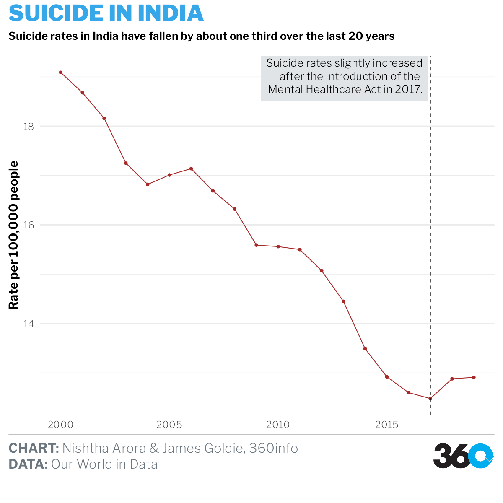
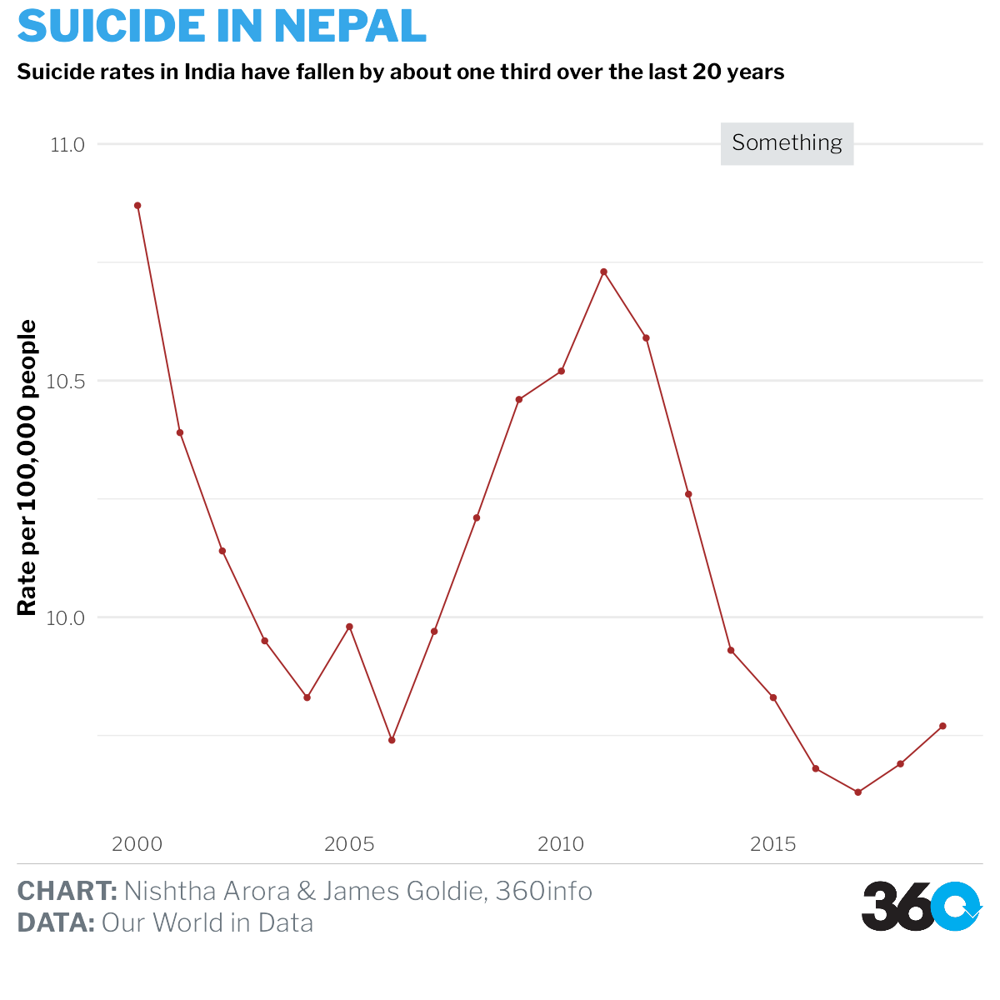
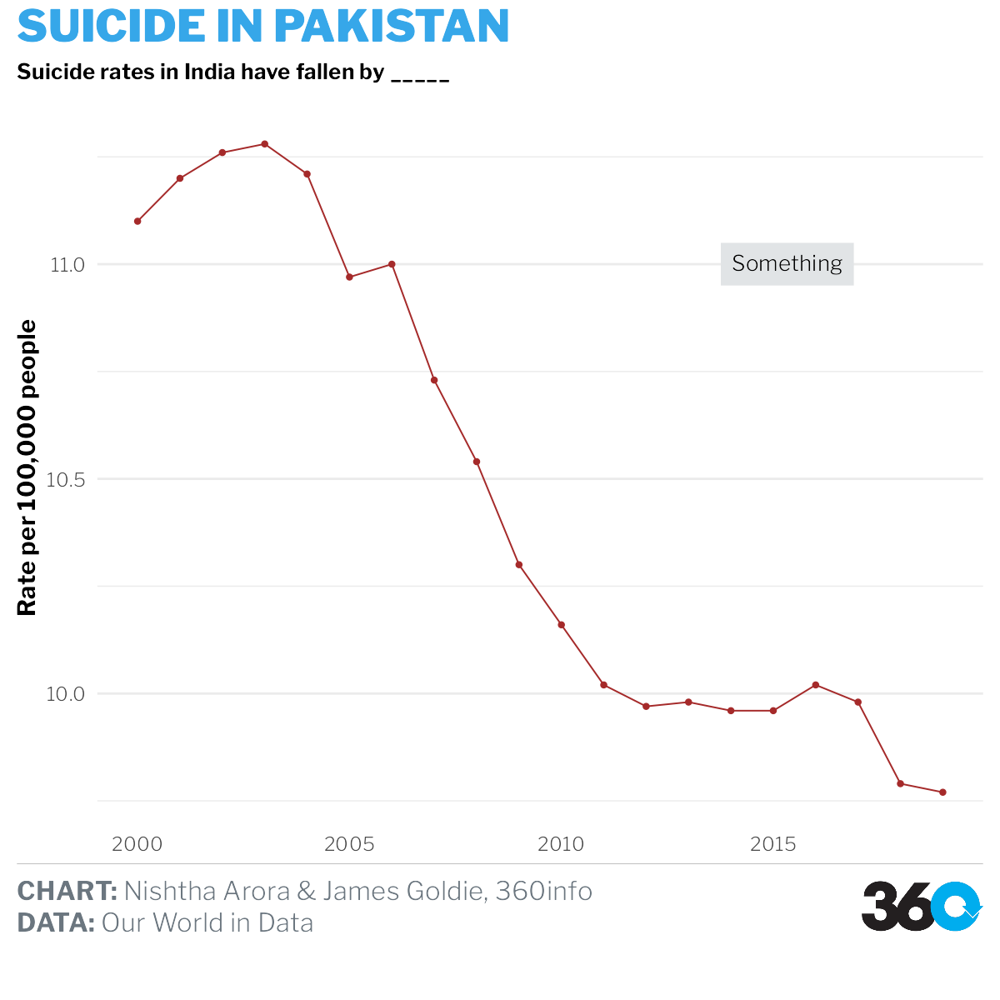

```{r setup, include=FALSE}
knitr::opts_chunk$set(echo = TRUE, message = FALSE, warning = FALSE, fig.width=12, fig.height=8)
```

```{r}
library(rsvg
        )
```

```{r libraries}
library(readxl)
library(readr)
library(rsvg)
library(tidyverse)
library(hrbrthemes)
library(ggthemes)
library(lubridate)
library(sf)
# library(gridExtra)
library(rgeos)
library(themes360info)
```

```{r}
whodata <- read_csv("data/Article-wise/data.csv") %>% 
  filter(Dim1== "Both sexes") %>% 
  select(Location, Period, FactValueNumeric)
```

# India

```{r}
india_suicide_rates_who <- whodata %>%
  filter(Location == "India") 

plot_india_who <- ggplot(india_suicide_rates_who, aes(x = Period, y = FactValueNumeric)) +
  geom_line(color="brown") +
  geom_point(color = "brown", size = 1.5) +
  geom_vline(xintercept = 2017, linetype = "dashed") +
  # geom(aes(x = 2005, y = 18.5, label = "Suicide Rate", colour = "Black")) +
  # scale_x_continuous(breaks = seq(from = 2000, to = 2019, by = 1)) +
  # scale_color_manual(values = c("brown", "purple", "black")) +
  labs(
    x = NULL,
    y = "Rate per 100,000 people",
    title = "SUICIDE IN INDIA",
    subtitle="Suicide rates in India have fallen by about one third over the last 20 years",
    caption = paste(
      "**CHART:** Nishtha Arora & James Goldie, 360info",
      "**DATA:** Our World in Data",
      sep = "<br>"
      )
  ) +
  theme_360()+
  theme(
    legend.position = "none",
    axis.title = element_text(face = "bold"),
     panel.grid.major.x = element_blank(),
        panel.grid.minor.x = element_blank(),
    
    )+
  theme( panel.grid.major.x = element_blank(),
        panel.grid.minor.x = element_blank() )+
    annotate_360_light(x = 2016.9, y = 19, label = paste( "Suicide rates slightly increased",
    "after the introduction of the ",
                                                          "Mental Healthcare Act
                                                          in 2017.",
                  sep="<br>")
               ,hjust=1, size=5)

save_360plot(plot_india_who, "indiatimeseriesWHO.svg")

```

# Nepal

```{r}
nepal_suicide_rates_who <- whodata %>%
  filter(Location == "Nepal") 

plot_nepal_who <- ggplot(nepal_suicide_rates_who, aes(x = Period, y = FactValueNumeric)) +
  geom_line(color="brown") +
  geom_point(color = "brown", size = 1.5) +
  # geom_vline(xintercept = 2017, linetype = "dashed") +
  # geom(aes(x = 2005, y = 18.5, label = "Suicide Rate", colour = "Black")) +
  # scale_x_continuous(breaks = seq(from = 2000, to = 2019, by = 1)) +
  # scale_color_manual(values = c("brown", "purple", "black")) +
  labs(
    x = NULL,
    y = "Rate per 100,000 people",
    title = "SUICIDE IN NEPAL",
    subtitle="Suicide rates in India have fallen by about one third over the last 20 years",
    caption = paste(
      "**CHART:** Nishtha Arora & James Goldie, 360info",
      "**DATA:** Our World in Data",
      sep = "<br>"
      )
  ) +
  theme_360()+
  theme(
    legend.position = "none",
    axis.title = element_text(face = "bold"),
     panel.grid.major.x = element_blank(),
        panel.grid.minor.x = element_blank(),
    
    )+
  theme( panel.grid.major.x = element_blank(),
        panel.grid.minor.x = element_blank() )+
    annotate_360_light(x = 2016.9, y = 11, label = paste( "Something",
                  sep="<br>")
               ,hjust=1, size=5)

save_360plot(plot_nepal_who, "nepaltimeseriesWHO.svg")

```

# Pakistan

```{r}
pak_suicide_rates_who <- whodata %>%
  filter(Location == "Pakistan") 

plot_pak_who <- ggplot(pak_suicide_rates_who, aes(x = Period, y = FactValueNumeric)) +
  geom_line(color="brown") +
  geom_point(color = "brown", size = 1.5) +
  # geom_vline(xintercept = 2017, linetype = "dashed") +
  # geom(aes(x = 2005, y = 18.5, label = "Suicide Rate", colour = "Black")) +
  # scale_x_continuous(breaks = seq(from = 2000, to = 2019, by = 1)) +
  # scale_color_manual(values = c("brown", "purple", "black")) +
  labs(
    x = NULL,
    y = "Rate per 100,000 people",
    title = "SUICIDE IN PAKISTAN",
    subtitle="Suicide rates in India have fallen by _____",
    caption = paste(
      "**CHART:** Nishtha Arora & James Goldie, 360info",
      "**DATA:** Our World in Data",
      sep = "<br>"
      )
  ) +
  theme_360()+
  theme(
    legend.position = "none",
    axis.title = element_text(face = "bold"),
     panel.grid.major.x = element_blank(),
        panel.grid.minor.x = element_blank(),
    
    )+
  theme( panel.grid.major.x = element_blank(),
        panel.grid.minor.x = element_blank() )+
    annotate_360_light(x = 2016.9, y = 11, label = paste( "Something",
                  sep="<br>")
               ,hjust=1, size=5)

save_360plot(plot_pak_who, "paktimeseriesWHO.svg")

```

