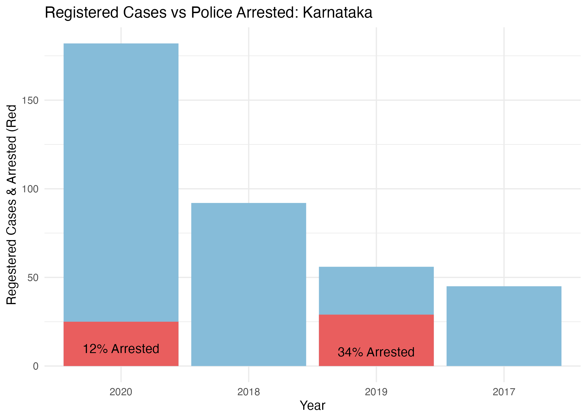

```{r setup, include=FALSE}
options(htmltools.dir.version = FALSE)
```

```{r libraries, echo=FALSE, message=FALSE, warning=FALSE}
library(readr)
library(themes360info)
library(readxl)
library(tidyverse)
library(hrbrthemes)
library(ggthemes)
library(lubridate)
library(sf)
library(rgeos)
library(pdftools)
library(ggthemes)
library(scales)
library(dumbbell)
library(RColorBrewer)
library(DiagrammeR)
```


class: left, top

# INTRODUCTION

**The greatest value of a picture is when it forces us to notice what we never expected to see**, says John W. Tukey, an American mathematician and statistician.

.pull-left[
```{r out.width = '100%', echo = FALSE}
knitr::include_graphics("images/Data_Visualization_Tools.jpg.avif")
```

.tiny[<span>Photo by <a href="https://www.simplilearn.com/authors/simplilearn">Simplilearn</a></span>]

]

.pull-right[

- Computer based visualizations/images have been an integral part of reporting.

- These images, are sometimes backed up by data bases- public or private.

- Investigates trends and anomalies.
]

.content-box-yellow[ 
**Challenges:** Data manupilation, wrangling, access to platforms supporting visualization reorganization, etc.
 ]
 
---
# ABOUT

[*360info*](https://360info.org) is a **not-for-profit** open access agency that provides **global information** regarding world's issues and provides solutions for the same. This content is forwarded to re-publishers without charge, under **Creative Commons**.

```{r out.width = '100%', echo = FALSE}

```

---

# PROJECT WORKFLOW

.pull-left[

```{r, fig.width=5, fig.height=6, echo= FALSE, warning= FALSE, message = FALSE}
grViz("digraph flowchart {

     node [shape = box,
        fontname = Helvetica,
        color = black]     
        
      tab1 [label = '@@1']
      tab2 [label = '@@2']
      tab3 [label = '@@3']
      tab4 [label = '@@4']
      tab5 [label = '@@5']
     
      # edge definitions with the node IDs
      tab1 -> tab2 -> tab3 -> tab4 -> tab5;
      }

      [1]: 'Research'
      [2]: 'Global Problem Identification'
      [3]: 'A special report with 5-10 articles, covering different aspects'
      [4]: 'Matched with the correct images/visualizations based on data'
      [5]: 'Published'
      
      ")
```


]

.pull-right[
Under the Guidance of

```{r out.width = '20%', echo = FALSE}

```

.tiny[<span>Damjan Vukcevic, <a href="https://research.monash.edu/en/persons/damjan-vukcevic">Associate Professor, Monash University.</a></span>]


```{r out.width = '20%', echo = FALSE}

```

.tiny[<span>James Goldie, <a href="https://jamesgoldie.dev">Data and Digital Story-Telling Lead, 360info.org</a></span>]

]


Why Creative Commons? - Good for art, educational and entertainment works and attribution 4.0 is used for more flexible rules when it comes to user rights. 

---

# AIM

To support the journalism team of authors and editors with compelling visualizations to support their claims and research, or creation of an analysis via a visual related to the topic selected. 

Packages selected:

- Decrimanlizing Suicide

- Policing the Police

---

# DECRIMANALIZING SUICIDE

.pull-left[

```{r out.width = '100%', echo = FALSE}
knitr::include_graphics("images/whatsapp-image-2019-01-29-at-13-46-16.jpeg")
```


]

.pull-right[
- Worldwide Public Health Problem.

- Over 700,000 deaths from suicide worldwide in 2019.

- Effects on the suicide rates?

- Still 20 countries have criminalized suicide.

]

##### How did we reach the concept of Decrimanlizing Suicide?

- The British Common Law: No right to take his/her life - effected the former British colonies.

- The Christian commandment of “thou shall not kill”.

- Suicide is a sin under Sharia law, in the Islamic Tradition.


---

# MOTIVATION & METHODOLOGY

- Suicide caused due to abuse, loss, loneliness, depression, anxiety, etc. This results in mental health issues, hence, all suicide cases will have mental health issues but might not be true vice versa. How related are these two?

- Identification of suicide victims can help in reduction. What other factors affects suicide?

- Data gaps due to casual tracking of rates, data hampering, poor sample sizes, needs to be tackled.

##### Some of the tools used:

```{r out.width = '100%', echo = FALSE}

```


```{r, echo = FALSE, message=FALSE, warning=FALSE}
visualization1 <- read_csv("presentation_data/visualization1.csv")
visualization2 <- read_csv("presentation_data/visualization2.csv")
visualization3 <- read_csv("presentation_data/visualization3.csv")
visualization4 <- read_csv("presentation_data/visualization4.csv")
visualization5 <- read_csv("presentation_data/visualization5.csv")
visualization6 <- read_csv("presentation_data/visualization6.csv")
visualization8 <- read_csv("presentation_data/visualization8.csv")
visualization9 <- read_csv("presentation_data/visualization9.csv")
visualization10 <- read_csv("presentation_data/visualization10.csv")
visualization11 <- read_csv("presentation_data/visualization11.csv")
visualization12 <- read_csv("presentation_data/visualization12.csv")
visualization13 <- read_csv("presentation_data/visualization13.csv")
visualization14 <- read_csv("presentation_data/visualization14.csv")
visualization15 <- read_csv("presentation_data/visualization15.csv")
visualization16 <- read_csv("presentation_data/visualization16.csv")
visualization17 <- read_csv("presentation_data/visualization17.csv")
visualization18 <- read_csv("presentation_data/visualization18.csv")
visualization19 <- read_csv("presentation_data/visualization19.csv")
visualization20 <- read_csv("presentation_data/visualization20.csv")
```


---
class: center, middle

### Step 1: Creating initial visualizations, aligning with specific draft articles.

#### Visualization 1 

```{r saving_cleaned_data, echo=FALSE, message=FALSE, warning=FALSE, fig.height=6, fig.width=9}
ggplot(visualization1,
       aes(
         x = reorder(Entity,-avg_rate),
         y = avg_rate,
         fill = `Development status`
       )) +
  geom_col() +
  geom_text(
    aes(label = avg_rate),
    vjust = 2,
    colour = "white",
    size = 3
  ) +
  theme(
    legend.position = "bottom",
    axis.text.x = element_text(
      angle = 45,
      vjust = 0.5,
      hjust = 1
    ),
    plot.title = element_text(face = "bold")
  ) +
  labs(title = "Top 30 countries by average suicide rate (2008-2019)",
       x = substitute(paste(bold("Country"))),
       y = substitute(paste(bold(
         "Suicide rate per 100,000 people"
       )))) +
  scale_fill_manual(values = c("#A0331C", "#1C56A0", "#4B902F", "#635A61"))


```

---

.pull-left[
```{r saving_cleaned, echo=FALSE, message=FALSE, warning=FALSE, out.width='90%'}
ggplot(visualization1,
       aes(
         x = reorder(Entity,-avg_rate),
         y = avg_rate,
         fill = `Development status`
       )) +
  geom_col() +
  geom_text(
    aes(label = avg_rate),
    vjust = 2,
    colour = "white",
    size = 3
  ) +
  theme(
    legend.position = "bottom",
    axis.text.x = element_text(
      angle = 45,
      vjust = 0.5,
      hjust = 1
    ),
    plot.title = element_text(face = "bold")
  ) +
  labs(title = "Top 30 countries by average suicide rate (2008-2019)",
       x = substitute(paste(bold("Country"))),
       y = substitute(paste(bold(
         "Suicide rate per 100,000 people"
       )))) +
  scale_fill_manual(values = c("#A0331C", "#1C56A0", "#4B902F", "#635A61"))


```
]


```{r out.width = '30%', echo = FALSE}

```

## Why?

- 2 data sets used fro different data sources, UNDP (HDI data) and OWID (Suicide rates).

- The HDI data has recordings from 2021 values (2020 rank) and OWID had vaialable data only till 2019.


.content-box-yellow[ 
This is a more generic visualization supporting the package completely. Click on 
[*criminalising-suicide-only-makes-it-worse*](https://360info.org/criminalising-suicide-only-makes-it-worse/) to view the full package
]
---

class: center, middle

#### Visualization 2


```{r,  echo=FALSE, message=FALSE, warning=FALSE, fig.height=5, fig.width=9}
visualization4 |>
  ggplot(aes(x = Location, y = FactValueNumeric, fill = Location)) +
  geom_boxplot() +
  theme(legend.position = "none") +
  scale_fill_viridis_d(alpha = 0.6) +
  theme(
    text = element_text(size = 8),
    axis.text.x = element_text(angle = 45, hjust = 1),
    axis.title = element_text(face = "bold"),
    plot.title = element_text(
      size = 14,
      lineheight = 8,
      face = "bold"
    )
  ) +
  labs(x = "Country",
       y = "Suicide rate",
       title = "Irregularity in Data Collection")
```

.content-box-yellow[ 
This visualization supports the article:  
[*What a registry database should look like*](https://360info.org/what-a-suicide-registry-database-should-look-like/)
]

---

.pull-left[

```{r,  echo=FALSE, message=FALSE, warning=FALSE, out.width='90%'}
visualization4 |>
  ggplot(aes(x = Location, y = FactValueNumeric, fill = Location)) +
  geom_boxplot() +
  theme(legend.position = "none") +
  scale_fill_viridis_d(alpha = 0.6) +
  theme(
    text = element_text(size = 8),
    axis.text.x = element_text(angle = 45, hjust = 1),
    axis.title = element_text(face = "bold"),
    plot.title = element_text(
      size = 14,
      lineheight = 8,
      face = "bold"
    )
  ) +
  labs(x = "Country",
       y = "Suicide rate",
       title = "Irregularity in Data Collection")
```

]

```{r out.width = '30%', echo = FALSE}

```

Why?
---


class: center, middle

#### Visualization 3

.content-box-yellow[ 

The suicide rates in South Asian countries are reported to be between 0.43 to 331.0 per 100,000 population, which is high compared to the world average.
]

```{r, echo = FALSE, message=FALSE, warning=FALSE, fig.height=5, fig.width=9}
ggplot(visualization5, aes(colour = Location, y = FactValueNumeric, x = Period)) +
  geom_line() +
  geom_point() +
  ylab("Suicide rate") +
  ggtitle("South Asian Countries") +
  scale_colour_brewer(type = "seq", palette = "Dark2") +
  theme_classic()
```


---

.pull-left[

```{r,  echo=FALSE, message=FALSE, warning=FALSE, out.width='90%'}

ggplot(visualization5, aes(colour = Location, y = FactValueNumeric, x = Period)) +
  geom_line() +
  geom_point() +
  ylab("Suicide rate") +
  ggtitle("South Asian Countries") +
  scale_colour_brewer(type = "seq", palette = "Dark2") +
  theme_classic()
```
]

```{r out.width = '30%', echo = FALSE}

```

## Why?

.content-box-yellow[ 
The package refers to Malaysia in the article 
[*Suicide is not a crime*](https://360info.org/suicide-is-not-a-crime/), Pakistan in [*With suicide not a crime, the real work begins*](https://360info.org/with-suicide-no-longer-a-crime-the-real-work-begins/), Bangladesh in [*Suicide is a mental health issue, not a crime*](https://360info.org/suicide-is-a-mental-health-issue-not-a-crime/) and a discussion on [*India's Mental Health act*](https://360info.org/how-india-continues-to-punish-those-who-attempt-suicide/). It also highlights facts about Sri Lanka in [The alternatives that can help prevent suicide](https://360info.org/the-alternatives-which-can-help-prevent-suicide/).

]

---
class: center, middle

### Step 2: More relvant plots were made and shortlisted where 360themes was added.

#### Visualization 4

.pull-left[


```{r out.width = '100%', echo = FALSE}
knitr::include_graphics("graphs/indiatimeseries.png")
```

```{r out.width = '20%', echo = FALSE}

```

]

.pull-right[

Data source: OWID (Our World in Data)

### Reason for rejection:

- The author did not trust the source and relied more on NCRB (National Crime Records Bureau) data. So later a plot with NCRB data was made.

]
---

#### Visualization 5

```{r out.width = '60%', echo = FALSE, fig.align="center"}
knitr::include_graphics("graphs/indiamap.png")
```

---

### Step 3: Plot with corrected data source was made for one of the short-listed plots.

#### Visualization 6

```{r out.width = '60%', echo = FALSE, fig.align="center"}
knitr::include_graphics("graphs/indiatimeseries2.png")
```

---

class: center, middle

# POLICING THE POLICE

---

#### Visualization 1

```{r, echo = FALSE, message=FALSE, warning=FALSE}
visualization9  |>
  ggplot(aes(reorder(x = Country,-VALUE), y = VALUE, fill = ToHighlight)) +
  geom_col() +
  theme(legend.position = "none") +
  theme_dark() +
  ggtitle("Average corruption count, 2013-2021") +
  xlab("Country") +
  ylab("Corruption Count") +
  theme(
    plot.title = element_text(face = "bold", size = 18),
    axis.title.x = element_text(face = "bold"),
    axis.title.y = element_text(face = "bold"),
      axis.text.x = element_text(angle = 35, face = "bold"),
    legend.position = "none"
  ) +
  scale_fill_manual(values = c("yes" = "#57AFD5", "no" = "lightblue"))
```
---

### Visualization 10

```{r, echo = FALSE, message=FALSE, warning=FALSE}
visualization10 |>
  ggplot(aes(x = Year, y = VALUE)) +
  geom_col(fill = "lightblue", width = 0.4) +
  geom_line(size = 1, colour = "#811B0F") +
  ggtitle("Corruption Count: USA") +
  ylab("Corruption Count") +
  theme_dark() +
  theme(
    plot.title = element_text(face = "bold", size = 15),
    axis.title.x = element_text(face = "bold"),
    axis.title.y = element_text(face = "bold"))
```


---

### Visualization 12

```{r, echo = FALSE, message=FALSE, warning=FALSE}
visualization12  |>
  ggplot(aes(x = year, y = avg_rate)) +
  geom_line(color = "#6F0269") +
  geom_point() +
  geom_vline(xintercept = 2021, linetype = "dashed")+
  theme_wsj() +
  ggtitle("USA Killings: 2015-2022")
```

---

### Visualization 13

```{r, echo = FALSE, message=FALSE, warning=FALSE}
visualization13 |>
  ggplot(aes(x = state_name, y = rate)) +
  geom_segment(aes(
    x = reorder(state_name, -rate),
    xend = state_name,
    y = 0,
    yend = rate
  )) +
  geom_point(
    size = 6,
    color = "#6F0269",
    fill = alpha("#074B1D", 0.3),
    alpha = 0.7,
    shape = 21,
    stroke = 2
  ) +
  theme_wsj() +
  theme(axis.text.x = element_text(size=8, angle = 35))+
  labs(title = "Highest Killing States",
       subtitle = "USA: 2015-2022")
```

---

### Visualization 14
```{r, echo = FALSE, message=FALSE, warning=FALSE}
colourCount = length(unique(visualization14$`State/UT`))
 visualization14 |> 
ggplot(aes( y = `Registered Cases`, x = Year, fill=`State/UT`))+
  geom_col()+
  scale_fill_manual(values = colorRampPalette(brewer.pal(15, "Set1"))(colourCount)) +
theme_calc()+
  theme(legend.position="bottom") +
  guides(fill=guide_legend(nrow=3))+
  ylab("Regestered Cases against Police")+
  ggtitle("India: States with higehst regestered cases", subtitle = " States with 100 or more cases in any/each year")
```

---

### Visualization 15

```{r out.width = '60%', echo = FALSE, fig.align="center"}

```

---

### Visualization 16

```{r, echo = FALSE, message=FALSE, warning=FALSE}
ggplot(
  visualization16,
  aes(y = `GDP per capita, PPP (constant 2017 international $)`, x = `Trust in police (Eurostat (2015))`)
) +
  geom_point() +
  geom_smooth(method = lm, se = FALSE) +
  geom_text(
    aes(label = Entity),
    data = visualization16 |> filter(
      Entity %in% c("Luxembourg", "Switzerland", "United Kingdom")),
      nudge_y = -0.25E4) +
  theme_bw()
```

---

### Visualization 17

```{r, echo = FALSE, message=FALSE, warning=FALSE}
ggplot(visualization17, aes(x = Date, y = count, fill = City)) +
  geom_bar(
    stat = "identity",
    position = position_dodge(),
    alpha = 0.75
  ) +
  ggtitle("Phillippines Drug War Police Killings") +
  ylab("People Killed") +
  theme_economist() +
  scale_fill_economist() +
  theme(
    axis.title.x = element_text(face = "bold"),
    axis.title.y = element_text(face = "bold")
  ) +
  scale_x_date(
    breaks = date_breaks("years"),
    labels = date_format("20%y")
  )
```

---

### Visualization 18

```{r out.width = '60%', echo = FALSE, fig.align="center"}
knitr::include_graphics("graphs/police.png")
```

---

### Visualization 19

```{r, echo = FALSE, message=FALSE, warning=FALSE}
dumbbell(xdf=visualization19,id = "Institution",
         key="chapters",
         column1 = "Count.x",
         column2 = "Count.y",
         lab1 = "2013",lab2 = "2017", 
         # delt=1, 
         expandy = 0.05, 
         col_lab1 = "blue", 
         col_lab2 = "red", 
         pt_val = 1,
         arrow = 1, 
         arrow_size = 0.2, 
         segsize = 1,
    pointsize = 1.5, 
    col_seg1 = "#A9A9A9", 
    col_seg2 = "#A9A9A9") +
  coord_flip()+
   scale_y_discrete(labels = scales::label_wrap(14))
```

---

### Visualization 20

```{r out.width = '60%', echo = FALSE, fig.align="center"}
knitr::include_graphics("graphs/police_2.png")
```


https://www.frontiersin.org/articles/10.3389/fpsyt.2022.1034206/full