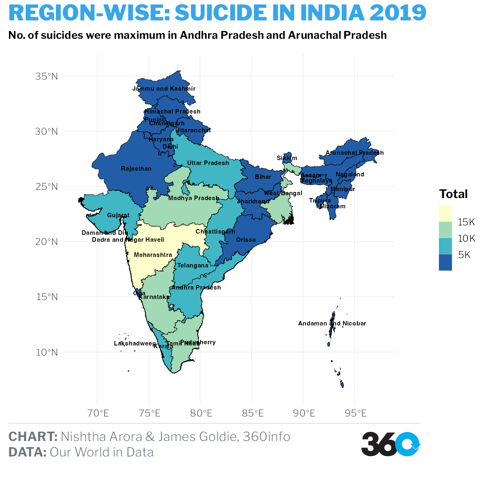
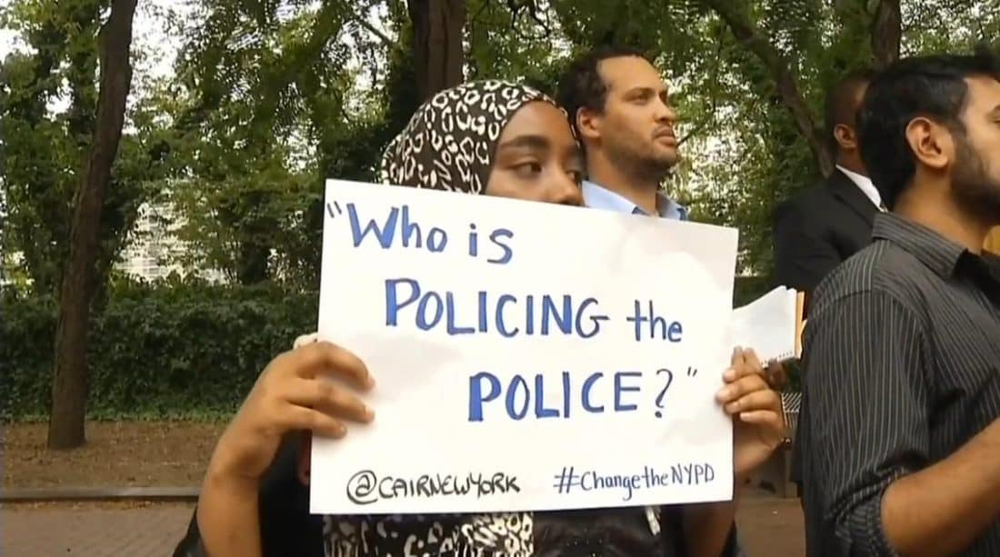
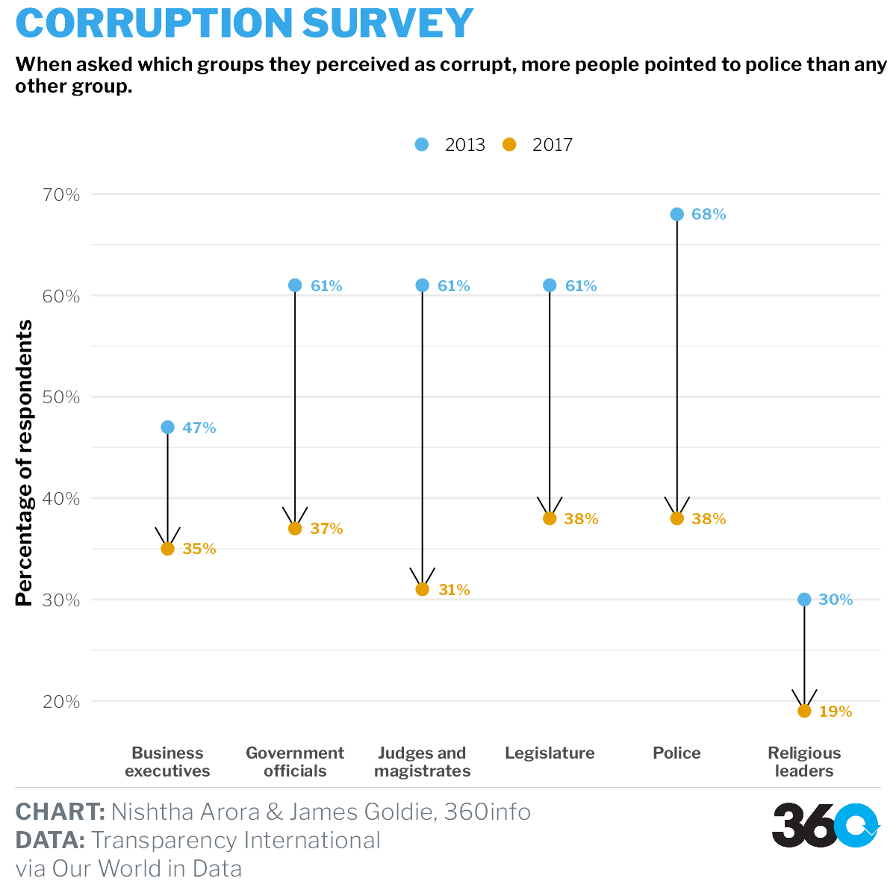

```{r setup, include=FALSE}
options(htmltools.dir.version = FALSE)
```

```{r libraries, echo=FALSE, message=FALSE, warning=FALSE}
library(readr)
library(themes360info)
library(readxl)
library(tidyverse)
library(hrbrthemes)
library(ggthemes)
library(lubridate)
library(sf)
library(rgeos)
library(pdftools)
library(ggthemes)
library(scales)
library(dumbbell)
library(RColorBrewer)
library(DiagrammeR)
```


class: left, top

# INTRODUCTION

**The greatest value of a picture is when it forces us to notice what we never expected to see**, says John W. Tukey, an American mathematician and statistician.

.pull-left[
```{r, echo = FALSE}
knitr::include_graphics("images/Data_Visualization_Tools.jpg.avif")
```

.tiny[<span>Photo by <a href="https://www.simplilearn.com/authors/simplilearn">Simplilearn</a></span>]

]

.pull-right[

- Computer based visualizations/images have been an integral part of reporting.

- These images, are sometimes backed up by data bases- public or private.

- Investigates trends and anomalies.
]

.content-box-yellow[ 
**Challenges:** Data manupilation, wrangling, access to platforms supporting visualization reorganization, etc.
 ]
 
---
# ABOUT

[*360info*](https://360info.org) is a **not-for-profit** open access agency that provides **global information** regarding world's issues and provides solutions for the same. This content is forwarded to re-publishers without charge, under **Creative Commons**.

```{r, echo = FALSE}

```

---

# PROJECT WORKFLOW

.pull-left[

```{r, fig.width=5, fig.height=6, echo= FALSE, warning= FALSE, message = FALSE}
grViz("digraph flowchart {

     node [shape = box,
        fontname = Helvetica,
        color = black]     
        
      tab1 [label = '@@1']
      tab2 [label = '@@2']
      tab3 [label = '@@3']
      tab4 [label = '@@4']
      tab5 [label = '@@5']
     
      # edge definitions with the node IDs
      tab1 -> tab2 -> tab3 -> tab4 -> tab5;
      }

      [1]: 'Research'
      [2]: 'Global Problem Identification'
      [3]: 'A special report with 5-10 articles, covering different aspects'
      [4]: 'Matched with the correct images/visualizations based on data'
      [5]: 'Published'
      
      ")
```


]

.pull-right[
Under the Guidance of

```{r out.width = '20%', echo = FALSE}

```

.tiny[<span>Damjan Vukcevic, <a href="https://research.monash.edu/en/persons/damjan-vukcevic">Associate Professor, Monash University.</a></span>]


```{r out.width = '20%', echo = FALSE}

```

.tiny[<span>James Goldie, <a href="https://jamesgoldie.dev">Data and Digital Story-Telling Lead, 360info.org</a></span>]

]


Why Creative Commons? - Good for art, educational and entertainment works and attribution 4.0 is used for more flexible rules when it comes to user rights. 

---

# AIM & MOTIVATION

To support the journalism team of authors and editors with compelling visualizations to support their claims and research, or creation of an analysis via a visual related to the topic selected. 

Packages selected:

- **Decriminalizing Suicide**: Suicide caused due to abuse, loss, loneliness, depression, anxiety, etc. This results in mental health issues, hence, all suicide cases will have mental health issues but might not be true vice versa. How related are these two? Identification of suicide victims can help in reduction. What other factors affects suicide?

- **Policing the Police** : Police misconduct could be a false confession, bribery, intimidation, brutality, etc. These crimes and happenings questions the trust in police worldwide. How much trust hampering has happened over the years? And is the required action being taken against the police? What are the other issues that may affect corrupt police?

---
# METHODOLOGY

### Step 1: Creating initial visualizations, aligning with specific draft articles.

### Step 2: More relvant plots were made and shortlisted where 360themes was added.

### Step 3: Plot with corrected flaws was made for one of the short-listed plots.

##### Some of the tools used:

```{r, echo = FALSE}

```


```{r, echo = FALSE, message=FALSE, warning=FALSE}
visualization1 <- read_csv("presentation_data/visualization1.csv")
visualization2 <- read_csv("presentation_data/visualization2.csv")
visualization3 <- read_csv("presentation_data/visualization3.csv")
visualization4 <- read_csv("presentation_data/visualization4.csv")
visualization5 <- read_csv("presentation_data/visualization5.csv")
visualization6 <- read_csv("presentation_data/visualization6.csv")
visualization8 <- read_csv("presentation_data/visualization8.csv")
visualization9 <- read_csv("presentation_data/visualization9.csv")
visualization10 <- read_csv("presentation_data/visualization10.csv")
visualization11 <- read_csv("presentation_data/visualization11.csv")
visualization12 <- read_csv("presentation_data/visualization12.csv")
visualization13 <- read_csv("presentation_data/visualization13.csv")
visualization14 <- read_csv("presentation_data/visualization14.csv")
visualization15 <- read_csv("presentation_data/visualization15.csv")
visualization16 <- read_csv("presentation_data/visualization16.csv")
visualization17 <- read_csv("presentation_data/visualization17.csv")
visualization18 <- read_csv("presentation_data/visualization18.csv")
visualization19 <- read_csv("presentation_data/visualization19.csv")
visualization20 <- read_csv("presentation_data/visualization20.csv")
```


---

# DECRIMANALIZING SUICIDE

.pull-left[

```{r, echo = FALSE}
knitr::include_graphics("images/whatsapp-image-2019-01-29-at-13-46-16.jpeg")
```


]

.pull-right[
- Worldwide Public Health Problem.

- Over 700,000 deaths from suicide worldwide in 2019.

- Effects on the suicide rates?

- Still 20 countries have criminalized suicide.

]

##### How did we reach the concept of Decrimanlizing Suicide?

- The British Common Law: No right to take his/her life - effected the former British colonies.

- The Christian commandment of “thou shall not kill”.

- Suicide is a sin under Sharia law, in the Islamic Tradition.


---


class: center, middle

## Initial Visualizations

#### Visualization 1 

```{r saving_cleaned_data, echo=FALSE, message=FALSE, warning=FALSE, fig.height=6, fig.width=9}
ggplot(visualization1,
       aes(
         x = reorder(Entity,-avg_rate),
         y = avg_rate,
         fill = `Development status`
       )) +
  geom_col() +
  geom_text(
    aes(label = avg_rate),
    vjust = 2,
    colour = "white",
    size = 3
  ) +
  theme(
    legend.position = "bottom",
    axis.text.x = element_text(
      angle = 45,
      vjust = 0.5,
      hjust = 1
    ),
    plot.title = element_text(face = "bold")
  ) +
  labs(title = "Top 30 countries by average suicide rate (2008-2019)",
       x = substitute(paste(bold("Country"))),
       y = substitute(paste(bold(
         "Suicide rate per 100,000 people"
       )))) +
  scale_fill_manual(values = c("#A0331C", "#1C56A0", "#4B902F", "#635A61"))


```

---

.pull-left[
```{r saving_cleaned, echo=FALSE, message=FALSE, warning=FALSE, out.width='90%'}
ggplot(visualization1,
       aes(
         x = reorder(Entity,-avg_rate),
         y = avg_rate,
         fill = `Development status`
       )) +
  geom_col() +
  geom_text(
    aes(label = avg_rate),
    vjust = 2,
    colour = "white",
    size = 3
  ) +
  theme(
    legend.position = "bottom",
    axis.text.x = element_text(
      angle = 45,
      vjust = 0.5,
      hjust = 1
    ),
    plot.title = element_text(face = "bold")
  ) +
  labs(title = "Top 30 countries by average suicide rate (2008-2019)",
       x = substitute(paste(bold("Country"))),
       y = substitute(paste(bold(
         "Suicide rate per 100,000 people"
       )))) +
  scale_fill_manual(values = c("#A0331C", "#1C56A0", "#4B902F", "#635A61"))


```
]


```{r out.width = '30%', echo = FALSE}

```

## Why?

- 2 data sets used fro different data sources, UNDP (HDI data) and OWID (Suicide rates).

- The HDI data has recordings from 2021 values (2020 rank) and OWID had vaialable data only till 2019.


.content-box-yellow[ 
This is a more generic visualization supporting the package completely. Click on 
[*criminalising-suicide-only-makes-it-worse*](https://360info.org/criminalising-suicide-only-makes-it-worse/) to view the full package
]
---

class: center, middle

#### Visualization 2


```{r,  echo=FALSE, message=FALSE, warning=FALSE, fig.height=5, fig.width=9}
visualization4 |>
  ggplot(aes(x = Location, y = FactValueNumeric, fill = Location)) +
  geom_boxplot() +
  theme(legend.position = "none") +
  scale_fill_viridis_d(alpha = 0.6) +
  theme(
    text = element_text(size = 8),
    axis.text.x = element_text(angle = 45, hjust = 1),
    axis.title = element_text(face = "bold"),
    plot.title = element_text(
      size = 14,
      lineheight = 8,
      face = "bold"
    )
  ) +
  labs(x = "Country",
       y = "Suicide rate",
       title = "Irregularity in Data Collection")
```

.content-box-yellow[ 
This visualization supports the article:  
[*What a registry database should look like*](https://360info.org/what-a-suicide-registry-database-should-look-like/) and tackled the data gaps which maybe due to different factors ranging from data hampering, small sample size, inconsistencies, etc.
]

---

.pull-left[

```{r,  echo=FALSE, message=FALSE, warning=FALSE, out.width='90%'}
visualization4 |>
  ggplot(aes(x = Location, y = FactValueNumeric, fill = Location)) +
  geom_boxplot() +
  theme(legend.position = "none") +
  scale_fill_viridis_d(alpha = 0.6) +
  theme(
    text = element_text(size = 8),
    axis.text.x = element_text(angle = 45, hjust = 1),
    axis.title = element_text(face = "bold"),
    plot.title = element_text(
      size = 14,
      lineheight = 8,
      face = "bold"
    )
  ) +
  labs(x = "Country",
       y = "Suicide rate",
       title = "Irregularity in Data Collection")
```

]

```{r out.width = '30%', echo = FALSE}

```

Data source here: [WHO](https://www.who.int/data/gho/data/themes/mental-health/suicide-rates)

## Why?

.pull-left[

- A box plot maybe the best way to show data gaps but is not an easy-to-read plot for the public.

- All countries were not covered, only the ones with outliers have been shown.
]
---


class: center, middle

#### Visualization 3

.content-box-yellow[ 

The suicide rates in South Asian countries are reported to be between 0.43 to 331.0 per 100,000 population, which is high compared to the world average.
]

```{r, echo = FALSE, message=FALSE, warning=FALSE, fig.height=5, fig.width=9}
ggplot(visualization5, aes(colour = Location, y = FactValueNumeric, x = Period)) +
  geom_line() +
  geom_point() +
  ylab("Suicide rate") +
  ggtitle("South Asian Countries") +
  scale_colour_brewer(type = "seq", palette = "Dark2") +
  theme_classic()
```


---

.pull-left[

```{r,  echo=FALSE, message=FALSE, warning=FALSE, out.width='90%'}

ggplot(visualization5, aes(colour = Location, y = FactValueNumeric, x = Period)) +
  geom_line() +
  geom_point() +
  ylab("Suicide rate") +
  ggtitle("South Asian Countries") +
  scale_colour_brewer(type = "seq", palette = "Dark2") +
  theme_classic()
```
]

```{r out.width = '30%', echo = FALSE}

```

Data source: [WHO](https://www.who.int/data/gho/data/themes/mental-health/suicide-rates)


- The interface for all articles is different, so it did not make sense to put this on one page or front page.

- Here, only Sri Lanka trend seems interesting but is inconsistent and did not relate to the article content.


.content-box-yellow[ 
The package refers to Malaysia in the article 
[*Suicide is not a crime*](https://360info.org/suicide-is-not-a-crime/), Pakistan in [*With suicide not a crime, the real work begins*](https://360info.org/with-suicide-no-longer-a-crime-the-real-work-begins/), Bangladesh in [*Suicide is a mental health issue, not a crime*](https://360info.org/suicide-is-a-mental-health-issue-not-a-crime/) and a discussion on [*India's Mental Health act*](https://360info.org/how-india-continues-to-punish-those-who-attempt-suicide/). It also highlights facts about Sri Lanka in [The alternatives that can help prevent suicide](https://360info.org/the-alternatives-which-can-help-prevent-suicide/).

]

---
class: center, middle


## Short-listed visualizations

#### Visualization 4

.pull-left[


```{r, echo = FALSE}
knitr::include_graphics("graphs/indiatimeseries.png")
```

```{r out.width = '20%', echo = FALSE}

```

]

.pull-right[

Data source: [*WHO*](https://www.who.int/data/gho/data/themes/mental-health/suicide-rates)

For the article based on: India's Mental Health Act 2017

### Reason for rejection:

- The author's article did not align with the results and relied more on NCRB (National Crime Records Bureau) data. So later a plot with NCRB data was made.

]
---


#### Visualization 5

.pull-left[

```{r, echo = FALSE}

```

```{r out.width = '30%', echo = FALSE}

```

]

.pull-right[

Data source: [*data.gov*](https://data.gov.in/catalog/stateut-wise-distribution-suicides-causes)

### Reason for rejection:

- There was overlapping of states in the Map and removing the overlaps, would remove data.

- 2 data sources were used, one for the rates and the other for state geometry. And because of the the "id"'s for different states in geometry data did not match with the rates data and most of the id column had to be renamed manually- not a good practice.

]
---

## Selected visualization

#### Visualization 6

Data source: [NCRB](https://ncrb.gov.in/sites/default/files/adsi_reports_previous_year/Table%202.1.pdf)

.pull-left[

```{r, echo = FALSE}
knitr::include_graphics("graphs/indiatimeseries2.png")
```
]

.pull-right[

- This plot depicts the data fro NCRB. When compared with Visualization 4 of this package, it is seen that the shape is somewhat similar but the values are lower.

- The plot was created by pdf extracting and since that process took time, it was finalized after the article was published.

]
---


# POLICING THE POLICE

.pull-left[

```{r, echo = FALSE}

```

]

.pull-right[

- Mistrust of Police in African-American community.

- Police shootings in the States and Philippines .

- Lack of reporting as victims may fear retaliation or lack trust in the internal systems as well.


]

##### Some stats of police misconduct around the world.

- In the UK, about 1440 cases have been recorded within England and Wales, during 2019-2020.

- Australia has 3.4% of its complaints against police involving racism and discrimination .

- There were about 2220 police killings slone in Rio de Janerio (Brazil) in 2020 itself.
---
class: center, middle

### Initial Visualizations

#### Visualization 1 & 2

.pull-left[
```{r saving_cleaned_2, echo=FALSE, message=FALSE, warning=FALSE, out.width='99%'}
visualization9  |>
  ggplot(aes(reorder(x = Country,-VALUE), y = VALUE, fill = ToHighlight)) +
  geom_col() +
  theme(legend.position = "none") +
  theme_dark() +
  ggtitle("Average corruption count, 2013-2021") +
  xlab("Country") +
  ylab("Corruption Count") +
  theme(
    plot.title = element_text(face = "bold", size = 18),
    axis.title.x = element_text(face = "bold"),
    axis.title.y = element_text(face = "bold"),
      axis.text.x = element_text(angle = 35, face = "bold"),
    legend.position = "none"
  ) +
  scale_fill_manual(values = c("yes" = "#57AFD5", "no" = "lightblue"))

```
]

.pull-right[
```{r, echo=FALSE, message=FALSE, warning=FALSE, out.width='99%'}
visualization10 |>
  ggplot(aes(x = Year, y = VALUE)) +
  geom_col(fill = "lightblue", width = 0.4) +
  geom_line(size = 1, colour = "#811B0F") +
  ggtitle("Corruption Count: USA") +
  ylab("Corruption Count") +
  theme_dark() +
  theme(
    plot.title = element_text(face = "bold", size = 15),
    axis.title.x = element_text(face = "bold"),
    axis.title.y = element_text(face = "bold"))
```


]


---
.pull-left[
```{r, echo=FALSE, message=FALSE, warning=FALSE, out.width='80%'}
visualization9  |>
  ggplot(aes(reorder(x = Country,-VALUE), y = VALUE, fill = ToHighlight)) +
  geom_col() +
  theme(legend.position = "none") +
  theme_dark() +
  ggtitle("Average corruption count, 2013-2021") +
  xlab("Country") +
  ylab("Corruption Count") +
  theme(
    plot.title = element_text(face = "bold", size = 18),
    axis.title.x = element_text(face = "bold"),
    axis.title.y = element_text(face = "bold"),
      axis.text.x = element_text(angle = 35, face = "bold"),
    legend.position = "none"
  ) +
  scale_fill_manual(values = c("yes" = "#57AFD5", "no" = "lightblue"))

```

```{r out.width = '20%', echo = FALSE}

```
]

.pull-right[
```{r, echo=FALSE, message=FALSE, warning=FALSE, out.width='80%'}
visualization10 |>
  ggplot(aes(x = Year, y = VALUE)) +
  geom_col(fill = "lightblue", width = 0.4) +
  geom_line(size = 1, colour = "#811B0F") +
  ggtitle("Corruption Count: USA") +
  ylab("Corruption Count") +
  theme_dark() +
  theme(
    plot.title = element_text(face = "bold", size = 15),
    axis.title.x = element_text(face = "bold"),
    axis.title.y = element_text(face = "bold"))
```

```{r out.width = '20%', echo = FALSE}

```


]

Data source: [UNODC](https://dataunodc.un.org/dp-crime-corruption-offences)

Why?

- Even though this is a legit data source, but this gives a count of 'corruption' only and does not compare with the percentage of corruption involving police.


---

### Visualization 3 & 4

.pull-left[

```{r, echo = FALSE, message=FALSE, warning=FALSE, out.width='99%'}
visualization12  |>
  ggplot(aes(x = year, y = avg_rate)) +
  geom_line(color = "#6F0269") +
  geom_point() +
  geom_vline(xintercept = 2021, linetype = "dashed")+
  theme_wsj() +
  ggtitle("USA Killings: 2015-2022")
```
]

.pull-right[

```{r, echo = FALSE, message=FALSE, warning=FALSE, out.width='99%'}
visualization13 |>
  ggplot(aes(x = state_name, y = rate)) +
  geom_segment(aes(
    x = reorder(state_name, -rate),
    xend = state_name,
    y = 0,
    yend = rate
  )) +
  geom_point(
    size = 6,
    color = "#6F0269",
    fill = alpha("#074B1D", 0.3),
    alpha = 0.7,
    shape = 21,
    stroke = 2
  ) +
  theme_wsj() +
  theme(axis.text.x = element_text(size=8, angle = 35))+
  labs(title = "Highest Killing States",
       subtitle = "USA: 2015-2022")
```
]
---

.pull-left[

```{r, echo = FALSE, message=FALSE, warning=FALSE, out.width='80%'}
visualization12  |>
  ggplot(aes(x = year, y = avg_rate)) +
  geom_line(color = "#6F0269") +
  geom_point() +
  geom_vline(xintercept = 2021, linetype = "dashed")+
  theme_wsj() +
  ggtitle("USA Killings: 2015-2022")
```

```{r out.width = '20%', echo = FALSE}

```

]

.pull-right[

```{r, echo = FALSE, message=FALSE, warning=FALSE, out.width='80%'}
visualization13 |>
  ggplot(aes(x = state_name, y = rate)) +
  geom_segment(aes(
    x = reorder(state_name, -rate),
    xend = state_name,
    y = 0,
    yend = rate
  )) +
  geom_point(
    size = 6,
    color = "#6F0269",
    fill = alpha("#074B1D", 0.3),
    alpha = 0.7,
    shape = 21,
    stroke = 2
  ) +
  theme_wsj() +
  theme(axis.text.x = element_text(size=8, angle = 35))+
  labs(title = "Highest Killing States",
       subtitle = "USA: 2015-2022")
```

```{r out.width = '20%', echo = FALSE}

```

]


 Why?

- A combination of 4 data sets have been used for this visualization, two census datas for population count (common years had different values), police shootings database from Washington post, which was extracted from github and a states code dataset to combine the three datasets.


---

### Visualization 5 & 6

.pull-left[
```{r, echo = FALSE, message=FALSE, warning=FALSE, out.width='99%'}
colourCount = length(unique(visualization14$`State/UT`))
 visualization14 |> 
ggplot(aes( y = `Registered Cases`, x = Year, fill=`State/UT`))+
  geom_col()+
  scale_fill_manual(values = colorRampPalette(brewer.pal(15, "Set1"))(colourCount)) +
theme_calc()+
  theme(legend.position="bottom") +
  guides(fill=guide_legend(nrow=3))+
  ylab("Regestered Cases against Police")+
  ggtitle("India: States with higehst regestered cases", subtitle = " States with 100 or more cases in any/each year")
```


]

.pull-right[


```{r, echo = FALSE, fig.align="center", out.width='90%'}

```

]

The article on India and Karnataka specifically were removed from draft.

---

### Visualization 7

.pull-left[

```{r, echo = FALSE, message=FALSE, warning=FALSE}
ggplot(
  visualization16,
  aes(y = `GDP per capita, PPP (constant 2017 international $)`, x = `Trust in police (Eurostat (2015))`)
) +
  geom_point() +
  geom_smooth(method = lm, se = FALSE) +
  geom_text(
    aes(label = Entity),
    data = visualization16 |> filter(
      Entity %in% c("Luxembourg", "Switzerland", "United Kingdom")),
      nudge_y = -0.25E4) +
  theme_bw()
```

]

.pull-right[


Data source : [OWID](https://ourworldindata.org/grapher/trust-in-others-vs-trust-in-police)

- This graph shows that the trust in police is proportional to the GDP per capita.

- This was pretty similiar to the plot shown by OWID on its website.

```{r out.width = '40%', echo = FALSE}

```

]
---

### Visualization 8

.pull-left[

```{r, echo = FALSE, message=FALSE, warning=FALSE, out.width='90%'}
ggplot(visualization17, aes(x = Date, y = count, fill = City)) +
  geom_bar(
    stat = "identity",
    position = position_dodge(),
    alpha = 0.75
  ) +
  ggtitle("Phillippines Drug War Police Killings") +
  ylab("People Killed") +
  theme_economist() +
  scale_fill_economist() +
  theme(
    axis.title.x = element_text(face = "bold"),
    axis.title.y = element_text(face = "bold")
  ) +
  scale_x_date(
    breaks = date_breaks("years"),
    labels = date_format("20%y")
  )
```

```{r out.width = '40%', echo = FALSE}

```

]


Data source: [data.world](https://data.world/stabile-center/ph-drug-war#)

## Why?

 - Here, the data is not available for more years.
---

### Visualization 9

### Short-listed plots

Data source: [OWID](https://ourworldindata.org/corruption)
.pull-left[

```{r, echo = FALSE, out.width='97%'}
knitr::include_graphics("graphs/police.png")
```


]

```{r out.width = '20%', echo = FALSE}

```

## Why?

- Absence of 2014 data.

---

### Visualization 10

#### Updating visualization 9

.pull-left[

```{r, echo = FALSE, message=FALSE, warning=FALSE, out.width='97%'}
dumbbell(xdf=visualization19,id = "Institution",
         key="chapters",
         column1 = "Count.x",
         column2 = "Count.y",
         lab1 = "2013",lab2 = "2017", 
         # delt=1, 
         expandy = 0.05, 
         col_lab1 = "blue", 
         col_lab2 = "red", 
         pt_val = 1,
         arrow = 1, 
         arrow_size = 0.2, 
         segsize = 1,
    pointsize = 1.5, 
    col_seg1 = "#A9A9A9", 
    col_seg2 = "#A9A9A9") +
  coord_flip()+
   scale_y_discrete(labels = scales::label_wrap(14))
```


]

```{r out.width = '20%', echo = FALSE}

```

## Why?

 - This plot has been created using a library dumbbell, which can be hard to integrate within the publishing code.
 
---
## Selected Visualization 

### Visualization 11

.pull-left[

```{r, echo = FALSE, out.width='99%'}

```

]

#### Updating visualization 10:

Here the arrows depict as if the trust in a particular institution has fallen down, which is contradictory to the authors and the gist of the package. Also, 2017 values are lower and 2013 are higher, it seems as if the higher points are for the latest year, so it can be easily misread.

---

# REFERENCES

360info. (n.d.). https://360info.org

Assisted dying - Christianity. (n.d.). Christianity. https://christianity.org.uk/article/assisted-dying

Dattani, S. (2023, April 2). Suicides. Our World in Data. https://ourworldindata.org/suicide

G, E. (1987). Hawkins, D. M.: Identification of Outliers. Chapman and Hall, London – New York 1980, 188 S., £ 14, 50. Biometrical Journal, 29(2), 198. https://doi.org/10.1002/bimj.4710290215

Jordans, M. J. D., Kaufman, A., Brenman, N. F., Adhikari, R. K., Kohrt, B. A., Tol, W. A., & Komproe, I. H. (2014). Suicide in South Asia: a scoping review. BMC Psychiatry, 14(1). https://doi.org/10.1186/s12888-014-0358-9

Kenya - The Penal Code (Cap. 63). (n.d.). https://www.ilo.org/dyn/natlex/natlex4.detail?p_isn=28595&p_lang=en

---

Lester, D. (2006). Suicide and Islam. Archives of Suicide Research, 10(1), 77–97. https://doi.org/10.1080/13811110500318489

Lua filters in R Markdown. (n.d.). https://rmarkdown.rstudio.com/docs/articles/lua-filters.html

Ochuku, B. K., Johnson, N. M., Osborn, T. L., Wasanga, C., & Ndetei, D. M. (2022). Centering decriminalization of suicide in low – and middle – income countries on effective suicide prevention strategies. Frontiers in Psychiatry, 13. https://doi.org/10.3389/fpsyt.2022.1034206

Ranjan, R., Kumar, S., Pattanayak, R. D., Dhawan, A., & Sagar, R. (2014). (De-) criminalization of attempted suicide in India: A review. Industrial Psychiatry Journal, 23(1), 4. https://doi.org/10.4103/0972-6748.144936

Riederer, Y. X. C. D. E. (2022, November 7). 10.1 The function knitr::kable() | R Markdown Cookbook. https://bookdown.org/yihui/rmarkdown-cookbook/kable.html

Suicide Decriminalisation - United for Global Mental Health. (2022, July 4). United for Global Mental Health. https://unitedgmh.org/knowledge-hub/suicide-decriminalisation/?utm_campaign=SuicideDecrimReport&utm_medium=referral&utm_source=vip&utm_content=SuicideDecrimReport

---

World Health Organization. (2021). Comprehensive mental health action plan 2013–2030. https://apps.who.int/iris/handle/10665/345301

World Health Organization: WHO. (2021). Suicide. www.who.int. https://www.who.int/news-room/fact-sheets/detail/suicide

Zhu, H. Z. (2021). Create Awesome LaTeX Table with knitr::kable and kableExtra. cran.r-project.org. Retrieved May 10, 2023, from https://cran.r-project.org/web/packages/kableExtra/vignettes/awesome_table_in_pdf.pdf

## Thank You
